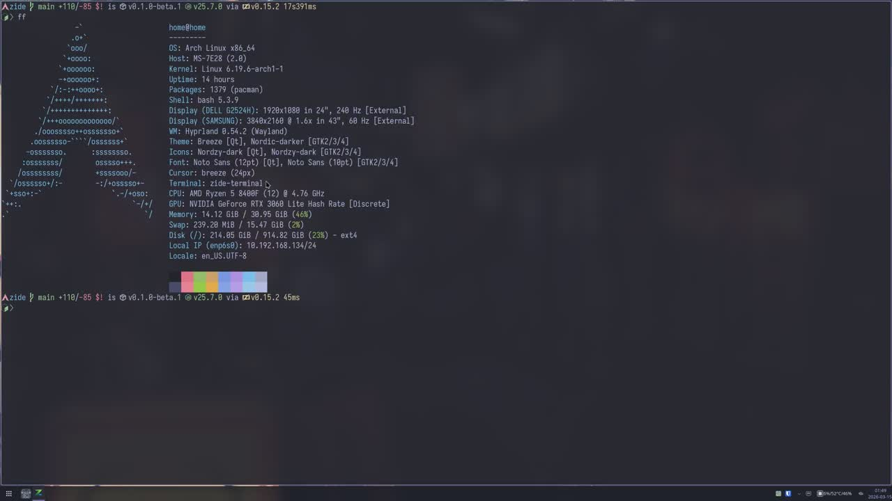

<h1>ide</h1>

A native IDE and terminal stack built in Zig, aimed at fast local workspaces,
serious terminal quality, and resource-aware tooling.

[](LICENSE)
[](https://github.com/LaurenceGuws/Zide/releases)
[](https://laurenceguws.github.io/Zide/tools/docs_explorer/)
[](https://ziglang.org/download/)
[](https://github.com/LaurenceGuws/Zide/releases)

## Links

- [Documentation](https://laurenceguws.github.io/Zide/tools/docs_explorer/)
- [Releases](https://github.com/LaurenceGuws/Zide/releases)
- [Issues](https://github.com/LaurenceGuws/Zide/issues)
- [Docs Index](docs/INDEX.md)

## Demo

[](assets/demo/zide-demo-2026-03-15.mp4)

## What Zide Is

Zide is being built for heavier real-world workspaces than the usual
"single-project editor" baseline. The practical driver is simple: many-service
workspaces can spawn many terminals, language servers, and background tooling,
and the normal answer is to burn RAM and idle CPU. Zide is aiming for a tighter
resource envelope without giving up native UX or terminal quality.

Current emphasis:

- Linux-native first
- integrated terminal quality and compatibility
- Zig-first implementation
- architecture that can later support embedded and foreign hosts honestly

## Current Status

Zide is in active beta. The large VT/render rewrite has landed, and current
work is focused on hardening, compatibility, and cleanup rather than broad new
surface area.

Published outputs currently include terminal bundles, editor bundles, IDE
bundles, terminal/editor FFI packages, and hosted release/architecture docs.
Use the Releases page for binaries.

## Quick Start

The hosted docs are the primary user-facing entrypoint. Start there for exact
platform details and current architecture notes.

- [Bootstrap and build notes](https://laurenceguws.github.io/Zide/tools/docs_explorer/#doc=app_architecture/BOOTSTRAP.md)
- [Dependency details](https://laurenceguws.github.io/Zide/tools/docs_explorer/#doc=docs/DEPENDENCIES.md)
- [Terminal compatibility](https://laurenceguws.github.io/Zide/tools/docs_explorer/#doc=docs/reference/terminal_compatibility.md)

Local Linux example:

```bash
sudo pacman -S zig wayland wayland-protocols libxkbcommon mesa fontconfig
./scripts/bootstrap.sh
zig build run
```

Important:

- In normal Linux/macOS flow, SDL3, Lua, FreeType, HarfBuzz, and tree-sitter
  are resolved through Zig package-managed dependencies.
- Linux package-manager setup is now mostly for platform/runtime libraries such
  as Wayland, Mesa/OpenGL, `libxkbcommon`, and `fontconfig`, not for sourcing
  the primary app library stack.
- You still need platform/system libraries for native execution.
- For exact platform dependency details, prefer the hosted dependency docs over
  cargo-culting old package lists from stale snippets.

If you are testing the terminal seriously, install the bundled terminfo entry:

```bash
mkdir -p ~/.terminfo
tic -x -o ~/.terminfo terminfo/zide.terminfo
```

Then launch a fresh shell inside Zide and verify:

```bash
printf '%s\n' "$TERM"
```

Expected TERM selection is compatibility-first:

- if `xterm-kitty` terminfo is already installed, Zide currently prefers it for
  broad app compatibility
- otherwise Zide uses `xterm-zide`
- then `zide-256color`
- finally `xterm-256color`

That does not mean Zide is trying to identify as Kitty as a product. It means
the PTY path currently prefers the broadest already-installed compatible entry
before falling back to Zide-owned terminfo.

## Documentation

Primary docs site:
- [Docs Explorer](https://laurenceguws.github.io/Zide/tools/docs_explorer/)

Good starting points:

- [Getting started](https://laurenceguws.github.io/Zide/tools/docs_explorer/#doc=app_architecture/BOOTSTRAP.md)
- [Dependency policy](https://laurenceguws.github.io/Zide/tools/docs_explorer/#doc=docs/DEPENDENCIES.md)
- [Terminal compatibility](https://laurenceguws.github.io/Zide/tools/docs_explorer/#doc=docs/reference/terminal_compatibility.md)
- [Current beta release notes](https://laurenceguws.github.io/Zide/tools/docs_explorer/#doc=docs/releases/v0.1.0-beta.1.md)

Contributor/operator navigation lives in [docs/INDEX.md](docs/INDEX.md).

## Developer Notes

Repository-local docs own the detailed operator guidance:

- bootstrap/build/run/test:
  [app_architecture/BOOTSTRAP.md](app_architecture/BOOTSTRAP.md)
- dependency authority:
  [docs/DEPENDENCIES.md](docs/DEPENDENCIES.md)
- release process:
  [RELEASING.md](RELEASING.md)
- docs explorer local run instructions:
  [tools/docs_explorer/README.md](tools/docs_explorer/README.md)

Local docs explorer workflow:

```bash
cd /home/home/personal/zide
npm run build:docs-explorer

cd tools/docs_explorer
python3 docs_explorer.py
```

## Features and Direction

- native Wayland-first renderer and app shell
- integrated terminal with PTY, VT core, scrollback, and redraw/present work
- tree-sitter grammar pack support
- rope-backed editor core with undo/redo
- terminal and editor FFI surfaces
- strong bias toward low idle cost and explicit runtime ownership

## Packaging and Dev Channels

Local Linux dev launcher channels:

- `zide-stable`
- `zide-test`

Commands:

```bash
scripts/dev/deploy_linux_channel.sh stable
scripts/dev/deploy_linux_channel.sh test
scripts/dev/deploy_linux_channels.sh
```

This is a local developer workflow under `~/.local`, not the published release
packaging path.

## License

MIT
