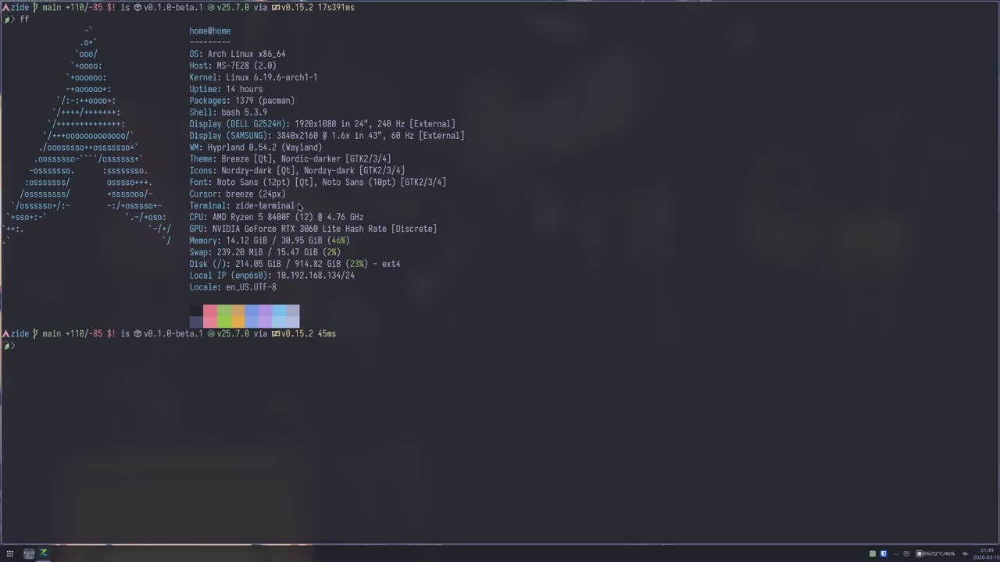

<h1>ide</h1>

A native IDE and terminal stack built in Zig, aimed at fast local workspaces,
serious terminal quality, and resource-aware tooling.

[](LICENSE)
[](https://github.com/LaurenceGuws/Zide/releases)
[](https://github.com/LaurenceGuws/docs-explorer)
[](https://github.com/LaurenceGuws/zlua-portable)
[](https://github.com/LaurenceGuws/zbar)
[](https://ziglang.org/download/)
[](https://github.com/LaurenceGuws/Zide/releases)

## Links

- [Docs Explorer Repo](https://github.com/LaurenceGuws/docs-explorer)
- [Releases](https://github.com/LaurenceGuws/Zide/releases)
- [Issues](https://github.com/LaurenceGuws/Zide/issues)
- [Docs Index](docs/INDEX.md)

## Related Projects

- [zlua-portable](https://github.com/LaurenceGuws/zlua-portable) provides the
  shared low-level Lua embedding and reader helpers used by Zide's config
  layer.
- [zbar](https://github.com/LaurenceGuws/zbar) is the sibling Zig status bar
  project that shares the same `zlua-portable` package boundary.

## Demo

[](assets/demo/zide-demo-2026-03-15.mp4)

## What Zide Is

Zide is being built for heavier real-world workspaces than the usual
"single-project editor" baseline. The practical driver is simple: many-service
workspaces can spawn many terminals, language servers, and background tooling,
and the normal answer is to burn RAM and idle CPU. Zide is aiming for a tighter
resource envelope without giving up native UX or terminal quality.

Current emphasis:

- Linux-native first
- integrated terminal quality and compatibility
- Zig-first implementation
- architecture that can later support embedded and foreign hosts honestly

## Current Status

Zide is in active beta. The large VT/render rewrite has landed, and current
work is focused on hardening, compatibility, and cleanup rather than broad new
surface area.

Terminal-wise, the current checkpoint is stronger than the older beta wording
implies:

- Linux native is now running on the rewritten VT/render architecture as the
  reference host path.
- The embeddable terminal FFI surface is no longer just a sketch:
  metadata, snapshot, viewport control, pending input, child-exit reporting,
  and the first conservative snapshot-diff lane are all real and regression
  backed.
- That host contract has also now been exercised against a second real host
  in Flutty, with the shared runtime/widget model holding across bridge-owned
  PTY and Flutter-owned PTY transport.

Published outputs currently include terminal bundles, editor bundles, IDE
bundles, terminal/editor FFI packages, and hosted release/architecture docs.
Use the Releases page for binaries.

## Quick Start

The hosted docs are the primary user-facing entrypoint. Start there for exact
platform details and current architecture notes.

- [Bootstrap and build notes](app_architecture/BOOTSTRAP.md)
- [Dependency details](docs/DEPENDENCIES.md)
- [Terminal compatibility](docs/reference/terminal_compatibility.md)

Local Linux example:

```bash
sudo pacman -S zig wayland wayland-protocols libxkbcommon mesa fontconfig
./ops/bootstrap.sh
zig build run
```

Important:

- In normal Linux/macOS flow, SDL3, Lua, FreeType, HarfBuzz, and tree-sitter
  are resolved through Zig package-managed dependencies.
- `zlua-portable` is now consumed as a pinned Zig package dependency from the
  `v0.1.0-beta.1` release line.
- Linux package-manager setup is now mostly for platform/runtime libraries such
  as Wayland, Mesa/OpenGL, `libxkbcommon`, and `fontconfig`, not for sourcing
  the primary app library stack.
- You still need platform/system libraries for native execution.
- For exact platform dependency details, prefer the hosted dependency docs over
  cargo-culting old package lists from stale snippets.

Fresh local checkout:

```bash
cd /home/home/personal
git clone git@github.com:LaurenceGuws/Zide.git zide
cd zide
./ops/bootstrap.sh
zig build check-app-imports
zig build test
```

For local co-development only, you can temporarily replace the pinned package
with a sibling path dependency to a local `zlua-portable` checkout:

```zig
.zlua_portable = .{
    .path = "../zlua-portable",
},
```

If you are testing the terminal seriously, install the bundled terminfo entry:

```bash
mkdir -p ~/.terminfo
tic -x -o ~/.terminfo terminfo/zide.terminfo
```

Then launch a fresh shell inside Zide and verify:

```bash
printf '%s\n' "$TERM"
```

Expected TERM selection is compatibility-first:

- if `xterm-kitty` terminfo is already installed, Zide currently prefers it for
  broad app compatibility
- otherwise Zide uses `xterm-zide`
- then `zide-256color`
- finally `xterm-256color`

That does not mean Zide is trying to identify as Kitty as a product. It means
the PTY path currently prefers the broadest already-installed compatible entry
before falling back to Zide-owned terminfo.

## Documentation

Primary docs entrypoints:
- [Docs Index](docs/INDEX.md)
- [Docs Explorer Repo](https://github.com/LaurenceGuws/docs-explorer)

Good starting points:

- [Getting started](app_architecture/BOOTSTRAP.md)
- [Dependency policy](docs/DEPENDENCIES.md)
- [Terminal compatibility](docs/reference/terminal_compatibility.md)
- [Terminal beta checkpoint summary](app_architecture/terminal/TERMINAL_BETA_CHECKPOINT.md)
- [Terminal architecture comparison](app_architecture/terminal/TERMINAL_ARCHITECTURE_COMPARISON.md)
- [Terminal FFI bridge design](app_architecture/terminal/ffi/BRIDGE_DESIGN.md)
- [Current beta release notes](docs/releases/v0.1.0-beta.6.md)

Contributor/operator navigation lives in [docs/INDEX.md](docs/INDEX.md).

## Lua Authoring

The repo ships LuaLS-facing config metadata and a scaffold snippet for
`.zide.lua` authoring:

- [lua/zide-meta.lua](/home/home/personal/worktrees/zide-portable-zbar-lua/lua/zide-meta.lua)
- [snippets/lua.json](/home/home/personal/worktrees/zide-portable-zbar-lua/snippets/lua.json)
- [.luarc.json](/home/home/personal/worktrees/zide-portable-zbar-lua/.luarc.json)

Refresh them with:

```bash
zig build meta
```

To seed a real user config from the shipped current-version defaults:

```bash
zig build run -- --write-default-config
```

That writes the default config to your platform user-config location:
- Linux: `${XDG_CONFIG_HOME:-~/.config}/zide/init.lua`
- macOS: `~/Library/Application Support/Zide/init.lua`
- Windows: `%APPDATA%\\Zide\\init.lua`

Useful variants:

```bash
zig build run -- --write-default-config --force
zig build run -- --write-default-config=./.tmp/zide-init.lua
zig build run -- --write-default-config --stdout
zig build run -- --write-default-config --with-lua-meta
zig build run -- --write-default-config --config-scope=editor --stdout
zig build run -- --write-default-config --config-scope=terminal --stdout
zig build run -- --write-default-config --config-scope=editor --with-lua-meta
zig build run -- --write-default-config --config-scope=terminal --with-lua-meta
```

By default, rerunning the command preserves an existing user `init.lua`.
Use `--force` only when you want to overwrite it with the current shipped
defaults.

Scoped exports are partial starter configs intended for merge-friendly
user/project overrides:
- `--config-scope=editor` exports editor-focused defaults
- `--config-scope=terminal` exports terminal-focused defaults

To make `~/.config/zide/init.lua` completion-friendly when opened as its own
workspace, install user-side LuaLS metadata too:

```bash
zig build run -- --install-user-lua-meta
zig build run -- --write-default-config --with-lua-meta
zig build run -- --write-default-config --config-scope=editor --with-lua-meta
zig build run -- --write-default-config --config-scope=terminal --with-lua-meta
```

That writes:
- `~/.config/zide/lua/zide-meta.lua`
- `~/.config/zide/.luarc.json`

Then opening `~/.config/zide` in a LuaLS-capable editor gives the same config
completion surface without requiring the main repo workspace.

## Developer Notes

Repository-local docs own the detailed operator guidance:

- bootstrap/build/run/test:
  [app_architecture/BOOTSTRAP.md](app_architecture/BOOTSTRAP.md)
- dependency authority:
  [docs/DEPENDENCIES.md](docs/DEPENDENCIES.md)
- release process:
  [RELEASING.md](RELEASING.md)
- development reference corpus:
  [dev_references/README.md](dev_references/README.md)
- docs explorer repository:
  <https://github.com/LaurenceGuws/docs-explorer>

Local docs explorer workflow:

```bash
./ops/open_docs_browser.sh
```

Project-owned docs browser config lives under `app_architecture/docs_browser/`.

## Features and Direction

- native Wayland-first renderer and app shell
- integrated terminal with PTY, VT core, scrollback, and redraw/present work
- embeddable terminal host contract with explicit snapshot/metadata/redraw and
  viewport ownership
- tree-sitter grammar pack support
- rope-backed editor core with undo/redo
- terminal and editor FFI surfaces
- strong bias toward low idle cost and explicit runtime ownership

## Packaging and Dev Channels

Local Linux dev launcher channels:

- `zide-stable`
- `zide-dev`

Commands:

```bash
ops/linux/install-local/deploy_channel.sh stable
ops/linux/install-local/deploy_channel.sh dev
ops/linux/install-local/deploy_channels.sh
ops/linux/install-local/sync_channel.sh dev
```

This is a local developer workflow under `~/.local`, not the published release
packaging path.

## License

MIT
