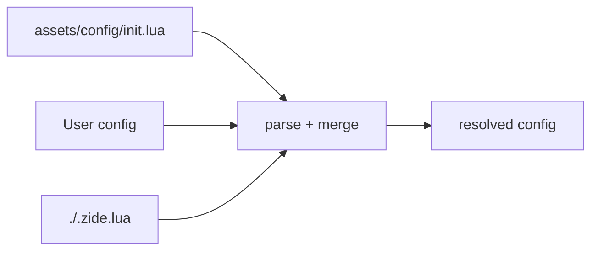
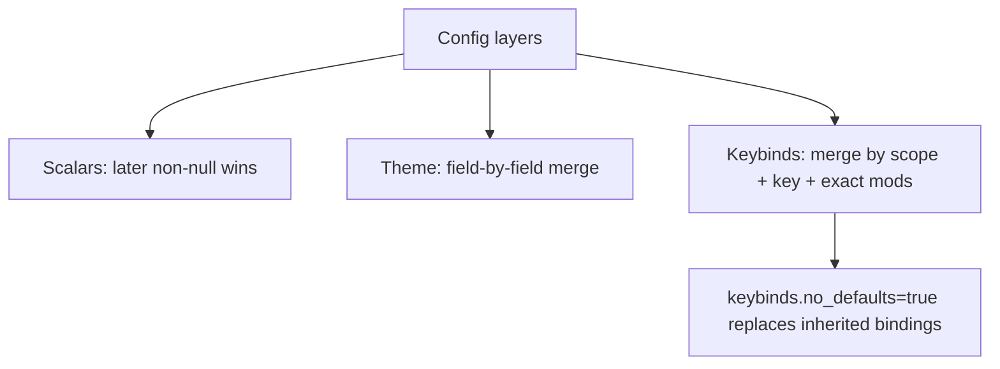
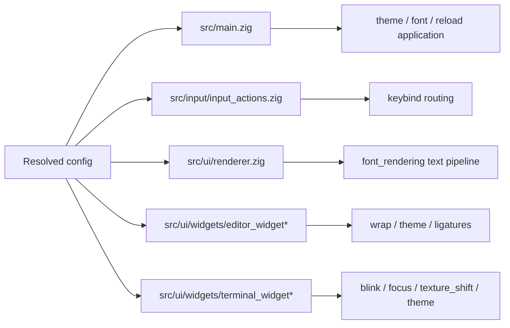
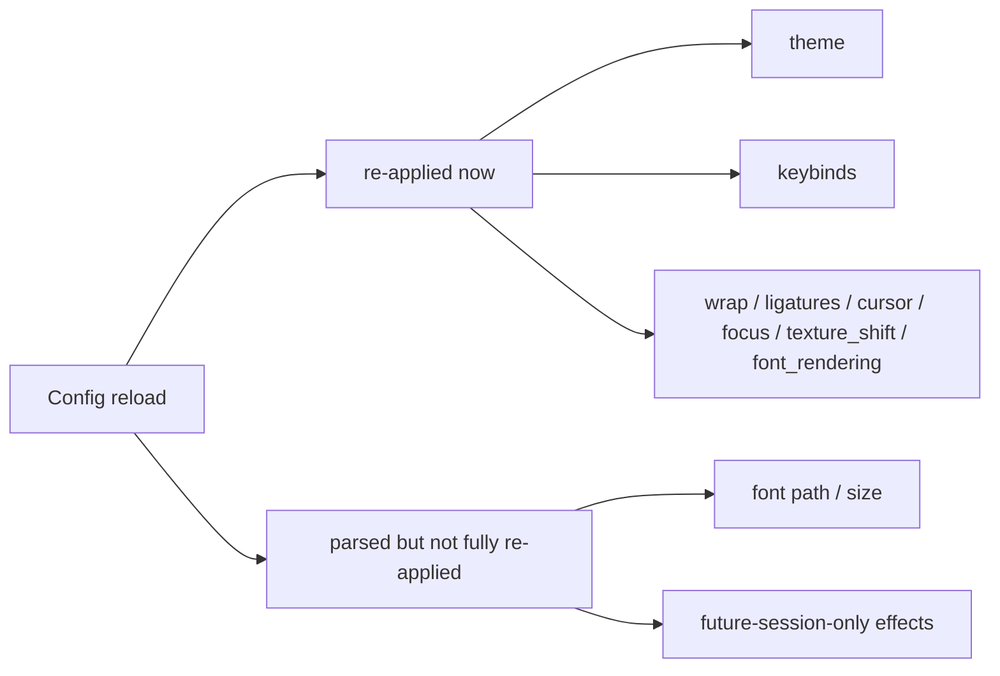

# Configuration

Lua config is a core early-development subsystem. It is not limited to logging anymore.

This document describes the current config surface as implemented today: parser shape, merge rules, runtime consumers, and reload behavior. Treat it as the current development contract, not a final frozen user API.

## Source Of Truth

Parser and merge logic:
- `src/config/lua_config.zig`

Runtime application:
- `src/main.zig`
- `src/ui/renderer.zig`
- `src/ui/widgets/editor_widget*.zig`
- `src/ui/widgets/terminal_widget*.zig`
- `src/input/input_actions.zig`

Defaults reference:
- `assets/config/init.lua`

Tracker:
- `app_architecture/config_todo.md`

## File Load Order

Zide loads config in this order:

1. `assets/config/init.lua`
2. User config:
   - Linux: `${XDG_CONFIG_HOME:-~/.config}/zide/init.lua`
   - macOS: `~/Library/Application Support/Zide/init.lua`
   - Windows: `%APPDATA%\\Zide\\init.lua`
3. Project override: `./.zide.lua`

Later layers override earlier ones.

## Merge Rules

- Scalar fields: later non-null value wins.
- `theme`: merged field-by-field, so partial palette/syntax overrides are supported.
- `keybinds`: merged by binding identity by default.
  - Identity is `scope + key + exact mods`.
  - Override bindings replace matching defaults.
  - Non-matching defaults remain available.
- `keybinds.no_defaults = true`: replace inherited bindings instead of filling gaps.

## Status Labels

This doc uses these status labels:
- `reloadable`: applied at startup and re-applied on config reload.
- `restart-only`: parsed at reload time, but runtime does not fully re-apply it.
- `partial`: supported, but with an important caveat or mismatch.
- `legacy`: accepted for compatibility or historical reasons; not the preferred public shape.

## Config Matrix

### `log`

| Lua path | Meaning | Runtime consumer | Status | Notes |
|---|---|---|---|---|
| `log = "all"|"none"|"tag1,tag2"` | File + console filter shorthand | `src/main.zig` logger setup | `reloadable` | String shorthand applies to both sinks. |
| `log.file` | File logger filter | `src/main.zig` logger setup | `reloadable` | |
| `log.console` | Console logger filter | `src/main.zig` logger setup | `reloadable` | |
| `log.enable` | Backfill for file/console when one or both are unset | `src/main.zig` logger setup | `reloadable` | Convenience form. |

### `sdl`

| Lua path | Meaning | Runtime consumer | Status | Notes |
|---|---|---|---|---|
| `sdl.log_level` | SDL log verbosity | `src/main.zig` -> app shell SDL logger | `reloadable` | Accepted values: `none`, `critical`, `error`, `warning`/`warn`, `info`, `debug`, `trace`. |
| `raylib.log_level` | Legacy alias for SDL log verbosity | `src/config/lua_config.zig` | `legacy` | Accepted if `sdl` is absent. Should be documented as compat only. |

### `theme`

| Lua path | Meaning | Runtime consumer | Status | Notes |
|---|---|---|---|---|
| `theme.palette.*` | Global/fallback palette colors | `src/main.zig`, renderer, editor/terminal/widgets | `reloadable` | Supports hex colors or `{ r, g, b, a }`. |
| `theme.syntax.*` | Global/fallback syntax colors | `src/ui/widgets/editor_widget_draw.zig` | `reloadable` | Used by token coloring. |
| `app.theme.*` | App-specific theme override | `src/main.zig`, UI chrome widgets | `reloadable` | Overrides global `theme` for UI elements (tabs, status, etc). |
| `editor.theme.*` | Editor-specific theme override | `src/main.zig`, editor widgets | `reloadable` | Overrides global `theme` for the text editor pane. |
| `editor.theme.groups.*` | nvim-style named highlight groups | `src/config/lua_config.zig` -> editor token theme fields | `reloadable` | Group values accept direct color, `{ fg=... }`, or `{ link=... }`. |
| `editor.theme.captures.*` | tree-sitter capture-level overrides | `src/config/lua_config.zig` -> editor token theme fields | `reloadable` | Capture keys such as `@keyword.control` are supported. |
| `editor.theme.links.*` | named highlight links | `src/config/lua_config.zig` -> editor token theme fields | `reloadable` | Link resolution is transitive with depth guard. |
| `terminal.theme.*` | Terminal-specific theme override | `src/main.zig`, terminal widgets | `reloadable` | Overrides global `theme` for the terminal pane. Supports `palette.color0..color15`, `palette.ansi = { ... }` (indexed or named), `selection_background` alias, and UI tab-chrome keys (for tab bar styling in `--mode terminal`). |
| flat `theme.<field>` | Alias form for palette/syntax fields | `src/config/lua_config.zig` | `legacy` | Nested `palette` / `syntax` is the preferred shape. |
| alias syntax keys | `comment_color`, `builtin_color`, `error_token` | `src/config/lua_config.zig` | `legacy` | Accepted alongside `comment`, `builtin`, `error`. |

Reload behavior: app/editor/terminal themes are re-resolved from a canonical shell base theme on each config reload, then per-domain overlays are applied. This avoids drift from repeated incremental overlay application. Terminal theme reload remaps existing terminal cells/scrollback that were using prior default fg/bg and ANSI palette colors so open tabs repaint immediately after theme swaps.
Theme import helper: `assets/config/theme_import.lua` provides `from_kitty(path)`, `from_ghostty(path)`, and `merge(...)` to map external terminal themes into Zide's Lua theme shape, including kitty tab keys (`tab_bar_background`, `active_tab_background`, `active_tab_foreground`, `inactive_tab_background`, `inactive_tab_foreground`, `active_border_color`) into terminal UI palette fields. Runtime terminal tab-bar theme adaptation now enforces a strong minimum text/background contrast for active tab labels, so imported low-contrast active-tab foregrounds remain readable.

### `app`

| Lua path | Meaning | Runtime consumer | Status | Notes |
|---|---|---|---|---|
| `app.font.path` / `app.font.size` | Base font choice | `src/main.zig` -> renderer font setup | `partial` | Parsed separately, but current runtime collapses app/editor/terminal font choice to one effective font. |

### `editor`

| Lua path | Meaning | Runtime consumer | Status | Notes |
|---|---|---|---|---|
| `editor.font.path` / `editor.font.size` | Editor font override | `src/main.zig` -> renderer font setup | `partial` | Same shared-font caveat as `app.font`. |
| `editor.wrap` | Soft wrap | `src/main.zig`, editor widget/layout/input | `reloadable` | Defaults to `false`. |
| `editor.tab_bar.width_mode` | IDE/editor tab bar width policy | `src/main.zig` + `src/ui/widgets/tab_bar.zig` | `reloadable` | `fixed`, `dynamic`, `label_length`. |
| `editor.disable_ligatures` | Editor ligature strategy | `src/main.zig` -> renderer/editor draw | `reloadable` | Current values: `never`, `cursor`, `always`. |
| `editor.font_features` | Editor OpenType features | `src/main.zig` -> renderer/editor draw | `reloadable` | Falls back to terminal font features when unset. |
| `editor.render.highlight_budget` | Highlight precompute budget | `src/main.zig` editor precompute path | `reloadable` | `0` disables precompute. |
| `editor.render.width_budget` | Width precompute budget | `src/main.zig` editor precompute path | `reloadable` | `0` disables precompute. |

### `terminal`

| Lua path | Meaning | Runtime consumer | Status | Notes |
|---|---|---|---|---|
| `terminal.font.path` / `terminal.font.size` | Terminal font override | `src/main.zig` -> renderer font setup | `partial` | Same shared-font caveat as `app.font`. |
| `terminal.disable_ligatures` | Terminal ligature strategy | `src/main.zig` -> renderer/terminal draw | `reloadable` | Current values: `never`, `cursor`, `always`. |
| `terminal.font_features` | Terminal OpenType features | `src/main.zig` -> renderer/terminal draw | `reloadable` | |
| `terminal.blink` | Cursor blink policy | `src/main.zig` -> terminal widget | `reloadable` | Preferred values: `kitty`, `off`. Boolean shorthand also accepted. |
| `terminal.texture_shift` | Enable terminal viewport texture-shift optimization | `src/main.zig` -> renderer/terminal draw | `reloadable` | Set `false` to disable the `scrollTerminalTexture` self-copy fast path while keeping normal redraw logic. |
| `terminal.tab_bar.show_single_tab` | Terminal-mode tab bar visibility when only one tab exists | `src/main.zig` terminal layout/draw/input | `reloadable` | `false` hides the tab bar until at least 2 tabs exist; `true` keeps it visible for one tab. |
| `terminal.tab_bar.width_mode` | Terminal-mode tab bar width policy | `src/main.zig` + `src/ui/widgets/tab_bar.zig` | `reloadable` | `fixed`, `dynamic`, `label_length`. |
| `terminal.scrollback` | Scrollback cap | `src/main.zig` -> new terminal sessions | `partial` | Reload updates future session init options, not existing scrollback history. |
| `terminal.cursor.shape` | Default cursor shape | `src/main.zig` -> terminal session init / reload | `reloadable` | `block`, `underline`, `bar`. |
| `terminal.cursor.blink` | Default cursor blink flag | `src/main.zig` -> terminal session init / reload | `reloadable` | |
| `terminal.focus_reporting.window` | Window-focus CSI `?1004` gating | `src/main.zig` -> terminal widget | `reloadable` | |
| `terminal.focus_reporting.pane` | Pane-focus CSI `?1004` gating | `src/main.zig` -> terminal widget | `reloadable` | |
| `terminal.focus_reporting = true/false` | Shorthand for both focus sources | `src/config/lua_config.zig` | `reloadable` | Convenience form. |

### `font_rendering`

| Lua path | Meaning | Runtime consumer | Status | Notes |
|---|---|---|---|---|
| `font_rendering.lcd` | LCD/subpixel raster path | `src/main.zig` -> renderer font rendering options | `reloadable` | Reload rebuilds fonts and refreshes terminal sizing. |
| `font_rendering.hinting` | FreeType hinting mode | `src/main.zig` -> renderer font rendering options | `reloadable` | |
| `font_rendering.autohint` | Force FreeType autohinter | `src/main.zig` -> renderer font rendering options | `reloadable` | |
| `font_rendering.glyph_overflow` | Glyph overflow policy | `src/main.zig` -> renderer font rendering options | `reloadable` | |
| `font_rendering.text.gamma` | Coverage gamma | `src/main.zig` -> renderer text config | `reloadable` | |
| `font_rendering.text.contrast` | Coverage contrast | `src/main.zig` -> renderer text config | `reloadable` | |
| `font_rendering.text.linear_correction` | Linear blending correction toggle | `src/main.zig` -> renderer text config | `reloadable` | |

### `keybinds`

| Lua path | Meaning | Runtime consumer | Status | Notes |
|---|---|---|---|---|
| `keybinds.no_defaults` | Replace inherited bindings instead of merging | `src/config/lua_config.zig` merge path | `reloadable` | Default behavior is fill-gaps merge. |
| `keybinds.global[]` | App-scope routed actions | `src/main.zig` -> `InputRouter` | `reloadable` | |
| `keybinds.editor[]` | Editor-scope routed actions | `src/main.zig` -> `InputRouter` | `reloadable` | |
| `keybinds.terminal[]` | Terminal-scope routed actions | `src/main.zig` -> `InputRouter` | `reloadable` | |
| binding `key` | SDL3 keycode-style key name | input router | `reloadable` | Key names track `shared_types.input.Key` tags. |
| binding `mods` | Exact modifier set | input router | `reloadable` | Lua parser supports `ctrl`, `shift`, `alt`, `super`, and `altgr`; matching is exact. |
| binding `action` | Semantic action id | input router + main dispatch | `reloadable` | Includes terminal tab actions (`terminal_new_tab`, `terminal_close_tab`, `terminal_next_tab`, `terminal_prev_tab`, `terminal_focus_tab_1..9`). |
| binding `repeat` | Repeatable binding flag | input router | `reloadable` | |

## Known Mismatches

### Shared-font reality vs per-domain config shape

The parser stores separate `app.font`, `editor.font`, and `terminal.font`, but runtime currently chooses one effective font stack with precedence:

1. `terminal.font`
2. `editor.font`
3. `app.font`

That means the current Lua surface is more expressive than the actual runtime behavior. This is a real subsystem gap, not just a docs issue.

### Hot reload is not full reload

Current reload support is intentionally partial:
- theme, keybinds, wrap, ligature settings, cursor/blink policy, texture-shift toggle, and focus reporting are re-applied.
- font path/size changes are parsed, but effectively restart-only.

### Validation behavior is improving, but not finished

Current parser policy is moving toward warn-and-default for explicit invalid values.

This is already true for:
- `terminal.scrollback`
- `terminal.cursor.shape`
- `terminal.cursor.blink`
- `sdl.log_level`
- ligature strategy fields
- `terminal.blink`
- `font_rendering.*`

Coverage is still incomplete and tracked in `CFG-04-01`.

### Modifier support drift

The internal input model includes `altgr`, and Lua keybind parsing/matching now treats it as part of exact modifier identity.

Current policy: `altgr` is supported as an advanced desktop modifier for exact-match bindings. It is not the preferred default binding style for mainstream examples, but it is part of the public early-development config surface.

## Preferred Public Shape Right Now

For current config examples and docs, prefer:
- nested `theme.palette` / `theme.syntax`
- `sdl.log_level`, not `raylib.log_level`
- string values for `terminal.blink` (`kitty`, `off`), not boolean shorthand
- partial override configs that rely on merge-by-default keybind behavior
- `app.font` as the base public font knob
- `editor.font` / `terminal.font` only when an override is intentionally taking precedence over the shared runtime font choice

This reflects the current runtime truth and mirrors the conservative direction used by reference terminals: do not advertise separate font stacks until runtime ownership, rebuild behavior, and docs are all real.

## Testing And Maintenance Rules

Any config-surface change should update all of:
- `assets/config/init.lua`
- `app_architecture/CONFIG.md`
- `app_architecture/config_todo.md` when it changes status/coverage

For runtime behavior changes, also verify:
- startup application path in `src/main.zig`
- reload behavior in `reloadConfig()`
- any affected input/editor/terminal/widget path

Dedicated subsystem test target:
- `zig build test-config`
