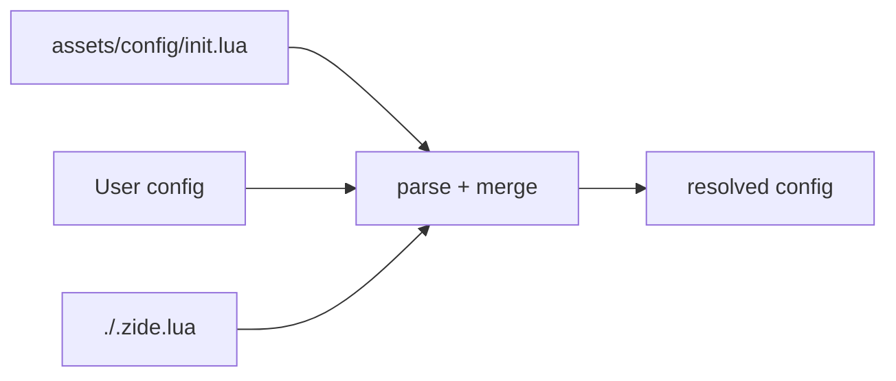
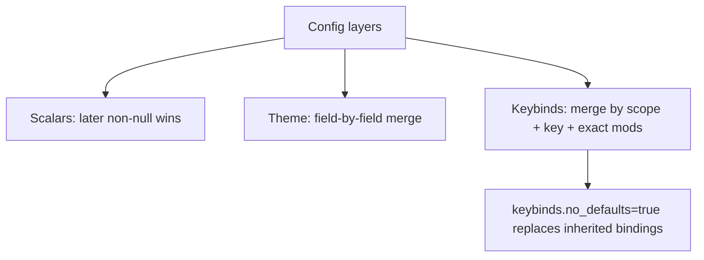
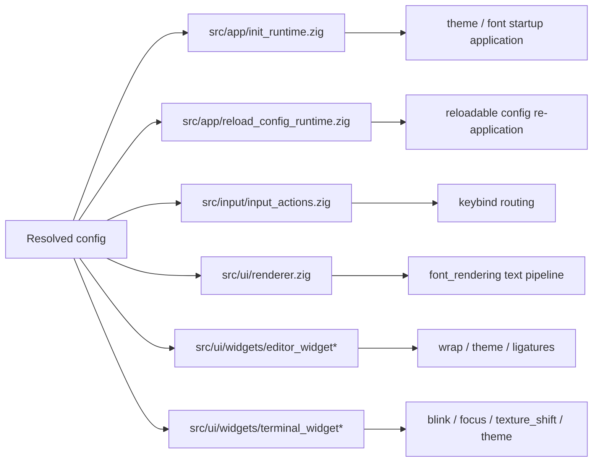
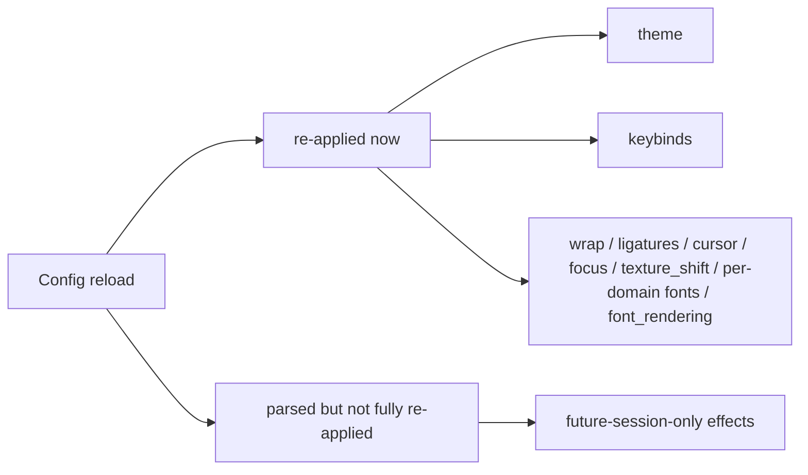

# Configuration

Lua config is a core early-development subsystem. It is not limited to logging anymore.

This document describes the current config surface as implemented today: parser shape, merge rules, runtime consumers, and reload behavior. Treat it as the current development contract, not a final frozen user API.

## Source Of Truth

Parser and merge logic:
- `src/config/lua_config.zig`

Runtime application:
- `src/app/init_runtime.zig`
- `src/app/reload_config_runtime.zig`
- `src/ui/renderer.zig`
- `src/ui/widgets/editor_widget*.zig`
- `src/ui/widgets/terminal_widget*.zig`
- `src/input/input_actions.zig`

Defaults reference:
- `assets/config/init.lua`

Tracker:
- `docs/todo/config.md`

## File Load Order

Zide loads config in this order:

1. `assets/config/init.lua`
2. User config:
   - Linux: `${XDG_CONFIG_HOME:-~/.config}/zide/init.lua`
   - macOS: `~/Library/Application Support/Zide/init.lua`
   - Windows: `%APPDATA%\\Zide\\init.lua`
3. Project override: `./.zide.lua`

Later layers override earlier ones.

```mermaid
flowchart LR
    Defaults[assets/config/init.lua] --> Merge[parse + merge]
    User[User config] --> Merge
    Project[./.zide.lua] --> Merge
    Merge --> Resolved[resolved config]
```

## Startup Application Phases

Config startup should follow these phases strictly:

1. Load and merge config layers into one resolved config.
2. Apply pre-window/bootstrap-safe settings.
   - logger filters / levels
   - SDL log level
3. Derive renderer init options from the resolved config and create the shell.
   - initial font path / size
   - initial font-rendering policy
   - initial text-rendering controls
   - initial platform/UI scale should come from the renderer's platform metrics,
     not from a later corrective rebuild
4. Apply startup-time mutable settings that are allowed to happen after shell
   creation but before first frame.
   - ligature strategy / feature lists
   - selection overlay style
   - terminal texture-shift / present-policy toggles
   - resolved app/editor/terminal themes
5. Construct app/editor/terminal state from the same resolved config.
6. After startup, config reload may only reapply fields that are explicitly
   classified as `reloadable`; restart-only fields must stay restart-only and
   log that truth clearly.

2026-03-20 audit result:

- the main startup-churn bug was renderer font bootstrap: startup used to build
  the hardcoded default face first and then rebuild to the configured face
  immediately after init
- that path is now fixed: renderer startup is seeded from resolved config
- no other startup-applied config path currently shows the same "boot wrong
  state, then visibly repair it" behavior; the remaining post-init settings are
  runtime-mutables applied before first real frame or explicitly restart-only

## Merge Rules

- Scalar fields: later non-null value wins.
- `theme`: merged field-by-field, so partial palette/syntax overrides are supported.
- `keybinds`: merged by binding identity by default.
  - Identity is `scope + key + exact mods`.
  - Override bindings replace matching defaults.
  - Non-matching defaults remain available.
- `keybinds.no_defaults = true`: replace inherited bindings instead of filling gaps.

```mermaid
flowchart TD
    Layers[Config layers] --> Scalars[Scalars: later non-null wins]
    Layers --> Theme[Theme: field-by-field merge]
    Layers --> Keys[Keybinds: merge by scope + key + exact mods]
    Keys --> NoDefaults[keybinds.no_defaults=true replaces inherited bindings]
```

## Status Labels

This doc uses these status labels:
- `reloadable`: applied at startup and re-applied on config reload.
- `restart-only`: parsed at reload time, but runtime does not fully re-apply it.
- `partial`: supported, but with an important caveat or mismatch.
- `legacy`: accepted for compatibility or historical reasons; not the preferred public shape.

## Config Matrix

```mermaid
flowchart LR
    Resolved[Resolved config] --> Startup[src/app/init_runtime.zig]
    Resolved[Resolved config] --> Reload[src/app/reload_config_runtime.zig]
    Resolved --> Router[src/input/input_actions.zig]
    Resolved --> Renderer[src/ui/renderer.zig]
    Resolved --> Editor[src/ui/widgets/editor_widget*]
    Resolved --> Terminal[src/ui/widgets/terminal_widget*]

    Startup --> ThemeApply[theme / font startup application]
    Reload --> ReloadApply[reloadable config re-application]
    Router --> Keybinds[keybind routing]
    Renderer --> TextCfg[font_rendering text pipeline]
    Editor --> EditorOpts[wrap / theme / ligatures]
    Terminal --> TerminalOpts[blink / focus / texture_shift / theme]
```

### `log`

| Lua path | Meaning | Runtime consumer | Status | Notes |
|---|---|---|---|---|
| `log = "all"|"none"|"tag1,tag2"` | File + console filter shorthand | `src/main.zig` logger setup | `reloadable` | String shorthand applies to both sinks. |
| `log.file` | File logger filter | `src/main.zig` logger setup | `reloadable` | |
| `log.console` | Console logger filter | `src/main.zig` logger setup | `reloadable` | |
| `log.enable` | Backfill for file/console when one or both are unset | `src/main.zig` logger setup | `reloadable` | Convenience form. |
| `log_file_output_mode` | Direct file sink output mode | `src/app/init_runtime.zig`, `src/app/reload_config_runtime.zig` | `reloadable` | `text` or `jsonl`. |
| `log_console_output_mode` | Direct console sink output mode | `src/app/init_runtime.zig`, `src/app/reload_config_runtime.zig` | `reloadable` | `text` or `jsonl`. |
| `logs.mode` | Shared output-mode default for file + console | `src/app/init_runtime.zig`, `src/app/reload_config_runtime.zig` | `reloadable` | Applies to both sinks unless a direct per-sink mode overrides it. |
| `logs.file_mode` | File sink output mode | `src/app/init_runtime.zig`, `src/app/reload_config_runtime.zig` | `reloadable` | Preferred nested form. |
| `logs.console_mode` | Console sink output mode | `src/app/init_runtime.zig`, `src/app/reload_config_runtime.zig` | `reloadable` | Preferred nested form. |
| `logs.groups.<name>.tags` | Grouped file-sink tag filter list | `src/app_logger.zig` grouped sink routing | `reloadable` | Accepts string or string-list; exact tags and `prefix.*` wildcard prefixes are supported. |
| `logs.groups.<name>.file` | Grouped sink file path | `src/app_logger.zig` grouped sink routing | `reloadable` | Relative to cwd today. If omitted, defaults to `zide-<name>.log` or `zide-<name>.jsonl` based on mode. |
| `logs.groups.<name>.mode` | Grouped sink output mode | `src/app_logger.zig` grouped sink routing | `reloadable` | `text` or `jsonl`; defaults to `text`. |

### `sdl`

| Lua path | Meaning | Runtime consumer | Status | Notes |
|---|---|---|---|---|
| `sdl.log_level` | SDL log verbosity | `src/main.zig` -> app shell SDL logger | `reloadable` | Accepted values: `none`, `critical`, `error`, `warning`/`warn`, `info`, `debug`, `trace`. |
| `raylib.log_level` | Legacy alias for SDL log verbosity | `src/config/lua_config.zig` | `legacy` | Accepted if `sdl` is absent. Should be documented as compat only. |

### `theme`

| Lua path | Meaning | Runtime consumer | Status | Notes |
|---|---|---|---|---|
| `theme.palette.*` | Global/fallback palette colors | `src/main.zig`, renderer, editor/terminal/widgets | `reloadable` | Supports hex colors or `{ r, g, b, a }`. |
| `theme.syntax.*` | Global/fallback syntax colors | `src/ui/widgets/editor_widget_draw.zig` | `reloadable` | Used by token coloring. |
| `theme.palette.ui_window_control_fg` | Integrated window-control icon foreground | `src/app/theme_utils.zig`, terminal integrated chrome draw | `reloadable` | Optional explicit foreground for integrated caption buttons. Runtime hardens it once against `ui_bar_bg` and `ui_hover` so button icons stay readable without per-frame contrast work. |
| `app.theme.*` | App-specific theme override | `src/main.zig`, UI chrome widgets | `reloadable` | Overrides global `theme` for UI elements (tabs, status, etc). |
| `editor.theme.*` | Editor-specific theme override | `src/main.zig`, editor widgets | `reloadable` | Overrides global `theme` for the text editor pane. |
| `editor.theme.groups.*` | nvim-style named highlight groups | `src/config/lua_config.zig` -> editor token theme fields | `reloadable` | Group values accept direct color, `{ fg=... }`, or `{ link=... }`. |
| `editor.theme.captures.*` | tree-sitter capture-level overrides | `src/config/lua_config.zig` -> editor token theme fields | `reloadable` | Capture keys such as `@keyword.control` are supported. |
| `editor.theme.links.*` | named highlight links | `src/config/lua_config.zig` -> editor token theme fields | `reloadable` | Link resolution is transitive with depth guard. |
| `terminal.theme.*` | Terminal-specific theme override | `src/main.zig`, terminal widgets | `reloadable` | Overrides global `theme` for the terminal pane. Supports `palette.color0..color15`, `palette.ansi = { ... }` (indexed or named), `selection_background` alias, and UI tab-chrome keys (for tab bar styling in `--mode terminal`). |
| flat `theme.<field>` | Alias form for palette/syntax fields | `src/config/lua_config.zig` | `legacy` | Nested `palette` / `syntax` is the preferred shape. |
| alias syntax keys | `comment_color`, `builtin_color`, `error_token` | `src/config/lua_config.zig` | `legacy` | Accepted alongside `comment`, `builtin`, `error`. |

Reload behavior: app/editor/terminal themes are re-resolved from a canonical shell base theme on each config reload, then per-domain overlays are applied. This avoids drift from repeated incremental overlay application. Terminal theme reload remaps existing terminal cells/scrollback that were using prior default fg/bg and ANSI palette colors so open tabs repaint immediately after theme swaps.
Theme import helper: `assets/config/theme_import.lua` provides `from_kitty(path)`, `from_ghostty(path)`, and `merge(...)` to map external terminal themes into Zide's Lua theme shape, including kitty tab keys (`tab_bar_background`, `active_tab_background`, `active_tab_foreground`, `inactive_tab_background`, `inactive_tab_foreground`, `active_border_color`) into terminal UI palette fields. Runtime terminal tab-bar theme adaptation now enforces a strong minimum text/background contrast for active tab labels, so imported low-contrast active-tab foregrounds remain readable.

Editor-theme import direction: the current shared theme schema is already broad
enough to serve as the import target for external IDE/editor themes too. The
preferred target shape is:
- shared `theme.palette` fields where semantics genuinely overlap
- `editor.theme.syntax` for coarse token buckets
- `editor.theme.groups` for named highlight groups
- `editor.theme.captures` for Treesitter-style capture overrides
- `editor.theme.links` for explicit group/capture link chains

This is intentionally broader than terminal palette import. Future Neovim or
VS Code theme importers should target this same shared/editor schema rather
than introducing a separate importer-specific theme model.

Deferred theme-surface split: this shared schema should not be read as a claim
that app chrome, editor buffer, and terminal presentation must remain one flat
runtime theme forever. The intended direction is:
- app chrome theme surface
- editor/buffer theme surface
- terminal theme surface

For now, editor-theme work should stay focused on making the editor/buffer
surface honest and complete. Shared widgets that appear in multiple modes
should eventually consume resolved style tokens supplied by the owning host
instead of reaching into one implicit global bucket. That cross-surface/widget
split is deferred until the editor theme surface is stable enough to act as a
real authority.

Current limitation: editor theme import now preserves Neovim-style highlight
metadata in config/theme parsing for the main editor syntax buckets, including
`italic`, `bold`, `underline`, `undercurl`, `strikethrough`, `reverse`,
`nocombine`, and special underline color (`sp`). The editor draw path now
consumes the low-cost decoration subset (`underline`, `strikethrough`, `sp`,
and a basic `undercurl` approximation), applies a simple bold overdraw
approximation, and now renders `italic` via a synthetic glyph-slant cache
variant in the font raster path. It still does not render richer style
semantics such as `reverse` or `nocombine`. The remaining gap for
"proper" Neovim theme translation is therefore richer runtime style
rendering, not schema preservation.

### `app`

| Lua path | Meaning | Runtime consumer | Status | Notes |
|---|---|---|---|---|
| `app.font.path` / `app.font.size` | Base app/UI font choice | `src/app/init_runtime.zig`, `src/app/reload_config_runtime.zig` -> renderer font setup | `reloadable` | Drives app chrome and default fallback for editor/terminal when their own font block is unset. |

### `editor`

| Lua path | Meaning | Runtime consumer | Status | Notes |
|---|---|---|---|---|
| `editor.font.path` / `editor.font.size` | Editor font override | `src/app/init_runtime.zig`, `src/app/reload_config_runtime.zig` -> renderer font setup | `reloadable` | Drives editor text/layout directly; falls back field-by-field to `app.font` when unset. |
| `editor.wrap` | Soft wrap | `src/main.zig`, editor widget/layout/input | `reloadable` | Defaults to `false`. |
| `editor.imported_theme` | Load a shipped imported editor theme artifact by name | config load path -> theme merge | `reloadable` | Current artifacts live under `assets/themes/<name>.lua`. Imported theme config is merged first, then the rest of the same config file can override it. |
| `editor.tab_bar.width_mode` | IDE/editor tab bar width policy | `src/main.zig` + `src/ui/widgets/tab_bar.zig` | `reloadable` | `fixed`, `dynamic`, `label_length`. |
| `editor.disable_ligatures` | Editor ligature strategy | `src/main.zig` -> renderer/editor draw | `reloadable` | Current values: `never`, `cursor`, `always`. |
| `editor.font_features` | Editor OpenType features | `src/main.zig` -> renderer/editor draw | `reloadable` | Falls back to terminal font features when unset. |
| `editor.render.highlight_budget` | Highlight precompute budget | `src/main.zig` editor precompute path | `reloadable` | `0` disables precompute. |
| `editor.render.width_budget` | Width precompute budget | `src/main.zig` editor precompute path | `reloadable` | `0` disables precompute. |

### `terminal`

| Lua path | Meaning | Runtime consumer | Status | Notes |
|---|---|---|---|---|
| `terminal.font.path` / `terminal.font.size` | Terminal font override | `src/app/init_runtime.zig`, `src/app/reload_config_runtime.zig` -> renderer font setup | `reloadable` | Drives terminal cell metrics directly; falls back field-by-field to `app.font` when unset. |
| `terminal.shell.path` | Shared PTY shell/program path | `src/app/init_runtime.zig`, `src/app/reload_config_runtime.zig`, `src/app/new_terminal_runtime.zig` | `partial` | Applies immediately to future terminal sessions in IDE/editor/terminal modes; existing PTYs keep their current child process. CLI/launcher `--shell` still overrides it. |
| `terminal.window_chrome.mode` | Terminal-only window chrome policy | `src/app/init_runtime.zig`, `src/app/reload_config_runtime.zig`, `src/app/post_preinput_hooks_runtime.zig` | `partial` | Accepted values: `native`, `integrated`. Windows terminal-only mode now consumes it at runtime: `native` keeps the ordinary framed tab row, while `integrated` enables the borderless titleband contract with compact tabs, caption buttons, and hit-test routing. The surface stays platform-capable even though Windows is the first implementation. |
| `terminal.disable_ligatures` | Terminal ligature strategy | `src/main.zig` -> renderer/terminal draw | `reloadable` | Current values: `never`, `cursor`, `always`. |
| `terminal.font_features` | Terminal OpenType features | `src/main.zig` -> renderer/terminal draw | `reloadable` | |
| `terminal.blink` | Cursor blink policy | `src/main.zig` -> terminal widget | `reloadable` | Preferred values: `kitty`, `off`. Boolean shorthand also accepted. |
| `terminal.texture_shift` | Enable terminal viewport texture-shift optimization | `src/main.zig` -> renderer/terminal draw | `reloadable` | Set `false` to disable the `scrollTerminalTexture` self-copy fast path while keeping normal redraw logic. |
| `terminal.tab_bar.show_single_tab` | Terminal-mode tab bar visibility when only one tab exists | `src/main.zig` terminal layout/draw/input | `reloadable` | `false` hides the ordinary content-row tab bar until at least 2 tabs exist; `true` keeps it visible for one tab. Integrated terminal chrome keeps the top titleband visible even with one tab because the band also owns drag/caption behavior. |
| `terminal.tab_bar.width_mode` | Terminal-mode tab bar width policy | `src/main.zig` + `src/ui/widgets/tab_bar.zig` | `reloadable` | `fixed`, `dynamic`, `label_length`. Integrated terminal chrome normalizes this to a compact internal width policy instead of stretching tabs to fill the whole titleband. |
| `terminal.scrollback` | Scrollback cap | `src/main.zig` -> new terminal sessions | `partial` | Reload updates future session init options, not existing scrollback history. |
| `terminal.cursor.shape` | Default cursor shape | `src/main.zig` -> terminal session init / reload | `reloadable` | `block`, `underline`, `bar`. |
| `terminal.cursor.blink` | Default cursor blink flag | `src/main.zig` -> terminal session init / reload | `reloadable` | |
| `terminal.focus_reporting.window` | Window-focus CSI `?1004` gating | `src/main.zig` -> terminal widget | `reloadable` | |
| `terminal.focus_reporting.pane` | Pane-focus CSI `?1004` gating | `src/main.zig` -> terminal widget | `reloadable` | |
| `terminal.focus_reporting = true/false` | Shorthand for both focus sources | `src/config/lua_config.zig` | `reloadable` | Convenience form. |
| `terminal.tab_bar.show_shell_icon` | Toggle per-shell tab image prefixes | `src/app/terminal/terminal_tab_bar_sync.zig`, `src/app/tabs/tabbar_draw_runtime.zig` | `reloadable` | `true` enables config-mapped PNG icons ahead of terminal tab labels. |
| `terminal.tab_bar.shell_icons` | Shell path/basename/stem -> PNG path map | `src/config/lua_config.zig`, `src/app/terminal/terminal_shell_icon_runtime.zig` | `reloadable` | Runtime matches exact shell path first, then basename, then basename stem. PNG paths are config-owned; no built-in shell icon map exists yet. |

### `font_rendering`

| Lua path | Meaning | Runtime consumer | Status | Notes |
|---|---|---|---|---|
| `font_rendering.lcd` | LCD/subpixel raster path | `src/main.zig` -> renderer font rendering options | `reloadable` | Reload rebuilds fonts and refreshes terminal sizing. |
| `font_rendering.hinting` | FreeType hinting mode | `src/main.zig` -> renderer font rendering options | `reloadable` | |
| `font_rendering.autohint` | Force FreeType autohinter | `src/main.zig` -> renderer font rendering options | `reloadable` | |
| `font_rendering.glyph_overflow` | Glyph overflow policy | `src/main.zig` -> renderer font rendering options | `reloadable` | |
| `font_rendering.text.gamma` | Coverage gamma | `src/main.zig` -> renderer text config | `reloadable` | |
| `font_rendering.text.contrast` | Coverage contrast | `src/main.zig` -> renderer text config | `reloadable` | |
| `font_rendering.text.linear_correction` | Linear blending correction toggle | `src/main.zig` -> renderer text config | `reloadable` | |

### `keybinds`

| Lua path | Meaning | Runtime consumer | Status | Notes |
|---|---|---|---|---|
| `keybinds.no_defaults` | Replace inherited bindings instead of merging | `src/config/lua_config.zig` merge path | `reloadable` | Default behavior is fill-gaps merge. |
| `keybinds.global[]` | App-scope routed actions | `src/main.zig` -> `InputRouter` | `reloadable` | |
| `keybinds.editor[]` | Editor-scope routed actions | `src/main.zig` -> `InputRouter` | `reloadable` | |
| `keybinds.terminal[]` | Terminal-scope routed actions | `src/main.zig` -> `InputRouter` | `reloadable` | |
| binding `key` | SDL3 keycode-style key name | input router | `reloadable` | Key names track `shared_types.input.Key` tags. |
| binding `mods` | Exact modifier set | input router | `reloadable` | Lua parser supports `ctrl`, `shift`, `alt`, `super`, and `altgr`; matching is exact. |
| binding `action` | Semantic action id | input router + main dispatch | `reloadable` | Includes terminal tab actions (`terminal_new_tab`, `terminal_close_tab`, `terminal_next_tab`, `terminal_prev_tab`, `terminal_focus_tab_1..9`). |
| binding `repeat` | Repeatable binding flag | input router | `reloadable` | |

## Known Mismatches

### Hot reload is not full reload

Current reload support is intentionally partial:
- theme, keybinds, wrap, ligature settings, cursor/blink policy, texture-shift toggle, and focus reporting are re-applied.
- per-domain app/editor/terminal font path/size and `font_rendering.*` changes are re-applied immediately.
- some session-init settings still only affect new sessions.

```mermaid
flowchart LR
    Reload[Config reload] --> Reapply[re-applied now]
    Reload --> ParsedOnly[parsed but not fully re-applied]

    Reapply --> A[theme]
    Reapply --> B[keybinds]
    Reapply --> C[wrap / ligatures / cursor / focus / texture_shift / per-domain fonts / font_rendering]

    ParsedOnly --> D[future-session-only effects]
```

### Validation behavior is improving, but not finished

Current parser policy is moving toward warn-and-default for explicit invalid values.

This is already true for:
- `terminal.scrollback`
- `terminal.cursor.shape`
- `terminal.cursor.blink`
- `sdl.log_level`
- ligature strategy fields
- `terminal.blink`
- `font_rendering.*`

Coverage is still incomplete and tracked in `CFG-04-01`.

### Modifier support drift

The internal input model includes `altgr`, and Lua keybind parsing/matching now treats it as part of exact modifier identity.

Current policy: `altgr` is supported as an advanced desktop modifier for exact-match bindings. It is not the preferred default binding style for mainstream examples, but it is part of the public early-development config surface.

## Preferred Public Shape Right Now

For current config examples and docs, prefer:
- nested `theme.palette` / `theme.syntax`
- `sdl.log_level`, not `raylib.log_level`
- string values for `terminal.blink` (`kitty`, `off`), not boolean shorthand
- partial override configs that rely on merge-by-default keybind behavior
- `app.font` as the base public font knob
- `editor.font` / `terminal.font` when editor or terminal should intentionally diverge from app chrome font choice

This reflects the current runtime truth: app chrome, editor text, and terminal text now have distinct runtime font ownership while still sharing one reload/scale contract.

## Testing And Maintenance Rules

Logging/config direction note:

- logging remains Lua-configurable and agent-owned through `./.zide.lua`
- future structured logging and grouped sink routing must stay aligned with:
  - `app_architecture/tools/STRUCTURED_LOGGING.md`
  - `app_architecture/tools/PERFORMANCE_TOOLING.md`
- config syntax may grow, but it should continue to control one logger system
  rather than separate human/debug and machine/perf logging stacks

Any config-surface change should update all of:
- `assets/config/init.lua`
- `app_architecture/CONFIG.md`
- `docs/todo/config.md` when it changes status/coverage

For runtime behavior changes, also verify:
- startup application path in `src/app/init_runtime.zig`
- reload behavior in `src/app/reload_config_runtime.zig`
- any affected input/editor/terminal/widget path

Dedicated subsystem test target:
- `zig build test-config`
  - root: `src/config_tests.zig`

Manual reload spot check for per-domain font changes:
- edit `app.font`, `editor.font`, or `terminal.font` in `./.zide.lua` or the user config
- trigger `reload_config` (default binding: `Ctrl+Shift+F5`)
- verify app chrome, editor, and terminal redraw immediately with the intended font changes

Manual reload spot check for terminal shell changes:
- edit `terminal.shell.path` in `./.zide.lua` or the user config
- trigger `reload_config` (default binding: `Ctrl+Shift+F5`)
- open a new terminal tab/session and verify the new PTY uses the updated shell path
