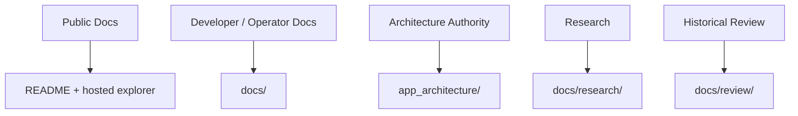
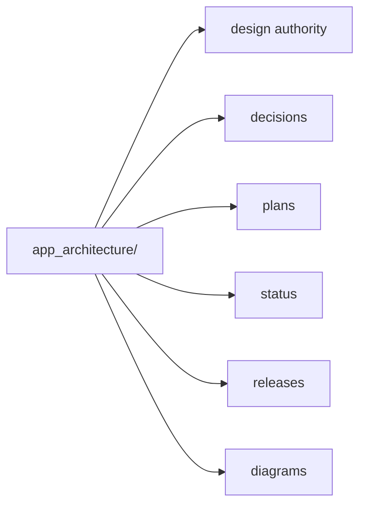

# Doc Taxonomy Proposal

Date: 2026-03-19

## Purpose

Define the stricter documentation model proposed during the editor redesign
 planning pass.

The user direction is:

- `docs/` should be developer/operator-facing
- `app_architecture/` should own design authority, diagrams, feature plans,
  implementation status, and release/design communication

The repo is close to this already, but not strict enough.

## Current Problem

The current written policy says:

- `docs/` is contributor/operator-facing
- `app_architecture/` is current technical authority

But actual placement is mixed:

- some architecture docs contain active status/progress logs
- some release/checkpoint communication lives in `app_architecture/`
- some release notes live in `docs/releases/`
- some mixed journey docs blur current authority and historical narrative

The result is that placement is understandable, but not crisp.

## Proposed Model

## Ownership Rules

### `README.md` and hosted explorer

Own:

- customer-facing overview
- public discovery
- high-level feature communication

### `docs/`

Own:

- workflow
- handoff
- developer/operator reference
- active execution queues that are not themselves architecture authority
- research
- review/history

Do not own:

- current design authority
- architecture diagrams as authority
- release/design checkpoint communication

### `app_architecture/`

Own:

- current design authority
- subsystem boundaries
- design diagrams
- feature plans when they define the intended target shape
- implementation status when it is part of architecture communication
- release/checkpoint communication tied to architecture/design

## Proposed Internal Structure

This can be implemented either with explicit top-level subfolders or by keeping
 domain folders and using strict file naming/placement rules inside them.

## Practical Placement Test

If a document answers one of these questions:

- “What is the current intended system shape?”
- “What boundary or contract is authoritative?”
- “What is the design target for this feature?”
- “What architecture/status checkpoint are we communicating?”

It belongs in `app_architecture/`.

If it answers:

- “How does a contributor/operator work with the repo?”
- “What is the current execution queue?”
- “What exploratory comparison did we do?”
- “What happened historically?”

It belongs in `docs/`.

## Migration Direction

1. Keep `docs/WORKFLOW.md` as the normative placement rule source.
2. Update it to explicitly say that `app_architecture/` owns design authority
   plus architecture communication.
3. Move release communication from `docs/releases/` into
   `app_architecture/releases/`.
4. Move mixed checkpoint/progress docs into clearer architecture status/plans
   locations.
5. Keep `docs/todo/` for execution queues, but move target contracts out of
   those files into `app_architecture/`.
6. Keep `docs/research/` for unratified comparisons and reference studies.
7. Keep `docs/review/` for historical evidence only.

## Risks

- putting status/plans into `app_architecture/` increases churn there
- if subfolders are not strict, authority docs will become noisy
- splitting mixed docs improves clarity but increases doc count

## Decision Direction

Recommended direction:

- adopt this taxonomy
- do not perform a bulk move immediately
- use the next editor redesign docs as the first clean example of the stricter
  model
- then migrate older mixed docs in small batches
