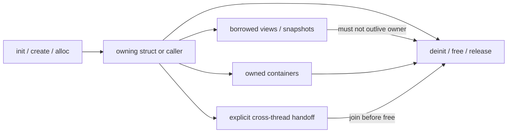
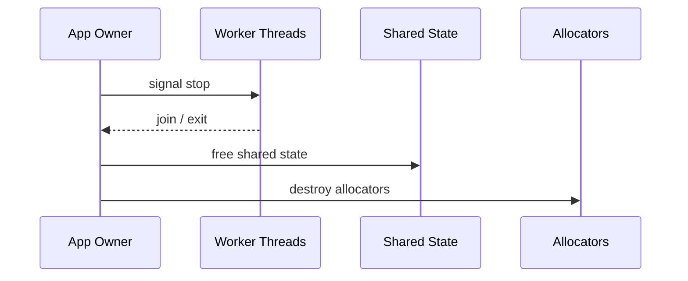
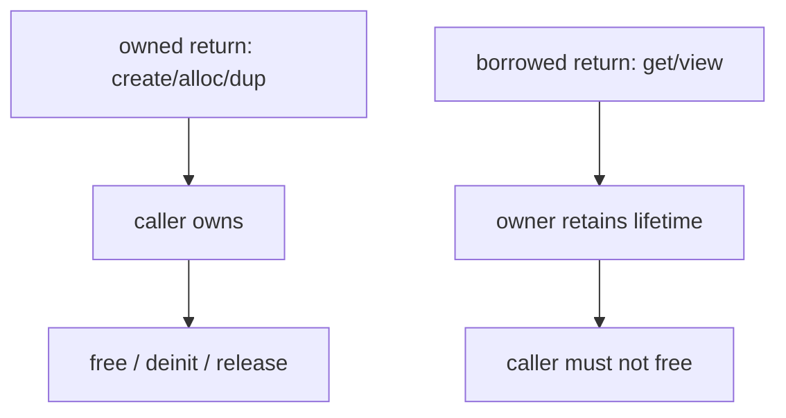
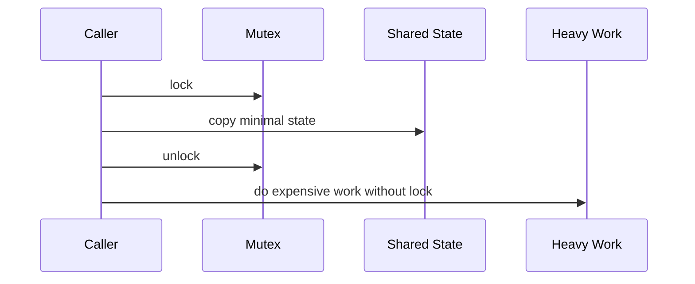

# Engineering guidelines

Goal: keep memory and threading safe and boring. These rules are simple on purpose.

Scope note, 2026-03-15:

- This file is the cross-cutting engineering baseline for current code on
  `main`.
- Subsystem-specific ownership contracts should live in their owning docs
  (for example terminal FFI acquire/release rules in
  `app_architecture/terminal/FFI_*` docs) rather than being duplicated here.
- Historical reviews and one-off investigations belong under
  `docs/review/`.

## Ownership Flow

## Shutdown Order

## Memory ownership (who allocates, who frees)

- The function that allocates is responsible for documenting who frees.
- Default rule: "creator frees". If a function returns an owned pointer/slice, name it (e.g. `create*`, `alloc*`, `dup*`).
- If a function returns a borrowed slice, name it (e.g. `get*`, `view*`) and keep it valid only for the caller's immediate use.
- For structs with `init/deinit`, all allocations done in `init` must be released in `deinit`.
- Any `errdefer` should clean up every resource allocated so far (FreeType, HarfBuzz, textures, buffers, etc.).

## Containers

- `ArrayList`/`HashMap` must be `deinit`'d in the owning struct's `deinit`.
- If you store pointers or owned slices in containers, you must free each element before `deinit`.
- If you store borrowed slices, document the lifetime contract at the point of insertion.

## Undo / history

- Undo stacks are capped. When exceeding the cap, evict the oldest entries and free their buffers.
- Large edits over the cap should clear history to avoid huge temporary allocations.

## Threading

- Locking rule: if a function takes a lock, it should not call any external code that might re-enter or block indefinitely.
- Long-running work should not hold locks; copy minimal data, drop the lock, then work.
- Shutdown order: stop worker threads first, then free shared data, then destroy allocators.
- Avoid cross-thread ownership unless it is explicit and documented.

## FFI and C libraries

- If C returns a heap allocation, wrap it and free it in `deinit` or a paired `free*` function.
- For any FFI API that returns a buffer to the caller, document the required free function in the same file.
- For snapshot/event style FFI APIs, name the paired release functions explicitly in both the ABI doc and the smoke host (`snapshot_acquire`/`snapshot_release`, `event_drain`/`events_free`).
- Always clean up partial state with `errdefer` when constructing C resources.

## Review checklist (quick)

- Every `init` has a matching `deinit` that frees all fields.
- Every `alloc/dupe/create` has a clear owner and a free path.
- No "owned" data is stored as borrowed references.
- Locks are not held across blocking I/O or callbacks.
- Thread shutdown joins before shared memory is freed.
