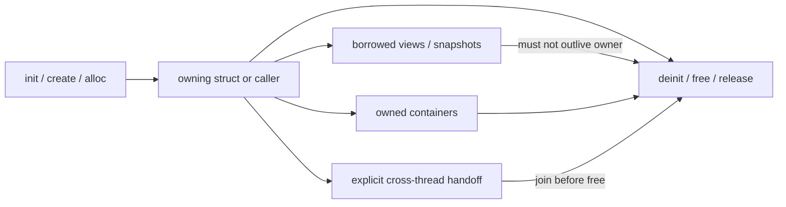
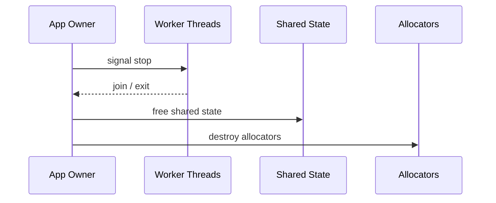
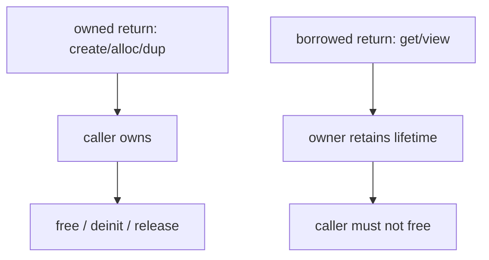
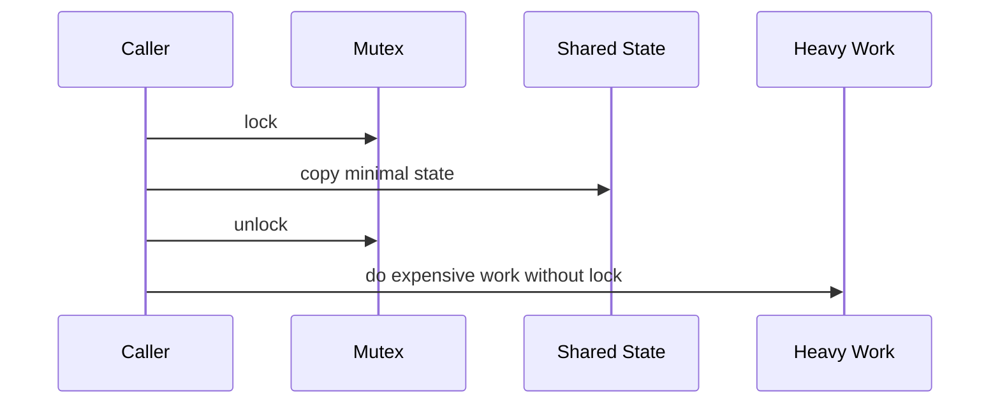

# Engineering guidelines

## Product Identity

Zide is a pure-Zig terminal engine with first-class native implementations on
each target platform. These are not separable things.

**The core is the real product.** It is a ruthlessly clean, fast, lean Zig
engine layer. It is not shaped by any single platform. It does not carry
platform-specific concessions, fallbacks, or convenience shims. No single
target environment gets to decide core shape or standards.

**Native implementations are first-class, not wrappers.** Each one targets the
most competitive version of Zide achievable on its platform:

- Linux: native OpenGL, compositor-aware, full terminal fidelity
- Windows: native shell integration, compositor-native chrome
- macOS: Metal by the official spec, not approximated
- Android: first-class mobile terminal — aim beyond what the platform has seen

**Quality rules that follow:**

- No fallbacks in core for platform weaknesses — those belong in the native
  layer or do not exist
- No stale code blocks tolerated at any layer
- No investigation leftovers in product paths: debugging/profiling artifacts
  must either become named correctness contracts, gated operator telemetry, or
  explicitly armed probes; otherwise delete them
- No reinventing what the platform already provides cleanly
- The renderer backend abstraction is intentionally open-ended — it adapts to
  proved real-world truth, not speculation
- If two platforms need different behavior, the difference lives in the native
  layer, not the core
- Pure architecture is not negotiable for delivery speed

---

## Implementation guidelines

Goal: keep memory and threading safe and boring. These rules are simple on purpose.

Scope note, 2026-03-15:

- This file is the cross-cutting engineering baseline for current code on
  `main`.
- Subsystem-specific ownership contracts should live in their owning docs
  (for example terminal FFI acquire/release rules in
  `app_architecture/terminal/FFI_*` docs) rather than being duplicated here.
- Historical reviews and one-off investigations belong under
  `docs/review/`.

## Ownership Flow

```mermaid
flowchart LR
    Init["init / create / alloc"] --> Owner["owning struct or caller"]
    Owner --> Borrow["borrowed views / snapshots"]
    Owner --> Container["owned containers"]
    Owner --> Thread["explicit cross-thread handoff"]
    Owner --> Deinit["deinit / free / release"]

    Borrow -->|must not outlive owner| Deinit
    Container --> Deinit
    Thread -->|join before free| Deinit
```

## Shutdown Order

```mermaid
sequenceDiagram
    participant App as App Owner
    participant Worker as Worker Threads
    participant Shared as Shared State
    participant Alloc as Allocators

    App->>Worker: signal stop
    Worker-->>App: join / exit
    App->>Shared: free shared state
    App->>Alloc: destroy allocators
```

## Memory ownership (who allocates, who frees)

- The function that allocates is responsible for documenting who frees.
- Default rule: "creator frees". If a function returns an owned pointer/slice, name it (e.g. `create*`, `alloc*`, `dup*`).
- If a function returns a borrowed slice, name it (e.g. `get*`, `view*`) and keep it valid only for the caller's immediate use.
- For structs with `init/deinit`, all allocations done in `init` must be released in `deinit`.
- Any `errdefer` should clean up every resource allocated so far (FreeType, HarfBuzz, textures, buffers, etc.).

```mermaid
flowchart TD
    Owned[owned return: create/alloc/dup] --> CallerOwns[caller owns]
    CallerOwns --> FreePath[free / deinit / release]

    Borrowed[borrowed return: get/view] --> OwnerRetains[owner retains lifetime]
    OwnerRetains --> NoFree[caller must not free]
```

## Containers

- `ArrayList`/`HashMap` must be `deinit`'d in the owning struct's `deinit`.
- If you store pointers or owned slices in containers, you must free each element before `deinit`.
- If you store borrowed slices, document the lifetime contract at the point of insertion.

## Undo / history

- Undo stacks are capped. When exceeding the cap, evict the oldest entries and free their buffers.
- Large edits over the cap should clear history to avoid huge temporary allocations.

## Threading

- Locking rule: if a function takes a lock, it should not call any external code that might re-enter or block indefinitely.
- Long-running work should not hold locks; copy minimal data, drop the lock, then work.
- Shutdown order: stop worker threads first, then free shared data, then destroy allocators.
- Avoid cross-thread ownership unless it is explicit and documented.

```mermaid
sequenceDiagram
    participant Caller
    participant Mutex
    participant Shared as Shared State
    participant Work as Heavy Work

    Caller->>Mutex: lock
    Caller->>Shared: copy minimal state
    Caller->>Mutex: unlock
    Caller->>Work: do expensive work without lock
```

## FFI and C libraries

- If C returns a heap allocation, wrap it and free it in `deinit` or a paired `free*` function.
- For any FFI API that returns a buffer to the caller, document the required free function in the same file.
- For snapshot/event style FFI APIs, name the paired release functions explicitly in both the ABI doc and the smoke host (`snapshot_acquire`/`snapshot_release`, `event_drain`/`events_free`).
- Always clean up partial state with `errdefer` when constructing C resources.

## Review checklist (quick)

- Every `init` has a matching `deinit` that frees all fields.
- Every `alloc/dupe/create` has a clear owner and a free path.
- No "owned" data is stored as borrowed references.
- Locks are not held across blocking I/O or callbacks.
- Thread shutdown joins before shared memory is freed.

## Boundary smell checklist (quick)

Use this when code looks reasonable locally but has a history of creating
cross-layer architectural drift.

- Ask "is this engine truth, bridge convenience, or host presentation?"
  If the answer is "a little of each", that is usually the smell.
- Reject convenience helpers in core/session code when they package host policy
  rather than terminal facts.
- Reject duplicated geometry/pacing/hover rules when one runtime owner already
  exists for that behavior.
- Prefer exporting one structured fact over exporting one pre-formatted string.
- Prefer host-side presentation composition over backend-side title/chip/badge
  formatting.
- Treat "just one more helper" with suspicion when it crosses from:
  - engine fact -> host policy
  - bridge convenience -> engine API
  - app chrome -> widget/content behavior
- If a feature needs the same rule in more than one layer, stop and create one
  authority rather than copying the heuristic.
- If a helper would be awkward or unjustified for an FFI host, it is probably
  in the wrong layer on native too.
