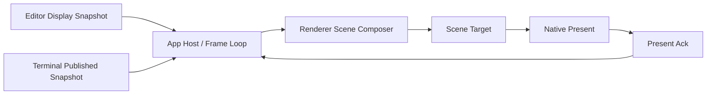
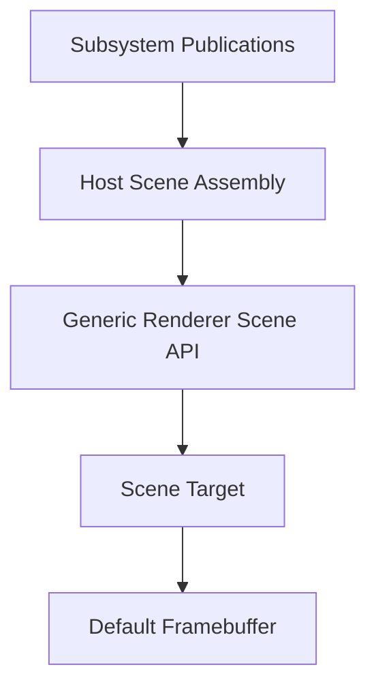
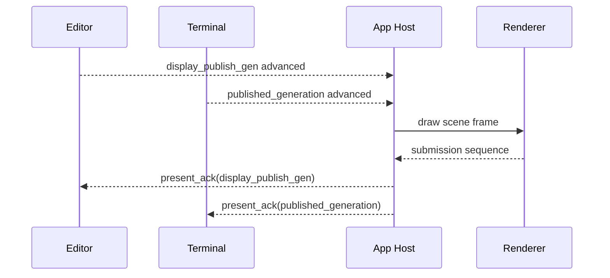

Date: 2026-03-19

Purpose: define the renderer/native-frame publication contract that both editor
and terminal should target after the current editor redesign.

This document is the architecture authority for:

- renderer-owned scene composition
- subsystem publication into renderer-consumable scene state
- native frame-loop redraw ownership
- convergence between editor and terminal draw contracts

It is the editor-side counterpart to:

- `app_architecture/terminal/rendering/RENDER_PUBLICATION_CONTRACT.md`

## Why This Exists

The renderer already owns an authoritative scene target in native mode, but the
 upstream contracts are still uneven:

- terminal has an explicit published-generation / present-ack model
- editor still routes through widget/draw/runtime-specific retained-texture
  behavior
- renderer still exposes product-specific APIs like `beginEditorTexture()` and
  `beginTerminalTexture()`
- app frame pacing is still driven mainly by terminal publication truth plus one
  app-global `needs_redraw`

The goal is one honest model:

- subsystems publish immutable render-facing state
- renderer owns composition
- frame loop owns draw/present scheduling
- acknowledgement stays explicit

## Quality Bar

The native renderer should be:

- authoritative for scene composition
- downstream from editor/terminal publication truth
- reusable across subsystem boundaries
- free of product-specific semantic ownership where possible

## Current Native Model

What already exists:

- renderer owns a scene target
- scene target is composed to the default framebuffer on submit
- terminal uses stronger publication semantics upstream
- terminal fractional-scale cell geometry is now derived from raster/device metrics once per frame and reused across terminal-space consumers

What is still weak:

- editor and terminal still use dedicated renderer target APIs
- scene composition input is not yet a generic subsystem-publication contract
- redraw is still one app-global flag instead of per-subsystem publication truth
- some native idle frames can still clear and submit the scene target without re-blitting retained terminal content, which violates the renderer-owned scene authority contract

## Target Model

Interpretation:

- editor and terminal publish render-facing state
- host decides what needs drawing
- renderer composes one scene target
- native present happens once
- acknowledgement is explicit and downstream

## Ownership Rules

### Editor / Terminal subsystems

Own:

- mutation truth
- published render-facing state
- subsystem-local generations

Do not own:

- renderer scene target lifecycle
- swap timing
- compositor-facing present semantics

### App Host / Frame Loop

Owns:

- wake handling
- deciding when a frame should be drawn
- collecting subsystem publications for the active frame
- feeding present acknowledgement back to subsystem pacing/publication logic
- guaranteeing that any frame submitted after a scene clear recomposes all retained surfaces that remain part of scene truth

### Renderer

Owns:

- scene target lifecycle
- retained surfaces
- final composition order
- submission identity

Does not own:

- editor semantics
- terminal semantics
- publication truth

## Scene Publication Contract

Subsystems should publish scene-consumable state, not renderer instructions with
 product semantics baked in.

### Editor

Publishes:

- `EditorDisplaySnapshot`
- optional editor retained-surface hints
- `display_publish_gen`

### Terminal

Publishes:

- terminal published snapshot / damage state
- `published_generation`
- present/ack state as already defined in terminal authority

### Host

Transforms subsystem publications into a generic frame assembly:

- active editor scene input
- active terminal scene input
- chrome/tooling scene input

## Renderer Contract

Renderer should expose generic scene/surface operations rather than:

- `ensureEditorTexture`
- `beginEditorTexture`
- `drawEditorTexture`
- `ensureTerminalTexture`
- `beginTerminalTexture`
- `drawTerminalTexture`

Those are useful transition APIs, but not the desired steady boundary.

### Target renderer shape

Preferred renderer concepts:

- retained surface
- scene layer
- scene node
- frame submission
- submission sequence

Avoid as long-term API:

- editor-specific render target
- terminal-specific render target

## Redraw / Wake Contract

The frame loop should answer “should I draw?” from subsystem publication truth,
not just one app-global boolean.

Additional native correctness rule:

- once the renderer-owned scene target is cleared for a frame, retained subsystem surfaces that are still part of the visible scene must be re-blitted before submit even if their publication generation did not advance

### Target inputs

- terminal redraw pending
- editor display publish advanced
- UI chrome state changed
- explicit host-local redraw request

### Target form

This does not require editor and terminal to share identical internal
 generations.

It does require both to participate in the same host-level publication model.

## Editor-Specific Mapping

For editor, the host should reason from:

- latest `display_publish_gen`
- last presented editor display generation
- whether new editor display content exists for the active surface

The editor path should stop relying on:

- implicit draw retries
- widget-owned warmup progress
- app-frame “drive more work because redraw happened” loops

## Terminal-Specific Mapping

Terminal already has stronger publication semantics.

The convergence rule is:

- do not weaken terminal publication to match editor
- strengthen editor publication to match the same quality bar

## Migration Phases

### Phase 1: Freeze terminology

- renderer-owned scene target stays authoritative
- product-specific texture APIs become explicitly transitional
- host redraw reasoning starts referencing editor and terminal publication state

### Phase 2: Editor publication alignment

- add editor present/published generation concepts at the display snapshot layer
- host integrates editor publication advancement into draw decisions

### Phase 3: Generic renderer surface API

- replace editor/terminal-specific texture APIs with generic retained-surface
  and scene-layer submission
- flatten any transition-only forwarding shell so retained-surface consumers
  talk to the retained-surface owner directly
- keep implementation internals retained and optimized

### Phase 4: Unified host draw reasoning

- frame loop reasons from subsystem publication truths
- `needs_redraw` becomes a derived host decision, not the only truth

## Immediate Rules

1. No new renderer APIs named for editor or terminal semantics unless they are
   clearly transitional.
2. No new subsystem code should treat renderer-local state as publication truth.
3. New draw scheduling logic must declare whether it is driven by:
   - editor publication
   - terminal publication
   - host-local chrome/input state
4. Editor redesign should converge toward the terminal publication quality bar,
   not create a weaker side contract.
