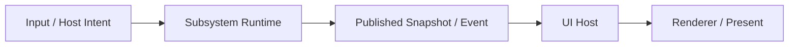

# Runtime Isolation and Resource Management

Date: 2026-03-25

Purpose: define the cross-cutting runtime, scheduling, lifecycle, and resource
management model that Zide should use as the IDE/editor/terminal product grows.

This document is the architecture authority for:

- runtime boundary shape
- active/background scheduling rules
- lifecycle states for tabs, sessions, and heavy subsystems
- resource-budget policy
- transport strategy for direct, threaded, and process-backed isolation

It is paired with:

- `app_architecture/tools/PERFORMANCE_TOOLING.md`
  - for first-class CLI/viewer/tooling ownership
  - for capture-artifact shape
  - for operator-facing measurement workflow
- `app_architecture/tools/STRUCTURED_LOGGING.md`
  - for machine-readable event-line direction
  - for grouped sink routing
  - for the structured seam between runtime counters and tooling

It is not the authority for:

- renderer scene publication details
- editor-only implementation boundaries
- terminal VT/PTY protocol semantics
- historical investigations

Those remain owned by their subsystem docs and research notes.

Primary research input for this document:

- `docs/research/RUNTIME_ISOLATION_RESOURCE_MANAGEMENT_2026-03-25.md`

## Problem

Zide already has stronger low-level control than most heavyweight IDE stacks,
but responsiveness still degrades too easily when multiple heavy workloads stay
open together.

Examples:

- several busy terminal tabs reduce responsiveness across the terminal lane
- large files or expensive editor work degrade unrelated UI behavior
- future session/workspace hopping will multiply this unless inactive work is
  cooled, bounded, and isolated by design

The architecture must therefore optimize for:

- low idle memory and CPU
- low interaction latency for the focused surface
- graceful degradation under contention
- fast resume of inactive-but-open work
- native-feeling UI even on ordinary hardware

## Product Bar

Zide should aim to exceed the best current IDEs and terminals in:

- responsiveness under load, not only at idle
- predictable latency on ordinary hardware
- native platform integration and UX quality
- low steady-state resource cost
- fast switching between active sessions, tabs, and tools

This means the system rule is:

- the active user path must not be punished by unrelated background work

## Core Principle

The native UI host remains authoritative for:

- input
- focus
- layout
- composition
- present

Heavy subsystem work should be isolated behind explicit runtime boundaries that
publish prepared state back to the UI host.

The architecture is not "make rendering multithreaded."

The architecture is:

- keep rendering/present main-thread authoritative
- move expensive work out of the UI lane
- publish commands, snapshots, and events across clean boundaries

This aligns with:

- `app_architecture/APP_LAYERING.md`
- `app_architecture/RENDERER_SCENE_PUBLICATION_CONTRACT.md`
- `app_architecture/ENGINEERING.md`

## Measurement Surfaces

Resource-management work must be measured through two distinct surfaces:

1. host resource usage
   - process CPU
   - RSS / virtual memory
   - thread and file-descriptor growth
   - process IO and context-switch behavior
   - optional GPU/process metrics where platform tooling can provide them

2. subsystem activity
   - runtime-owned counters
   - scheduler budgets and spillover/backlog signals
   - frame/pacing logs
   - subsystem-specific work counters

These surfaces must not be conflated.

Important rule:

- Zide should not claim direct per-subsystem CPU or GPU percentages unless a
  real sampler exists for that boundary.

Current practical model:

- host resources come from external OS/GPU tooling
- subsystem attribution comes from Zide-owned counters and logs
- performance conclusions should correlate both over the same workload window

Measurement/tooling ownership note:

- this document defines what must be measurable and why
- `app_architecture/tools/PERFORMANCE_TOOLING.md` defines how the CLI, capture
  artifacts, and future viewer should expose that measurement surface

## Runtime Classes

Zide should treat the following as distinct runtime classes:

### 1. UI host runtime

Owns:

- native window lifecycle
- input polling and dispatch
- focus routing
- frame-loop scheduling
- layout/chrome state
- scene assembly
- present acknowledgement

Does not own:

- terminal parsing/IO throughput work
- editor semantic heavy work
- LSP/session/tooling heavy work

### 2. Terminal session runtime

Owns:

- PTY or backend transport
- protocol parse/update
- terminal state mutation
- publication of render-facing terminal state

Does not own:

- native UI policy
- renderer present
- unrelated tab/session scheduling policy

### 3. Editor runtime

Owns:

- document mutation truth
- search/highlight/indexing-style heavy work
- editor-owned publication of render-facing state
- progress/cancellation for expensive editor tasks

Does not own:

- renderer present
- app chrome policy

### 4. Workspace/session service runtime

Future class for:

- session switching
- workspace inventory/state
- tooling orchestration
- LSP/symbol/reference/index services

This class should be designed now even if only partially implemented later,
because session-heavy IDE use will otherwise recreate heavyweight IDE failure
modes.

## Execution Model

The architecture should model work as:

- commands into a runtime
- runtime-local mutation and scheduling
- events/snapshots published outward
- UI host consumes the latest coherent state

In short:

Subsystem runtime logic must not depend on whether the transport is:

- direct in-process call
- worker thread queue
- process-backed IPC

The same transport-agnostic rule should also shape observability:

- runtime-owned counters and events must remain usable regardless of whether
  the runtime is direct, threaded, or process-backed later
- performance tooling should consume stable runtime-facing signals rather than
  transport-specific implementation accidents

## Transport Strategy

Transport is an adapter choice, not the architecture.

### Required rule

Runtime modules must be transport-agnostic.

That means:

- command/event/snapshot contracts stay stable
- runtime logic does not know whether the caller is local, threaded, or remote
- transport-specific code belongs in adapters

### Supported transport shapes

#### Direct adapter

Use when:

- work is cheap enough
- latency must be minimal
- isolation is not yet needed

#### Threaded adapter

Use when:

- work is expensive enough to threaten the UI lane
- state can remain in-process
- latency still benefits from avoiding process overhead

This is the preferred next-step isolation strategy for Zide.

#### Process adapter

Use only when later justified by:

- memory isolation
- crash containment
- third-party tool ownership
- security/sandboxing
- very large service separation

Process isolation is allowed by this architecture, but it is not required to
start the lane.

## Scheduling Tiers

Every subsystem workload should be classified by user relevance.

### Visibility / ownership tiers

1. focused visible
2. visible inactive
3. hidden warm
4. paused
5. evicted

Interpretation:

- focused visible work has highest budget and lowest latency target
- visible inactive work stays reactive but secondary
- hidden warm retains enough state for fast resume
- paused keeps ownership but no steady active budget
- evicted drops recoverable state and must rehydrate on demand

No open tab/session should automatically stay in the same tier as the focused
surface.

## Work Classes

Every expensive task should also be classified by work class:

1. frame-critical
2. interactive
3. background
4. deferred

### Frame-critical

Examples:

- focused cursor/input response
- render-facing state needed for the next present

Rules:

- must remain bounded
- must preempt lower-priority work

### Interactive

Examples:

- focused terminal parse/publish followthrough
- editor search update for the active buffer

Rules:

- should run promptly
- may be interrupted by frame-critical work

### Background

Examples:

- non-focused tab upkeep
- warm-cache filling
- passive diagnostics/index continuation

Rules:

- always budgeted
- never allowed to steal active interaction responsiveness

### Deferred

Examples:

- deep indexing
- cold cache rebuild
- low-value speculative work

Rules:

- easiest class to throttle, cancel, or skip under pressure

## Budget Policy

Every subsystem that can grow in cost must have explicit budgets.

Required budget families:

- frame-time budget
- active CPU budget
- background CPU budget
- memory budget
- cache budget
- publication frequency budget

### Budget rules

- budgets must exist before the subsystem is allowed to scale aggressively
- active and background budgets must be distinct
- background work should be interruptible or cancellable
- when budgets are exceeded, the system should degrade quality before it
  degrades responsiveness

Examples of acceptable degradation:

- lower background refresh frequency
- defer noncritical highlight/index work
- cool inactive sessions earlier
- evict speculative caches

Examples of unacceptable degradation:

- focused typing/cursor latency regresses first
- active terminal input lags because hidden tabs are busy

## Lifecycle Model

Open is not the same as active.

Every heavy surface should participate in lifecycle management.

### Hot

- currently focused or immediately user-visible
- highest responsiveness target
- fullest budget allocation

### Warm

- inactive but likely to resume soon
- retain cheap/high-value state
- reduced background budget

### Paused

- not user-visible
- retain identity and restartable state only
- no steady heavy work budget

### Evicted

- recoverable state released
- rehydration required on next activation

Each subsystem must define:

- what state is needed to resume quickly
- what state can be rebuilt cheaply
- what state is too expensive to keep indefinitely

## Snapshot / Publication Model

The UI host should consume published state, not drive expensive production
inline.

Rules:

- runtimes publish render-facing or host-facing state
- UI host consumes the latest coherent state
- renderer remains downstream from published state
- present acknowledgement flows back to the host and, where useful, to runtime
  pacing logic

This extends the direction already defined in:

- `app_architecture/RENDERER_SCENE_PUBLICATION_CONTRACT.md`

## Subsystem Application

### Terminal

Terminal direction should be:

- keep PTY/parse/update work in terminal-owned runtime lanes
- keep active terminal sessions prioritized over background tabs
- preserve bounded background polling fairness
- publish terminal render-facing state to the host
- cool inactive sessions without losing fast resume where feasible

Near-term implication:

- terminal budget/fairness work should evolve into a broader lifecycle-aware
  runtime model rather than remain only frame-pacing heuristics

### Editor

Editor direction should be:

- move expensive semantic work out of the UI frame path
- keep document mutation truth local and explicit
- publish prepared render-facing state
- treat large-buffer cost as a schedulable runtime concern, not only a draw
  optimization problem

Near-term implication:

- highlight/search/index-style work should converge on an editor-owned runtime
  service with cancellation, progress, and publication

### Session / Workspace / Tooling

Future IDE growth will require:

- session lifecycle ownership
- warm/cold switching policy
- explicit memory caps
- lazy activation of heavy services
- resource-aware session hopping

This must be designed before rich session/sidebar workflows are treated as
fully mature product surfaces.

## Resource Ownership Rules

Every heavy resource must have:

- one owner
- one lifecycle policy
- one eviction story

This applies to:

- terminal session state
- editor semantic caches
- search results
- syntax/highlight data
- workspace indexes
- LSP/client processes
- GPU/renderer caches that mirror subsystem state

If a resource has no owner, no budget, or no eviction policy, it is not ready
to scale.

## Measurement Requirement

This architecture only matters if it can be verified locally.

Every implementation step in this lane should be accompanied by local evidence
for at least one of:

- focused latency improvement
- background CPU reduction
- lower idle memory
- better contention behavior with many open sessions/tabs
- faster resume from warm/paused state

This follows the existing project direction toward explicit local validation and
measurement rather than CI-only confidence.

## Anti-Goals

Do not:

- make IPC the foundation of the design
- move SDL render ownership off the main thread
- treat all open tabs/sessions as equally live forever
- optimize only micro-hotspots while leaving ownership and scheduling implicit
- grow background services without lifecycle and budget policy

## Initial Implementation Order

1. Make runtime ownership and scheduling explicit before adding more heavy IDE
   features.
2. Keep UI host light and authoritative.
3. Extend terminal/editor runtime boundaries so heavy work is published, not
   performed on the UI lane.
4. Introduce lifecycle tiers for inactive work.
5. Only then decide which lanes need threaded vs process-backed adapters.

## Immediate Next Architectural Targets

1. Formalize one cross-subsystem scheduler/lifecycle vocabulary in code:
   - focused visible
   - visible inactive
   - hidden warm
   - paused
   - evicted

2. Choose the first runtime service to harden:
   - terminal session runtime
   - editor semantic runtime
   - or a small shared lifecycle service that both can adopt

3. Ensure all new heavy features in the IDE/session lane must declare:
   - owner
   - budget
   - lifecycle state behavior
   - publication contract

## First Implementation Checkpoint

Current first adoption on `main`:

- `src/app/runtime_policy.zig` defines the first shared runtime vocabulary:
  - `RuntimeKind`
  - `LifecycleTier`
  - `WorkClass`
  - `RuntimeIntent`
- terminal poll-profile selection now routes through that shared intent model
  in `src/app/terminal/terminal_poll_runtime.zig`

This is an ownership/foundation cut only:

- it does not yet change user-visible scheduling behavior
- it exists to stop future runtime work from inventing new vocabulary ad hoc

2026-03-28 terminal lifecycle checkpoint:

- terminal workspace polling now uses the shared lifecycle tiers for a first
  real budget distinction:
  - active tab: `focused_visible`
  - exactly one background tab: `visible_inactive`
  - larger background sets: `hidden_warm`
- terminal poll-counter epochs now also reset on tab create/close topology
  changes, not only focus changes, so lifecycle measurements stay scoped to one
  background-shape regime
- this is intentionally a conservative first cut, not a claim that the app now
  has full terminal visibility truth for secondary/background surfaces
- the immediate goal is measurable cooling behavior through shared vocabulary
  before a richer UI/runtime visibility model exists

2026-03-28 editor observability checkpoint:

- `editor.perf` structured events for display-preparation and visible-cache
  precompute now emit the shared runtime vocabulary too:
  - `runtime_kind = editor`
  - `lifecycle = visible_inactive`
  - `work_class = background`
- this is still an observability/foundation cut, not a claim that editor runtime
  scheduling or inactive-editor lifecycle policy is fully implemented yet

2026-03-28 editor visible-work budget checkpoint:

- visible-cache precompute and visible highlight scheduling now use a first real
  editor runtime-policy budget seam via `editorVisibleWorkLineBudget`
- current conservative policy:
  - visible active editor background work is labeled `visible_inactive`
  - visible inactive editor work is capped to 8 lines per pass by default
  - hidden warm editor work would cap to 2 lines if adopted later
- explicit user-configured `editor_highlight_budget` and `editor_width_budget`
  still apply as base budgets, then flow through the shared runtime policy cap

2026-03-28 editor startup deferral checkpoint:

- editor file-open startup now routes highlight/precompute/cluster deferrals
  through shared runtime policy instead of hardcoded frame counts in editor
  state reset
- current conservative visible-inactive startup policy on open:
  - highlight init: 4 frames
  - visible-cache precompute: 3 frames
  - cluster offsets: 6 frames
- save/save-as on the active editor still keeps immediate local follow-through;
  this cut is scoped to open/startup background work cooling

2026-03-28 terminal perf event alignment checkpoint:

- `terminal.frame` structured events now also emit shared runtime vocabulary for
  the active visible terminal path:
  - `runtime_kind = terminal_session`
  - `lifecycle`
  - `work_class`
  - `sleep_lifecycle`
- `input.latency` terminal-related structured events now carry the same shared
  terminal runtime fields plus active/background poll lifecycle and work-class
  labels from workspace polling metrics
- this keeps local perf captures aligned across terminal wake, frame pacing, and
  latency surfaces without introducing a second event vocabulary

2026-03-29 terminal shutdown-hardening checkpoint:

- terminal sessions now have an explicit `prepareForShutdown()` phase that runs
  before shell/renderer teardown in app shutdown
- that phase stop-signals and joins the PTY read/parse threads first, then
  tears down the terminal transport while `shell_deinitialized = false`
- the verified Linux terminal GUI shutdown trace now shows:
  - `shutdown_begin`
  - `terminal_prepare_shutdown_begin`
  - per-session thread stop/join and transport teardown
  - `shell_deinit_begin`
  - `shell_deinit_end`
- this closes the previous app-level ordering gap where terminal async work
  could remain alive past shell teardown even though session deinit later joined
  threads correctly

2026-03-29 terminal startup-rollback checkpoint:

- terminal startup now treats session/widget creation as one rollbackable unit
  at the app layer
- workspace startup records the initial tab/widget counts and rolls back any
  newly created sessions/widgets if a later startup step fails
- single-session startup now also rolls back the started-but-not-yet-owned
  session if failure happens after PTY/thread start but before the session is
  fully integrated into `state.terminals` plus `state.terminal_widgets`
- this closes the partial-init ownership gap where a live PTY/process/session
  could outlive a failed startup step because ownership had not yet become
  durable or rollback had not been wired

2026-03-29 terminal child-exit shutdown checkpoint:

- terminal shutdown preparation now refreshes child-exit truth before transport
  teardown
- verified Linux terminal GUI repro:
  - external helper kills the PTY child shortly before app shutdown
  - `shutdown_begin`
  - `terminal_prepare_shutdown_begin`
  - `terminal_child_exit_poll_begin`
  - `terminal_child_exit_detected`
  - `terminal_transport_prepare_shutdown_begin child_exited=true`
  - `shell_deinit_begin`
- this closes the stale child-exit status gap where a PTY child could already
  be dead at shutdown start but transport teardown still ran with
  `child_exited=false`
