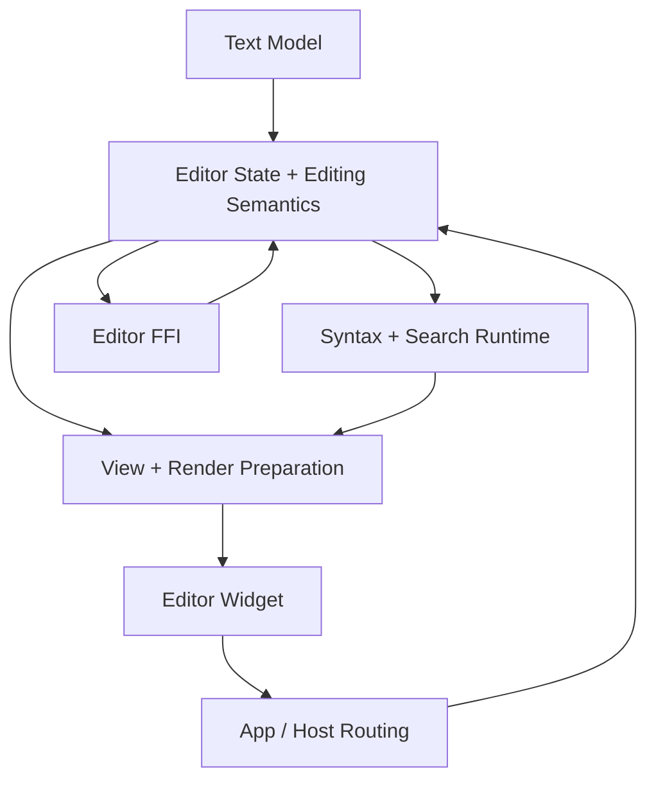
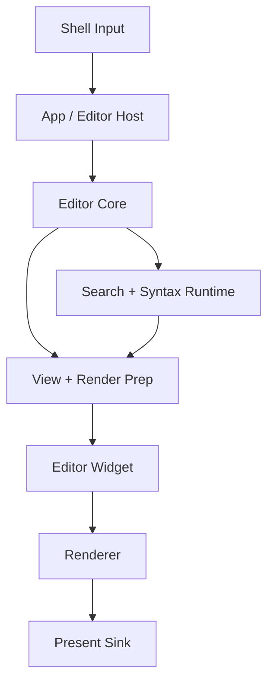

# Editor Design

This is the current technical authority for Zide's editor subsystem.

It owns:

- the editor subsystem boundary
- durable ownership splits inside the editor stack
- the relationship between editor core, widget/view code, host/app routing, and
  editor FFI
- the current execution-lane map for editor work

It does not own:

- step-by-step task progress
- active checklists or implementation sequencing
- historical research or review evidence

Those live under `docs/todo/editor/`, `docs/research/`, and `docs/review/`.

## Product Direction

The editor is a first-class subsystem, not a thin widget.

Its current product direction is:

- first, reach a clean Notepad-grade baseline for common editor/app behavior:
  file flow, shortcuts, mouse/selection behavior, basic chrome, config, and CLI
- second, continue deeper editor quality work: richer editing semantics,
  tree-sitter/query richness, stronger reference parity, and later performance
  tightening

That means current baseline work should land through the real subsystem seams,
not through one-off widget-local hacks.

## Subsystem Goals

- fast edits on large files without obvious O(n) hot-path mistakes
- correct cursor/selection behavior on Unicode text
- predictable undo/redo and selection-state restoration
- incremental syntax highlighting with bounded disruption
- low-latency rendering with explicit cache ownership
- a reusable editor core that can serve native UI and external hosts through FFI

## Design Summary

The chosen direction is a layered editor subsystem:

- keep the text model, editor semantics, syntax/search runtime, view/render
  preparation, widget integration, app-host routing, and FFI as explicit
  boundaries
- land baseline editor behavior through real editor/app seams rather than
  widget-local shortcuts or ad hoc host logic
- preserve a reusable editor core that can serve native UI directly and support
  external hosts through a separate FFI boundary

What does not change in this design:

- the text model remains rope/text-store based
- editor-core semantics remain the authority for editing behavior
- bindings remain config-owned rather than hardcoded in subsystem code

What does change as the editor lane matures:

- more behavior moves out of "queue knowledge" and into durable editor-core and
  app-host boundaries
- stress/reference investigation becomes a first-class documentation lane
- editor FFI is treated as an actual subsystem contract, not incidental glue

## Subsystem Communication Map

Meaning:

- authoritative edit/search/highlight truth flows outward from editor core
- host/app and FFI both drive editor-core behavior, but they do not own editor
  semantics themselves
- widget/view code consumes editor truth and translates interaction back into
  editor operations

## Native Frame Path

Meaning:

- input is routed through the app/host layer first
- editing semantics execute in editor core
- syntax/search/runtime state feeds render preparation
- widget code consumes prepared editor state and submits to the renderer
- renderer/present remain downstream consumers, not owners of editor truth

## Ownership Layers

### 1. Text model

Files:

- `src/editor/rope.zig`
- `src/editor/text_store.zig`

Responsibilities:

- authoritative text storage
- byte/line aggregates
- undo/redo storage
- range insert/delete primitives

Non-responsibilities:

- cursor policy
- selection semantics
- app/file lifecycle
- UI rendering

Rule:

- if a change is about storage correctness, line indexing, undo grouping, or raw
  text mutation primitives, it belongs here before it belongs anywhere else.

### 2. Editor state and editing semantics

Files:

- `src/editor/editor.zig`
- `src/editor/navigation.zig`
- `src/editor/selection_state.zig`
- `src/editor/edit_ops.zig`
- `src/editor/types.zig`

Responsibilities:

- authoritative editor state
- cursor and selection semantics
- edit operations and tracked undo grouping
- search state ownership
- file load/save ownership inside the editor object
- line-oriented editing operations used by app shortcuts

Non-responsibilities:

- app-shell policy
- tab/session lifecycle
- widget hit-testing and mouse routing
- renderer details

Rule:

- editing behavior should exist here as a real editor action/operation before it
  is exposed by app shortcuts or FFI.

### 3. Syntax and search/highlight runtime

Files:

- `src/editor/search_highlight.zig`
- `src/editor/syntax.zig`
- `src/editor/syntax_runtime.zig`
- `src/editor/syntax_queries.zig`
- `src/editor/syntax_tokens.zig`
- `src/editor/syntax_registry.zig`
- `src/editor/manual_highlights.zig`
- `src/editor/grammar_manager.zig`
- `src/editor/treesitter_api.zig`

Responsibilities:

- syntax/highlight pipeline ownership
- tree-sitter integration
- grammar/query loading and registry concerns
- search query, match set, and active match state

Non-responsibilities:

- host UI prompts
- app-level search panel presentation
- renderer cache policy

Rule:

- highlight/search truth lives in editor state and syntax/search runtime, not in
  widget-local caches.

### 4. View, geometry, and render preparation

Files:

- `src/editor/view/*.zig`
- `src/editor/render/*.zig`

Responsibilities:

- visible-line traversal
- cursor/selection geometry
- editor chrome geometry
- retained-cache state for editor rendering
- segment/paint preparation

Non-responsibilities:

- app-shell shortcut policy
- storage mutation rules
- host tab/session ownership

Rule:

- this layer may derive visible/editor-frame state from editor truth, but should
  not invent new editor semantics.

### 5. Widget/UI integration

Files:

- `src/ui/widgets/editor_widget.zig`
- `src/ui/widgets/editor_widget_input.zig`
- supporting draw modules under `src/ui/widgets/`

Responsibilities:

- widget-local input hit-testing
- rendering invocation
- scrollbar and viewport interaction
- mapping shell/input coordinates into editor operations

Non-responsibilities:

- app-level file flow
- tab management
- action binding policy

Rule:

- widget code should stay focused on interaction and presentation, not grow into
  an alternate editor/app policy layer.

### 6. App/editor host integration

Files:

- `src/app/editor/*.zig`
- editor-facing seams in `src/app/*.zig`

Responsibilities:

- app/editor shortcuts and host routing
- open/save/save-as prompt flow
- close/document cycling behavior
- editor tab/workspace coordination with the shared host shell

Non-responsibilities:

- text-engine ownership
- syntax-engine truth
- binding policy itself

Rule:

- the app layer owns routing and host policy, but should call real editor-core
  operations instead of duplicating semantics locally.

### 7. External editor FFI

Files:

- `src/editor/ffi/bridge.zig`
- `src/editor/ffi/c_api.zig`

Responsibilities:

- exporting a reusable editor core to external hosts
- stable C-facing function surface
- ABI-owned string/result structs
- handle lifecycle and memory ownership rules for the bridge

Non-responsibilities:

- native app-shell policy
- widget rendering
- host-specific UI behavior

The FFI surface is substantial enough to count as a real subsystem boundary.
Its detailed contract should live beside this doc, not only in code.

See:

- `app_architecture/editor/FFI_DESIGN.md`

## Configuration Boundary

Config-owned policy:

- shipped/default key mappings
- editor-facing theme/config defaults
- user/project overrides

Code-owned policy:

- action ids
- editor behavior semantics
- runtime merge/load behavior

This split is intentional so later keymap importers can map external IDE/editor
bindings onto a stable Zide action surface instead of rebinding arbitrary
in-code shortcuts.

## Current Durable Boundaries

### App baseline lane

Authority:

- `docs/todo/editor/app_baseline.md`
- `docs/todo/editor/editor_action_baseline_register.md`

Meaning:

- common editor behavior should keep landing through real editor/app seams
- bindings stay Lua-owned
- action support is the implementation baseline

### Theme lane

Authority:

- `app_architecture/editor/RESOLVED_THEME_EXPORT_CONTRACT.md`
- `app_architecture/editor/LSP_THEME_OVERLAY_BOUNDARY.md`
- `docs/todo/editor/theme_import.md`

Meaning:

- base editor theme import is driven by resolved Neovim state, not source-theme
  parsing
- LSP/semantic-token coloring is explicitly deferred as an overlay boundary

### Text-model migration history

Authority:

- `app_architecture/editor/text_model_rope.md`

Meaning:

- rope/text-store ownership is already an established subsystem choice, not an
  open design question

## Execution Queues

Primary execution lane:

- `docs/todo/editor/app_baseline.md`

Stress, comparison, and investigation:

- `docs/todo/editor/stress_and_reference.md`

Editor semantics and follow-up:

- `docs/todo/editor/protocol.md`
- `docs/todo/editor/widget.md`
- `docs/todo/editor/modularization.md`

Syntax/tree-sitter:

- `docs/todo/editor/treesitter.md`
- `docs/todo/editor/treesitter_dynamic_roadmap.md`

Theming:

- `docs/todo/editor/theme_import.md`
- `app_architecture/editor/RESOLVED_THEME_EXPORT_CONTRACT.md`
- `app_architecture/editor/LSP_THEME_OVERLAY_BOUNDARY.md`

## Decision Log

### 2026-03-18

- The editor subsystem now needs the same documentation standard as terminal:
  durable ownership docs in `app_architecture/editor/`, queue docs in
  `docs/todo/editor/`, and explicit recognition that editor FFI is a real
  boundary rather than an implementation detail.
- Editor stress/reference investigation is now part of the documentation model,
  not a side activity. Cross-reference work should produce durable docs and
  diagrams that clarify Zide's own stack rather than a pile of detached notes.

### 2026-03-17

- Editor priority is explicitly split into two phases:
  - first, reach a clean Notepad-grade baseline for common app/editor behavior
  - second, resume optimization and deeper reference-repo comparison work once
    that baseline is implemented through the shared host/editor seams

### 2026-01-24

- Tree-sitter highlight integration follows Neovim's query/highlighter model.

### 2026-01-21

- Rope/piece-tree text storage with aggregated line metadata is the current text
  model authority.
