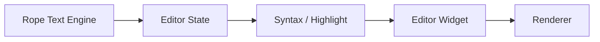

# Editor Design & Decision Log

Goal: ship a best-in-class editor widget and text engine (Linux-first) that reaches
Notepad++-level capability while keeping Zide's core fast and minimal.

## Principles

- Basic everyday editor usability comes before optimization passes: common file flows, shortcuts, mouse interactions, editor chrome, config, and CLI behavior should feel solid before we spend cycles reducing redraw or steady-state cost further.
- Fast edits on large files (avoid O(n) in hot paths).
- Correct Unicode and grapheme handling for cursor movement and selection.
- Low-latency rendering with caching and damage tracking.
- Incremental syntax highlighting with predictable latency.
- Clear separation between text engine, editor state, and UI view.

## Current architecture (Zide)

- Text engine: `src/editor/rope.zig` (rope/piece-tree + undo/redo)
- Editor state: `src/editor/editor.zig`
- Syntax highlight: `src/editor/syntax.zig`
- View/render: `src/ui/widgets/editor_widget.zig`, `src/ui/renderer.zig`

### Editor Architecture Map

## Execution Queues

- `docs/todo/editor/widget.md` (end-to-end widget + features)
- `docs/todo/editor/protocol.md` (text engine + editing semantics)
- `app_architecture/ui/DEVELOPMENT_JOURNEY.md` (rendering stack + per-OS plan)
- `docs/todo/editor/modularization.md` (layer split + migration steps)
- `docs/todo/editor/treesitter.md` (tree-sitter query + highlight integration)
- `docs/todo/editor/treesitter_dynamic_roadmap.md` (dynamic grammar packs: fetch/compile/load)

## Decision Log

2026-03-17
- Editor priority is now explicitly split into two phases:
  - first, reach a clean Notepad-grade baseline for common app/editor behavior
    including basic editor chrome, file/open/save flows, common shortcuts,
    expected mouse/selection interactions, and friendly Lua config / CLI entry
    points
  - second, perform optimization and reference-repo comparison work once that
    baseline is implemented cleanly through the shared IDE/editor host layer
    rather than duplicated editor-only glue

2026-01-21
- Adopt terminal-style workflow for editor work: add explicit todo lists with
  reference repo paths for each task, and update them as tasks are completed.

2026-01-21
- Text model audit complete; migrated to a rope/piece-tree implementation with
  per-node aggregates (bytes + line breaks) and rope-based undo/redo.

2026-01-21
- Rope text model implemented and integrated (see
  `app_architecture/editor/text_model_rope.md`).

2026-01-24
- Tree-sitter highlight integration follows Neovim's query/highlighter
  pipeline. Active execution lives in
  `docs/todo/editor/treesitter.md`.
