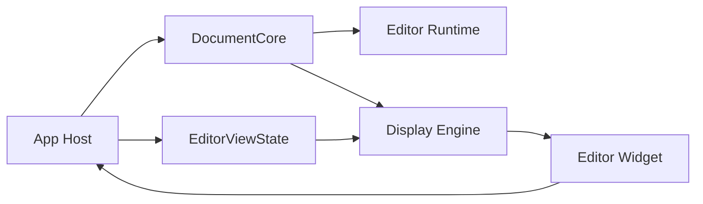

# Document Core And View State Boundary

Date: 2026-03-19

## Purpose

Define the first concrete ownership split in the editor redesign:

- `DocumentCore`
- `EditorViewState`

This is the first decisive cut because the current `Editor` object still mixes:

- text/document state
- editing semantics
- view/scroll state
- syntax/search runtime state
- file lifecycle
- display caches

That prevents every later runtime/display/render cleanup from being a clean
 downstream split.

## Current Problem

Today `Editor` owns all of the following in one mutable object:

- text buffer
- cursor and selections
- preferred visual column
- scroll line/column/row offset
- line-width cache
- grapheme-cluster cache
- syntax highlighter lifetime
- highlight dirty/pending state
- search query and results
- search worker state
- file path and dirty state
- startup warmup throttles
- undo-selection restoration side table

This violates the intended editor layering in
 [DESIGN.md](DESIGN.md).

## Decision

Split the current `Editor` responsibilities into:

1. `DocumentCore`
2. `EditorViewState`

`DocumentCore` is the authority for document truth.

`EditorViewState` is the authority for one view onto that document.

This follows the same broad lesson as:

- Neovim buffer vs window state
- Helix/Kakoune document vs selection/view handling

## Target Ownership

## `DocumentCore`

Owns:

- text buffer
- transaction/history state
- document generations and invalidation epochs
- syntax/search runtime identity
- parser/highlighter identity
- file identity/path
- dirty/saved status
- document-local settings that change semantics

Does not own:

- scroll positions
- row offsets
- viewport-local wrap state
- preferred visual column for one view
- widget drag/hover state
- renderer/display cache scheduling

### `DocumentCore` API direction

`DocumentCore` should expose:

- apply edit/action
- produce `ChangeSet`
- expose stable document snapshot reads
- manage file load/save/replace
- manage search/highlight/runtime epochs

It should not expose:

- direct viewport mutation
- widget-facing hit-test behavior
- frame-local display cache mutation

## `EditorViewState`

Owns:

- scroll line
- scroll column
- row offset
- wrap mode
- preferred visual column
- view-local selection/caret presentation state if separated later
- viewport request generations

Does not own:

- file lifecycle
- parser/highlighter lifetime
- search worker state
- highlight pending state
- document dirty state

### `EditorViewState` API direction

`EditorViewState` should expose:

- scroll/move viewport
- set preferred visual column
- toggle wrap/view options
- request visible ranges
- produce view snapshot inputs for display engine

It should not expose:

- text mutation
- search/highlight execution
- file replacement logic

## Immediate Field Split

### Move to `DocumentCore`

- `buffer`
- `highlighter`
- `highlight_dirty_start_line`
- `highlight_dirty_end_line`
- `highlight_pending`
- `highlight_disabled_for_large_file`
- `search_query`
- `search_matches`
- `search_active`
- `search_mode`
- `search_refresh_on_text_change`
- `search_epoch`
- `search_worker`
- `search_worker_running`
- `search_mutex`
- `search_cond`
- `search_generation`
- `search_request`
- `search_result`
- `change_tick`
- `highlight_epoch`
- `file_path`
- `modified`
- `saved_content_hash`
- `grammar_manager`
- `undo_selection_states`
- `next_undo_selection_state_id`

### Move to `EditorViewState`

- `scroll_line`
- `scroll_col`
- `scroll_row_offset`
- `preferred_visual_col`
- `wrap_enabled` when this is no longer threaded ad hoc through widget/app

### Transitional

These can remain temporarily on a combined object but should end up in other
 seams:

- `cursor`
- `selection`
- `selections`
  Direction:
  move into a dedicated `SelectionSet`, or temporarily keep adjacent to
  `EditorViewState` for the first cut.

- `line_width_cache`
- `cluster_offset_cache`
- `max_line_width_cache`
  Direction:
  move into display-engine/editor-render-owned state, not document core and not
  widget state.

- `highlight_defer_frames`
- `visible_cache_precompute_defer_frames`
- `cluster_offsets_defer_frames`
- `startup_defer_last_frame_id`
- `startup_visible_warmup_active`
  Direction:
  remove as ad hoc editor state and replace with explicit runtime/display work
  state.

## Resulting Contracts

### Mutation contract

Widget does not mutate `DocumentCore` directly.

Instead:

- widget emits intent
- host applies intent against `DocumentCore` and `EditorViewState`
- `DocumentCore` emits `ChangeSet`
- runtime/display react downstream

### View contract

`EditorViewState` does not own document truth.

It only answers:

- what range is visible
- where is the viewport
- how should movement/scroll preferences be interpreted for this view

### Snapshot contract

The future `EditorDisplaySnapshot` should be derived from:

- `DocumentSnapshot`
- `SelectionSet`
- `EditorViewState`
- completed runtime publications

Not from a live `*Editor` backpointer.

## Migration Phases

### Phase 1

- introduce `DocumentCore`
- introduce `EditorViewState`
- keep a temporary wrapper that contains both
- route existing callers through the wrapper while changing ownership

### Phase 2

- update widget and app code to mutate only through host-applied commands
- stop direct widget mutation of document internals

### Phase 3

- split out `SelectionSet`
- split display caches into display engine
- retire the legacy all-in-one `Editor`

## Non-Goals For This Cut

- not redesigning FFI in this step
- not redesigning renderer in this step
- not solving all runtime threading in this step

This boundary exists to make those later changes possible.
