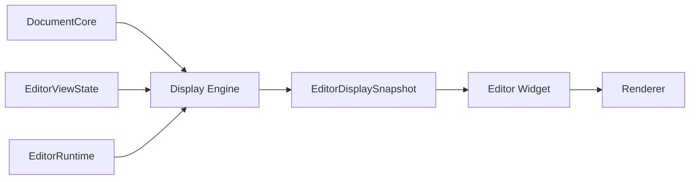
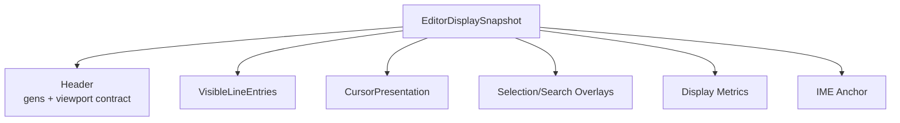

# Editor Display Snapshot Contract

Date: 2026-03-19

## Purpose

Define the immutable publication contract between:

- `DocumentCore`
- `EditorViewState`
- `EditorRuntime`
- `Display Engine`
- `Editor Widget`
- `Renderer`

This contract exists because the current path still uses live-object adapters:

- `EditorFrameView`
- `EditorViewRuntime`
- widget callbacks for line text and clusters
- render prep that reads through a live `*Editor`

That is not a publication boundary. It is a convenience façade.

## Decision

The display engine must publish an immutable
 `EditorDisplaySnapshot` for one frame.

Widget and renderer consume that snapshot.

They do not reach back into live document/runtime state to fetch more truth.

## Why This Matters

Without an immutable display snapshot:

- draw can observe live mutation
- widget helpers become hidden runtime dependencies
- render prep stays coupled to editor internals
- runtime publication cannot be reasoned about cleanly
- redraw generations remain implicit

## Current Problem

Today:

- `EditorFrameView` copies a few scalars but still stores `editor: *Editor`
- `EditorViewRuntime` relies on widget callbacks to fetch line text and clusters
- `visible_prep` imports widget modules and can still call synchronous
  highlight helpers
- draw computes per-line state from live editor access during rendering

This is the opposite of a clean publication seam.

## Snapshot Rule

For one frame, editor draw must depend only on:

- immutable snapshot data
- renderer state
- widget-local interaction state

It must not depend on:

- live `*Editor`
- live syntax runtime calls
- widget-owned data fetch callbacks into editor internals

## Target Publication Shape

## `EditorDisplaySnapshot`

The snapshot should represent one stable renderable view.

### Snapshot header

Must include:

- `document_gen`
- `selection_gen`
- `style_gen`
- `view_gen`
- `display_publish_gen`
- viewport geometry inputs used to build it

Purpose:

- debugability
- stale-result rejection
- deterministic redraw/publication tracking

### Snapshot body

Should include:

- visible line range
- visible visual-row mapping
- gutter geometry inputs
- text start geometry inputs
- cursor visual location data
- selection overlay ranges
- search overlay ranges
- line widths for visible lines
- wrap counts / segment mapping
- grapheme-cluster offsets for visible lines
- highlight slices for visible lines
- IME anchor position for current caret/view

### Snapshot payload style

Prefer:

- immutable slices
- range-indexed arrays
- pre-split highlight data by line/segment where useful

Avoid:

- callback-based refetch into editor
- renderer-owned editor truth
- widget-owned durable display caches

## Suggested Shape

## `VisibleLineEntry`

Each visible line entry should carry enough data that widget/render do not need
 live document access.

Should include:

- `line_idx`
- `line_start`
- `line_end`
- immutable line text slice or stable owned text
- grapheme-cluster slice
- line width
- visual segment metadata
- per-line highlight tokens or line-local highlight ranges
- line-local selection ranges
- current-line flags

The important rule is not the exact shape.

The important rule is:

- all draw-critical visible data is already published

## Snapshot Production

Snapshot production belongs to the display engine.

Inputs:

- `DocumentSnapshot`
- `EditorViewState`
- completed runtime publications
- theme/display configuration

Outputs:

- immutable snapshot
- `display_publish_gen`

The display engine may request missing work from runtime, but it must not block
 snapshot production on expensive synchronous runtime execution.

## Snapshot Consumption

### Widget

Widget may:

- map pointer coordinates to published line/cluster geometry
- emit intents
- place IME rect from published cursor/anchor data

Widget may not:

- ask editor for line text during draw
- ask editor for clusters during draw
- ask highlighter for tokens during draw

### Renderer

Renderer may:

- consume scene or draw operations derived from snapshot
- retain surfaces by snapshot generation and contract

Renderer may not:

- know editor semantics beyond generic scene inputs
- call back into editor modules

## Relationship To Display Caches

Display caches should become display-engine-owned backing state for snapshot
 production.

That means:

- line width cache belongs to display engine
- grapheme-cluster cache belongs to display engine
- wrap cache belongs to display engine
- highlight result cache is consumed from runtime publications into display
  ownership

Not widget-owned:

- cluster lifetime
- line text lifetime policies for display prep
- runtime queue state

## Relationship To Runtime

Runtime publishes expensive computed artifacts.

Display engine integrates them into the next snapshot.

The contract is:

- runtime computes
- display integrates
- snapshot publishes
- widget/render consume

Not:

- widget asks runtime for more truth mid-draw

## Migration Phases

### Phase 1: Freeze the shape

- define `EditorDisplaySnapshot`
- define snapshot header generations
- keep payload minimal at first

### Phase 2: Replace live frame façade

- replace `EditorFrameView` with immutable snapshot consumption
- stop render prep from depending on `*Editor`

### Phase 3: Move line/cluster/text publication

- make visible text and cluster data published snapshot fields
- retire widget callback-based `EditorViewRuntime` fetch model

### Phase 4: Move overlay publication

- publish line-local selection/search/highlight overlay data directly
- keep widget/render fully downstream

### Phase 5: Integrate renderer scene contract

- snapshot becomes the upstream truth for scene submission
- renderer no longer needs editor-specific texture semantics

## Immediate Rules

1. No new live `*Editor` reads in draw code for data that could be published.
2. No new widget callback contract for line/cluster fetch.
3. No new synchronous highlight fetch during draw or precompute.
4. New display data must declare whether it is:
   - document snapshot input
   - runtime publication
   - display snapshot field
   - widget-local interaction state
