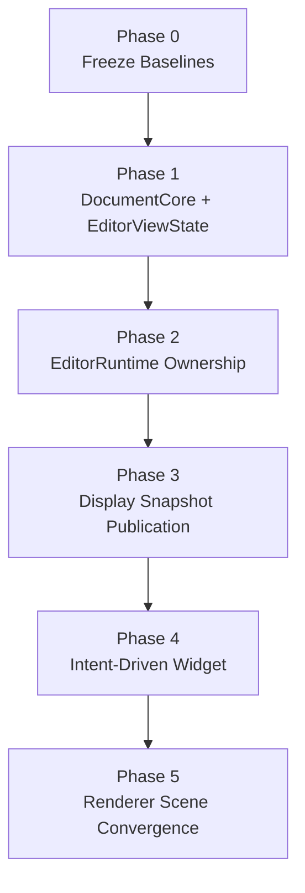
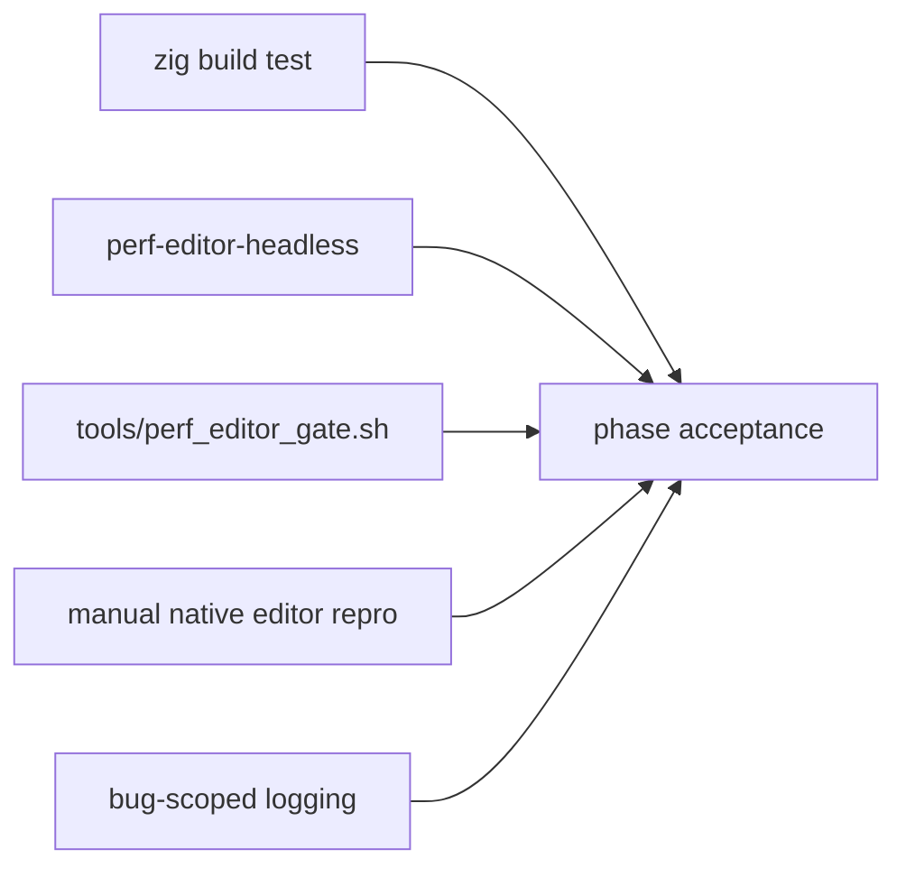

# Editor Redesign Execution Roadmap

Date: 2026-03-19

## Purpose

Convert the current editor redesign authority into an execution roadmap that can
be implemented in reviewable phases.

This roadmap exists to answer:

- what order the cuts should land in
- what each phase is allowed to change
- what validation gates must exist before each phase
- where to stop if a phase starts blending responsibilities again

## Inputs

This roadmap is downstream from:

- `app_architecture/editor/EDITOR_STACK_REDESIGN_PLAN.md`
- `app_architecture/editor/DOCUMENT_CORE_AND_VIEW_STATE_BOUNDARY.md`
- `app_architecture/editor/EDITOR_RUNTIME_CONTRACT.md`
- `app_architecture/editor/EDITOR_DISPLAY_SNAPSHOT_CONTRACT.md`
- `app_architecture/RENDERER_SCENE_PUBLICATION_CONTRACT.md`

Stress ritual and measurement authority:

- `docs/research/editor/EDITOR_STRESS_RITUAL_2026-03-18.md`
- `tools/perf_editor_gate.sh`

## Roadmap Principles

1. No “move files first” refactors.
   Ownership and contract must drive the cut.

2. No behavior changes during extraction-only steps.
   If behavior changes, the phase must say so explicitly.

3. No new widget-owned runtime or display truth.

4. Every phase needs a before/after validation ritual.

5. If a phase cannot explain who owns mutation, computation, publication, and
   draw, it is not ready.

## Phase Overview

## Phase 0: Freeze Baselines

### Goal

Make later changes comparable and safe.

### Required outputs

- replay/stress ritual remains current
- perf gate remains runnable
- first manual editor repro ritual remains fixed
- current architecture docs remain authoritative

### Validation

- `zig build test`
- `zig build -Doptimize=ReleaseFast perf-editor-headless`
- `tools/perf_editor_gate.sh`
- manual native editor repro on:
  - `fixtures/editor/stress/unicode_longline_sample.txt`
  - `fixtures/editor/stress/large_highlight_sample.zig`

### Stop condition

Do not begin `Phase 1` if the replay/stress authority is stale.

## Phase 1: Split `DocumentCore` And `EditorViewState`

### Goal

Remove the first god-object failure by separating document truth from viewport
state.

### Allowed changes

- introduce `DocumentCore`
- introduce `EditorViewState`
- add transitional wrapper if needed
- move file/document/runtime identity fields out of mixed editor object
- move viewport-local fields into view state

### Not allowed yet

- runtime worker redesign
- widget intent redesign
- renderer API redesign

### Deliverables

- document/view split compiles
- old mixed `Editor` starts shrinking or becomes a transitional wrapper only
- no new direct widget mutation of mixed document/view fields

### Current status

Initial extraction is now materially landed:

- `Editor` now has real `doc` and `view` backing storage for
  `DocumentCore` and `EditorViewState`
- a broad call-site sweep moved file/dirty/document/runtime consumers onto
  document-owned state and moved scroll/preferred-column consumers onto
  view-owned state
- `zig build test` is green after the storage move
- `zig build -Dmode=editor -Doptimize=ReleaseFast` is green after the storage
  move
- the first API extraction is now started:
  - preferred-visual-column clears are being routed through explicit editor
    state methods instead of direct field mutation
  - the first scroll writes are being routed through explicit editor scroll
    setters instead of widget/view code mutating raw fields directly
  - the FFI bridge is being moved off old mixed editor fields so external-host
    entrypoints follow the same document/view boundary as native UI
- the first `DocumentCore` write helpers now exist for file/saved/modified
  /highlight-pending/highlight-epoch/change-tick state, and the highlight
  lane has started consuming them
- the remaining raw document mutation is now concentrated primarily in the
  search worker/request/result seam, which is the correct next extraction
  target inside `Phase 1`
- search result publication is now routed through explicit editor helpers; the
  main remaining unabstracted portion is the worker synchronization seam
  (mutex/condition/lifecycle), which is the handoff edge toward `Phase 2`
- the remaining `EditorViewState` work is now narrow edge cleanup rather than
  broad write-surface extraction; the main Phase 1 question is checkpointing
  and deciding what cleanly hands off to `Phase 2`
- the remaining `Phase 1` work is shrinking direct `editor.doc.*` /
  `editor.view.*` mutation behind explicit `DocumentCore` and
  `EditorViewState` APIs

### Validation

- baseline build/test ritual from `Phase 0`
- focused cursor/scroll/manual checks
- no perf regression beyond noise on headless gate

### Checkpoint Gate

Treat `Phase 1` as checkpoint-ready when all of the following are true:

- document/view backing storage is real, not façade-only
- the dominant write surfaces for document and view state route through
  explicit editor/state helpers rather than broad raw field mutation
- remaining raw document mutation is concentrated in one clearly named seam
  rather than spread across widget/app/editor modules
- remaining raw view work is edge cleanup rather than broad ownership
  ambiguity
- the team can point to a specific handoff edge from `Phase 1` into
  `Phase 2`

Current checkpoint assessment:

- storage split: yes
- dominant write surfaces narrowed: yes
- remaining raw document seam concentrated: yes, in search worker
  synchronization
- remaining raw view work broad: no, now narrow edge cleanup
- handoff edge identified: yes, search worker synchronization toward
  `EditorRuntime`

Decision:

- freeze the `Phase 1` checkpoint here
- treat search worker synchronization as the first explicit `Phase 2`
  extraction target

Rationale:

- the dominant document/view write surfaces are already narrowed
- the remaining raw seam is runtime synchronization, not storage ownership
- continuing to abstract mutex/condition/worker lifecycle under `Phase 1`
  would blur the runtime boundary we are trying to expose in `Phase 2`

### Stop condition

If the phase starts adding more adapter fields back onto the wrapper than it
removes, stop and re-scope.

## Phase 2: Move Runtime Ownership Into `EditorRuntime`

### Goal

Remove runtime ownership from render cache/app frame seams.

### Allowed changes

- introduce `EditorRuntime`
- move highlight queue/progress/completion state out of render cache
- move search publication toward evented runtime completion
- define wake/redraw signaling from runtime

### Not allowed yet

- full display snapshot cut
- renderer genericization

### Deliverables

- highlight work no longer scheduled by render cache
- search/highlight owned by one runtime seam
- runtime completion can request redraw without user input
- the first runtime-owned seam is extracted from the existing search worker
  synchronization path rather than starting with another foreground highlight
  patch

### Current status

Phase 2 has now started in code:

- the existing search worker synchronization state is no longer spread as raw
  search fields on `DocumentCore`
- search worker lifecycle/request/result/generation state now lives under a
  named runtime-oriented sub-structure in editor code
- lock/signal/request/result coordination is being routed through explicit
  helper verbs instead of repeated nested runtime-field access
- pending search publication now drives redraw from the editor frame hook
  rather than waiting passively for unrelated input
- pending search publication is now applied from the frame-hook lane instead of
  being hidden inside display-prepare work
- highlight scheduling state in render cache is now grouped behind a named
  state block as preparation for the next ownership move
- render cache no longer owns highlight scheduling state; editor-owned state now
  drives visible highlight work progression
- visible highlight publication now explicitly requests redraw from the
  frame-hook lane when a batch publishes tokens, even if no further highlight
  work remains queued
- visible highlight scheduling and startup warmup state now live under one
  named editor-owned runtime block, reducing the next execution move to a
  single seam instead of loose field migration
- visible highlight request/result mailbox state now exists on that runtime
  block, so the next threading move can shift execution ownership without
  redesigning publication shape again
- visible highlight cache publication now happens from the frame/runtime lane
  by applying the mailbox result, rather than directly inside widget precompute
- visible highlight runtime completion now exposes an explicit redraw signal,
  which keeps wake semantics on the runtime block instead of in frame-path
  inference logic
- visible highlight scheduling and execution are now distinct code phases,
  shrinking the remaining threading move to “change execution lane” instead of
  “untangle execution from scheduling and publication”
- the current cut is structural and behavior-preserving; it does not yet claim
  full `EditorRuntime` ownership, but it makes that ownership line explicit

### Validation

- same perf/build gates
- logging proves runtime publication and redraw wake behavior
- manual startup/highlight repro no longer depends on input to progress

### Stop condition

If runtime logic starts reappearing in app/frame hooks or widget helpers, stop.

## Phase 3: Publish `EditorDisplaySnapshot`

### Goal

Replace live editor/view façades with immutable published display state.

### Allowed changes

- introduce `EditorDisplaySnapshot`
- move visible line/cluster/highlight/text publication into display engine
- replace `EditorFrameView` in draw-facing code

### Not allowed yet

- broad input/intent rewrite
- renderer API redesign

### Deliverables

- draw consumes immutable display snapshot
- visible prep stops importing widget helpers for truth
- widget callback-based line/cluster fetch starts disappearing

### Validation

- baseline build/test ritual
- manual correctness around selection/search/cursor/IME anchoring
- no synchronous highlight generation during draw

### Stop condition

If draw still depends on live `*Editor` for core visible data, the phase is not
done.

## Phase 4: Make Widget Intent-Driven

### Goal

Turn widget into a host adapter instead of a semantic owner.

### Allowed changes

- define editor intents/results
- route widget input through intents
- host/core applies semantic operations

### Deliverables

- widget stops calling core mutation APIs directly for main input flows
- host becomes the mutation entrypoint
- widget remains owner of hit-testing and interaction translation only

### Validation

- shortcut, mouse-selection, drag, and IME manual checks
- same replay/perf gates

### Stop condition

If widget still owns semantic mutation policy rather than intent translation,
the phase is incomplete.

## Phase 5: Renderer Scene Convergence

### Goal

Align editor and terminal with one renderer scene/publication model.

### Allowed changes

- replace product-specific retained-target APIs with generic scene/surface APIs
- derive draw scheduling from subsystem publication truth
- connect editor publication acknowledgements into the host frame model

### Deliverables

- renderer API no longer grows long-term editor/terminal-specific target seams
- host draw decisions reason from editor + terminal publication state
- scene target remains authoritative

### Validation

- native rendering/manual checks
- terminal publication/present checks remain intact
- editor draw behavior remains correct through snapshot publication

### Stop condition

If renderer becomes a new product-semantic owner instead of a generic scene
composer, stop.

## Cross-Phase Validation Matrix

### Minimum acceptance per phase

- build/test passes
- perf gate passes or known deviations are documented
- manual repro notes recorded if behavior changed
- owning docs updated

## Reviewability Rules

Each implementation PR/cut should ideally answer one row:

1. ownership split
2. runtime ownership
3. snapshot publication
4. widget intent routing
5. renderer scene convergence

Do not blend two major rows unless the first cannot compile without the second.

## Immediate Next Implementation Candidate

The first code cut should be:

- transitional `DocumentCore` + `EditorViewState`
- no behavior change beyond ownership movement
- no runtime redesign yet

Why:

- it removes the main god-object boundary failure
- it is prerequisite for runtime and snapshot publication cuts
- it is easier to review than starting with renderer or runtime changes

## Open Execution Questions

1. Should `SelectionSet` be split in `Phase 1` or deferred until `Phase 3`?
2. Should `EditorRuntime` initially be one thread for both search/highlight, or
   should highlight be isolated immediately?
3. Should the first `EditorDisplaySnapshot` include owned text slices, or keep a
   transitional stable-line-storage indirection?

## Current Recommendation

Recommended sequence:

1. land `Phase 1`
2. land `Phase 2`
3. only then revisit remaining highlight perf symptoms

That keeps us from solving a structural problem with more foreground heuristics.
