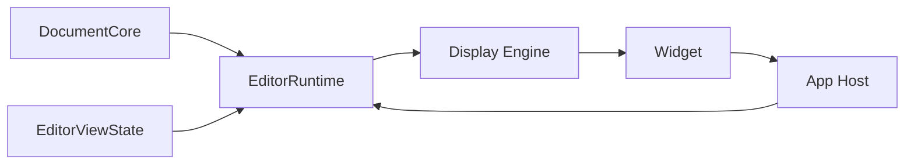
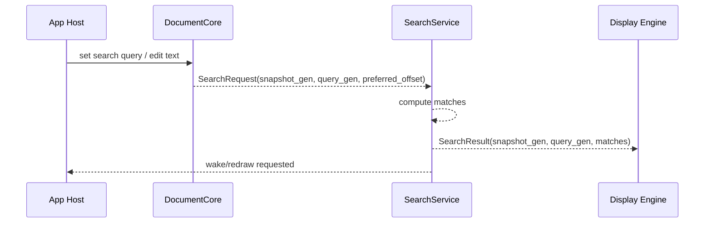
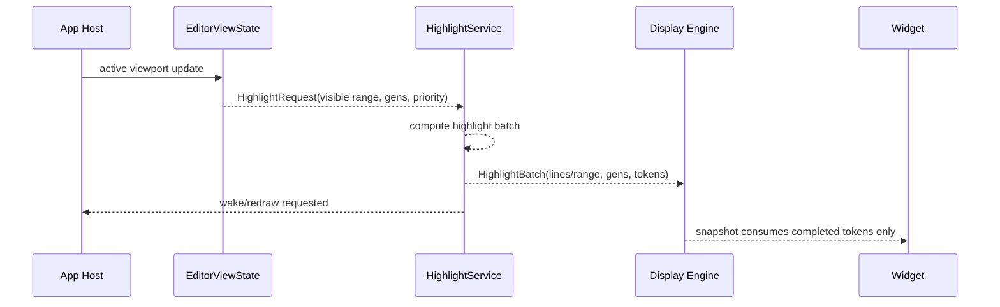

# Editor Runtime Contract

Date: 2026-03-19

## Purpose

Define the execution-lane contract for editor runtime work.

This is the authority for:

- background work ownership
- queueing and cancellation
- work prioritization
- result publication
- redraw/wake semantics

It exists because the current code is split across two incompatible models:

- search already has a worker seam
- visible highlight still runs on the foreground frame path

The redesign direction is to unify those into one editor-owned runtime seam.

Current execution decision:

- `Phase 1` is frozen after the document/view checkpoint
- the existing search worker synchronization seam is the first explicit
  extraction target for `Phase 2`
- that means search is no longer treated as "already solved"; it is the
  bootstrap lane for real `EditorRuntime` ownership

Current implementation progress:

- search synchronization state has begun moving under a named runtime-oriented
  sub-structure in editor code
- the current cut is deliberately structural first: isolate worker/request/
  result ownership before changing wake/publication semantics
- lock/signal/request/result operations are now being routed through explicit
  editor/runtime helper verbs instead of open-coded nested field access
- pending search results now explicitly request redraw driving from the editor
  frame hook instead of depending solely on unrelated input/redraw traffic
- pending search result application is now initiated from the editor frame hook
  rather than being hidden inside display-prepare work
- highlight scheduling state in render cache has started being isolated behind a
  named state block so the next ownership move can be structural instead of a
  diffuse field sweep
- highlight scheduling ownership has now moved off render cache and onto
  editor-owned state; render cache remains a token/cache publication surface,
  not the queue owner
- visible highlight publication now also requests redraw from the frame hook
  when a batch publishes tokens, even if that batch drains the queue on the
  same frame
- visible highlight scheduling and startup-warmup throttling now live together
  under a named editor-owned runtime state block instead of as loose editor
  fields
- visible highlight now also has explicit request/result mailbox state on that
  runtime block; execution is still synchronous for now, but publication no
  longer depends on a frame-path-only shape
- visible highlight cache publication is now applied from the editor
  frame/runtime lane rather than being performed directly inside widget
  precompute
- visible highlight completion now also has an explicit runtime redraw signal
  rather than relying on the frame path to infer publication from mailbox
  presence
- visible highlight scheduling and execution are now distinct phases in code,
  even though execution is still foreground; that removes the last direct
  schedule-and-execute knot ahead of the worker move
- visible highlight execution is now invoked explicitly from the app/runtime
  precompute path rather than being hidden inside the widget precompute
  entrypoint
- visible highlight execution logic itself now lives on `Editor` rather than in
  widget helper code; the remaining step is to move that editor-owned execution
  onto a worker/task lane

## Current Problem

Today:

- search uses a worker thread and a single pending-result mailbox
- search completion is polling-based
- grammar bootstrap is detached global worker logic
- visible highlight queue/progress/completion state lives in `EditorRenderCache`
- visible highlight production still executes synchronously from widget/frame
  precompute

That means runtime work is not owned by one subsystem seam.

## Runtime Ownership Rule

All expensive editor work that is not required to execute immediately in
 response to a user command belongs to `EditorRuntime`.

That includes:

- search computation
- visible highlight generation
- background highlight fill
- future expensive display work such as wrap/width/grapheme lanes if needed

It does not include:

- direct document mutation
- widget hit-testing
- draw submission
- renderer composition

## Target Runtime Shape

## Services

`EditorRuntime` should initially expose two services:

1. `SearchService`
2. `HighlightService`

These may share one worker thread initially, but they must not share ownership
 through app/widget/render artifacts.

## Work Model

### Common work item fields

Every runtime work item should carry:

- `editor_id` or owning instance identity
- `request_gen`
- `document_gen`
- `style_gen` where relevant
- `view_gen` where relevant
- `priority`
- `kind`

### Common publication fields

Every completed result should carry:

- `request_gen`
- `document_gen`
- `style_gen`
- `view_gen`
- `result_kind`
- `payload`

Results are valid only if their generations still match current core/view state
 at consume time.

## Search Service

### Current weakness

Current search:

- copies the whole buffer to allocate a request
- queues one pending request
- writes one pending result
- relies on later frame prep to notice that result

### Target contract

Search service should:

- accept search requests against immutable document snapshots
- drop stale requests by generation
- publish completed match sets via runtime mailbox
- request redraw/wake on completion

### Search request

### Search rules

1. Search publication must be evented, not polling-only.
2. Result payload must be immutable.
3. Search should prefer snapshot references over repeated full-buffer copies when
   safe.
4. “latest request wins” is acceptable initially, but must be explicit runtime
   policy, not incidental queue overwrite.

## Highlight Service

### Current weakness

Current visible highlight flow:

- view/render decides missing visible work
- render cache owns queue/progress/completion state
- widget precompute calls `highlightRange(...)` inline
- results are published directly into render cache

This is the wrong ownership split.

### Target contract

Highlight service should:

- own highlight job queue and progress
- accept visible-range requests from host/view state
- prioritize visible work first
- compute highlight batches off the UI lane
- publish immutable completed batches
- let display/render consume only completed batches

### Highlight priorities

Initial priority bands:

1. `visible_now`
2. `near_visible`
3. `background_fill`

### Highlight request flow

### Highlight rules

1. `highlightRange(...)` must not be called from widget precompute or draw.
2. `EditorRenderCache` must not own highlight work scheduling state.
3. Highlight batches must be epoch-keyed.
4. Stale batches must be dropped before publish and again on consume.
5. UI lane may request work and apply results, but it must not execute the
   expensive query inline.

## Mailbox / Queue Contract

The initial runtime implementation can stay simple:

- one worker thread
- one request queue per service
- one completed-result mailbox per service

But the ownership must be explicit.

### Required capabilities

- enqueue request
- coalesce or replace stale lower-priority work
- cancel work by generation
- publish completed immutable result
- notify host that redraw/wake is needed

### Forbidden shortcuts

- storing runtime queue state in widget objects
- storing runtime queue state in render cache
- requiring app frame hooks to “drive” computation by repeatedly calling the
  expensive work function

## Wake / Redraw Contract

Runtime completion must be able to request a redraw/wake without waiting for
 unrelated input.

That can be implemented initially as:

- editor-owned `runtime_publish_gen`
- host-visible `runtime_needs_redraw` flag

Later it can become:

- explicit wake channel or event queue

But it must be runtime-owned, not implicit polling.

## Relationship To Display Engine

The display engine is a consumer of runtime results.

It may:

- request missing visible work
- ingest completed highlight/search/display batches
- build immutable display snapshots

It may not:

- schedule runtime ownership state
- own long-running highlight queues
- decide runtime cancellation policy

## Relationship To Widget

Widget is downstream of display publication.

It may:

- translate input into intents
- request viewport changes
- consume immutable display snapshots

It may not:

- execute expensive runtime work
- own runtime queues
- mutate search/highlight runtime state directly

## Migration Phases

### Phase 1: Runtime ownership cut

- introduce `EditorRuntime`
- move highlight queue/progress/completion state out of `EditorRenderCache`
- keep the current result shape to reduce churn

### Phase 2: Publish/consume cut

- change visible precompute to submit missing work and consume results only
- add explicit runtime completion wake/redraw signaling

### Phase 3: Snapshot hardening

- move search requests toward immutable document snapshots
- attach all runtime jobs to generation bundles
- reject stale results on publish and consume

### Phase 4: Priority refinement

- add near-visible and background fill
- consider separate lanes for width/wrap/grapheme work if still needed

## Immediate Rules

1. No new highlight work scheduling state in render cache.
2. No new polling-only background publication path.
3. No new widget-triggered expensive runtime execution.
4. New background work must define:
   - owner
   - request generations
   - cancellation rule
   - publication payload
   - redraw/wake rule
