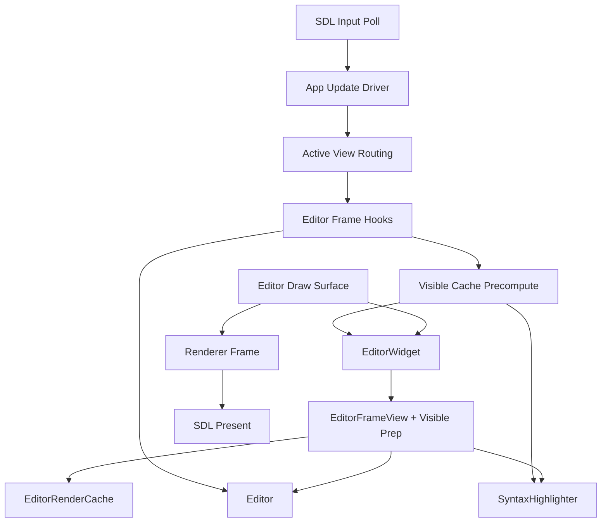
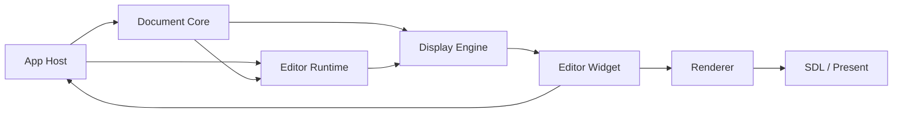
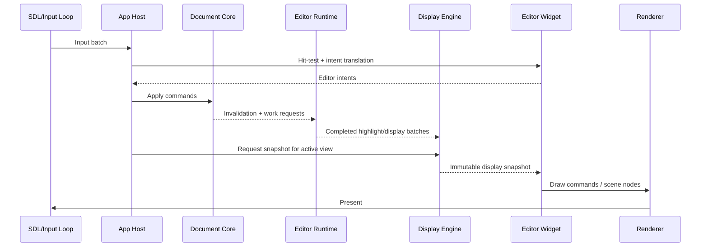

# Editor Stack Redesign Plan

Date: 2026-03-19

## Purpose

This document turns the recent Unicode/highlight/threading investigation into a
 full-stack redesign plan from text engine to native SDL presentation.

It exists because the current editor is no longer blocked on one isolated perf
 bug. The remaining weakness is structural:

- the editor core still owns too many responsibilities
- runtime work is split across editor/app/widget/render seams
- expensive highlight/display work still leaks onto the foreground frame path
- widget, render, and app layers still reach into each other in the wrong
  direction

This file is planning authority for the redesign shape.

Task sequencing remains in `docs/todo/editor/`.

## Why This Exists

The reference comparison against Neovim, Neovide, and Notepad++/Scintilla
 produced one consistent conclusion:

- strong peers keep syntax/styling truth in an engine/runtime seam
- strong peers keep window/input/render lanes downstream consumers of that
  truth
- Zide still performs too much editor work in app/frame/widget lanes

The current product symptoms are downstream of that:

- startup highlight still needed repeated structural fixes
- warmup moved from one giant stall to streaming foreground batches
- user-visible highlighting now behaves like deferred UI work instead of engine
  publication

That is not a tuning problem. It is a layering problem.

## Current Smell Map

### Structural smells

- `Editor` is still a god-object
- widget code still mutates editor core directly
- app frame hooks still own editor render/runtime policy
- render modules still import widget helpers
- display prep still runs in both update and draw lanes
- highlight queue ownership still sits in render cache instead of editor runtime
- frame view is still a thin live façade, not a stable frame snapshot
- redraw scheduling is app-global, not per-lane publication aware

### Consequences

- editor runtime work is not independently schedulable
- widget and render layers cannot be treated as downstream consumers
- background work and publication contracts are under-specified
- UI behavior regresses into visible staged convergence
- architecture docs say one thing while code still routes through older seams

## Current Pipeline

Problems in this pipeline:

- app frame hooks invoke editor runtime work
- widget precompute invokes syntax work
- draw path still reaches back into live editor state
- renderer consumes editor-specific retained targets instead of a generic scene

## Target Layer Map

The target split should be:

This is not just file movement. It is an authority split.

## Target Layers

### 1. Text Buffer

Owns:

- rope or piece-tree storage
- offsets, line starts, line metrics
- primitive splice operations

Does not own:

- file lifecycle
- undo transaction policy
- search/highlight runtime
- selections
- scroll/view state

### 2. Transaction + History

Owns:

- undo/redo transactions
- inverse edits
- selection/caret restoration state
- emitted `ChangeSet`

Does not own:

- UI cache invalidation
- widget behavior
- syntax work scheduling

### 3. Document Core

Owns:

- `TextBuffer`
- `History`
- document identity and dirty state
- syntax/search epochs
- parser/highlighter state identity

Does not own:

- scroll/view state
- widget hit-testing
- renderer caches

### 4. Selection Set

Owns:

- cursor(s)
- selections
- rectangular selection state
- movement semantics against document snapshots

### 5. View State

Owns:

- scroll line/column
- row offset
- preferred visual column
- wrap mode
- viewport-local navigation state

### 6. Editor Runtime

Owns:

- search worker/service
- highlight worker/service
- future expensive display work scheduling
- cancellation
- prioritization
- result publication mailboxes

Does not own:

- widget code
- draw submission
- app routing

### 7. Display Engine

Owns:

- visible line traversal
- line widths
- grapheme clusters
- wrap counts
- highlight slices
- segment preparation
- immutable `EditorDisplaySnapshot`

Does not own:

- syntax execution scheduling
- direct widget callbacks
- app frame policy

### 8. Widget

Owns:

- hit-testing
- pointer/drag interpretation
- IME anchor routing
- translation of user interaction into intents

Does not own:

- document mutation
- highlight execution
- cluster cache lifetime
- render cache scheduling

### 9. Renderer + SDL

Renderer owns:

- generic retained surfaces
- scene composition
- frame publication

SDL/app frame owns:

- event polling
- frame pacing
- present acknowledgement

## Target Execution Lanes

Rules:

- the UI lane does not execute expensive syntax generation
- runtime work publishes results
- display snapshot is immutable for one frame
- widget is downstream from display publication

## Target Publications

The editor subsystem should publish generationed state, not just rely on one
 `needs_redraw` flag.

Suggested generations:

- `content_gen`
- `selection_gen`
- `style_gen`
- `viewport_gen`
- `display_request_gen`
- `display_publish_gen`
- `present_ack_gen`

This mirrors the stronger publication thinking already used in terminal work.

## Reference Comparison

### Neovim

Use as the ownership reference:

- syntax/highlight state is runtime-owned
- window/view state is not buffer-owned
- redraw consumes runtime truth

### Neovide

Use as the execution-lane reference:

- bridge/editor/renderer/window are separate lanes
- heavy preprocessing does not belong to the window/input lane

### Notepad++ / Scintilla

Use as the styling-progress reference:

- styling belongs to the engine seam
- bounded foreground work and deferred continuation are engine-owned, not
  widget-invented

## Planned Redesign Phases

### Phase 0: Freeze Authority

Before code movement:

- keep this plan as architecture authority
- keep task sequencing in `docs/todo/editor/`
- forbid new widget-owned highlight/runtime work

### Phase 1: Split Core Ownership

Goals:

- split `Editor` into `DocumentCore` and `EditorViewState`
- move file/document lifecycle out of editing semantics
- unify undo history and selection restoration

Deliverables:

- `DocumentCore`
- `EditorViewState`
- first `ChangeSet`

### Phase 2: Introduce Editor Runtime

Goals:

- create editor-owned highlight service
- move queue/progress/cancellation out of render cache
- keep search and highlight under one runtime seam

Deliverables:

- worker/mailbox contracts
- publish/wake path
- epoch-keyed job model

### Phase 3: Introduce Display Snapshot

Goals:

- replace live `EditorFrameView`
- produce immutable display snapshot per frame
- move cluster/width/wrap ownership into display engine

Deliverables:

- `EditorDisplaySnapshot`
- editor display cache ownership cut
- no render imports from widget modules

### Phase 4: Intent-Driven Widget

Goals:

- make widget emit intents rather than mutate document directly
- keep hit-testing and interaction local
- host/core applies semantic actions

Deliverables:

- input intent DTOs
- host apply path
- widget no longer calls editor mutation APIs directly

### Phase 5: Renderer Genericization

Goals:

- replace editor-specific renderer targets with generic retained-surface scene
  APIs
- keep retained-target performance without editor/terminal semantic leakage

Deliverables:

- generic scene/layer submission
- editor and terminal downstream of renderer abstraction

## First No-Regret Rules

These should be treated as immediate architecture rules even before the full
 redesign lands:

1. No new expensive editor runtime work in widget precompute.
2. No new render-module imports from widget modules.
3. No new widget direct mutation of document/search/highlight internals.
4. No new app-frame ownership of editor runtime scheduling.
5. Any new cache must declare whether it is:
   - document-owned
   - runtime-owned
   - display-owned
   - widget-owned
   - renderer-owned

## Open Questions

These are legitimate design questions, not blockers:

1. Should `SelectionSet` stay inside `DocumentCore` for the first cut, or be a
   separate object immediately?
2. Should highlight and search share one runtime thread initially, or be two
   services behind one runtime API?
3. Should display snapshot publication be per-editor only, or per-view to
   support multiple simultaneous views later?
4. How far should renderer genericization go before it risks destabilizing the
   current terminal/editor retained-target wins?

## Immediate Next Planning Outputs

After this plan, the next design docs should be:

1. `DocumentCore + EditorViewState` boundary doc
2. `Editor Runtime` worker/publication contract
3. `Editor Display Snapshot` contract
4. renderer scene/publication proposal for editor and terminal convergence

Current follow-up authority created from this plan:

- `app_architecture/editor/DOCUMENT_CORE_AND_VIEW_STATE_BOUNDARY.md`
- `app_architecture/editor/EDITOR_RUNTIME_CONTRACT.md`
- `app_architecture/editor/EDITOR_DISPLAY_SNAPSHOT_CONTRACT.md`
- `app_architecture/RENDERER_SCENE_PUBLICATION_CONTRACT.md`
- `app_architecture/editor/EDITOR_REDESIGN_EXECUTION_ROADMAP.md`
