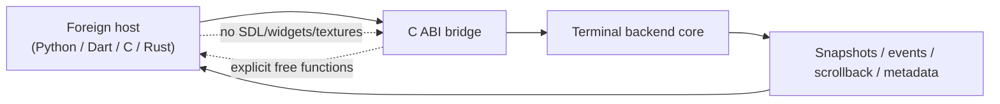
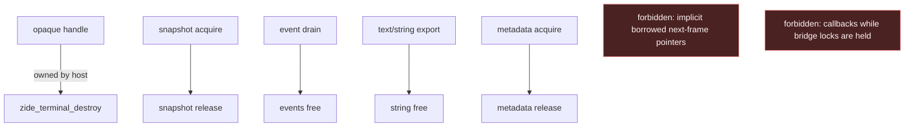

# Terminal FFI Bridge Design

Date: 2026-02-27

Purpose: define the first embeddable terminal backend surface for Zide.

Status: milestone-1 baseline is implemented. This document now describes the active bridge shape and constraints.

## Why this exists

Zide already has a modular terminal backend:
- PTY and process I/O
- VT parser and protocol handlers
- screen model and scrollback
- immutable render-facing snapshots

What has now landed as a productized host boundary:
- C ABI exports via `include/zide_terminal_ffi.h`
- explicit ownership model for foreign callers
- standalone smoke consumers outside the Zide UI shell

This bridge makes modularity real. If the backend cannot be hosted cleanly outside the current SDL widget stack, the boundary is not finished.

## Goals

- Export a narrow, boring, host-facing terminal backend API.
- Keep UI/rendering concerns out of the exported surface.
- Make ownership and lifetime explicit for every exported buffer.
- Support desktop hosts first: Linux, macOS, Windows.
- Prove the surface with a minimal non-Zide consumer before any Flutter-specific work.

## Non-goals

- No Flutter-specific API in milestone 1.
- No SDL, renderer, texture, or widget types in the bridge.
- No final ABI-stability promise before the smoke host and tests exist.
- No attempt to export the current renderer as a foreign widget.
- No daemon/multiplexer requirement in milestone 1.

## Primary exported shape

The first bridge should be:
- an opaque-handle C ABI
- implemented in Zig
- optionally wrapped by higher-level hosts later

That means:
- foreign callers never see Zig allocators, slices, or tagged unions directly
- all long-lived state is referenced by opaque handles
- all returned owned buffers have explicit `free` functions
- all inputs use flat structs or pointer+len pairs

This matches the practical direction used by Ghostty's embedded runtime and is simpler to bind from Python, Dart, Swift, Rust, or C than a Zig-only package boundary.

## Layer boundary

The bridge sits above the terminal backend and below host UI/render code.

Host responsibilities:
- create/destroy session
- start session / spawn child
- resize
- send bytes, key events, text, mouse events
- poll/drain work
- acquire snapshot
- drain events
- free exported buffers

Backend responsibilities:
- PTY lifecycle and byte transport
- VT parsing
- protocol state
- screen model and scrollback
- damage tracking
- snapshot construction
- event generation

Out of scope for the bridge:
- glyph rasterization
- texture upload
- SDL input translation
- widget hover/selection visuals

## Initial API surface

Required operations for milestone 1:
- `zide_terminal_create(config)`
- `zide_terminal_destroy(handle)`
- `zide_terminal_start(handle)`
- `zide_terminal_poll(handle)`
- `zide_terminal_resize(handle, cols, rows, cell_width_px, cell_height_px)`
- `zide_terminal_send_bytes(handle, ptr, len)`
- `zide_terminal_send_text(handle, utf8_ptr, utf8_len)`
- `zide_terminal_feed_output(handle, ptr, len)`
- `zide_terminal_close_input(handle)`
- `zide_terminal_send_key(handle, key_event)`
- `zide_terminal_send_mouse(handle, mouse_event)`
- `zide_terminal_present_ack(handle, generation)`
- `zide_terminal_acknowledged_generation(handle, &generation)`
- `zide_terminal_published_generation(handle, &generation)`
- `zide_terminal_redraw_state(handle, &state)`
- `zide_terminal_needs_redraw(handle)`
- `zide_terminal_snapshot_acquire(handle, out_snapshot)`
- `zide_terminal_snapshot_release(snapshot)`
- `zide_terminal_scrollback_acquire(handle, start_row, max_rows, out_buffer)`
- `zide_terminal_scrollback_release(out_buffer)`
- `zide_terminal_metadata_acquire(handle, out_metadata)`
- `zide_terminal_metadata_release(metadata)`
- `zide_terminal_event_drain(handle, out_events)`
- `zide_terminal_events_free(events)`
- `zide_terminal_is_alive(handle)`
- `zide_terminal_selection_text(handle, out_string)`
- `zide_terminal_scrollback_plain_text(handle, out_string)`
- `zide_terminal_scrollback_ansi_text(handle, out_string)`
- `zide_terminal_string_free(string)`
- `zide_terminal_child_exit_status(handle, out_code, out_has_status)`
- `zide_terminal_snapshot_abi_version()`
- `zide_terminal_event_abi_version()`
- `zide_terminal_scrollback_abi_version()`
- `zide_terminal_metadata_abi_version()`
- `zide_terminal_redraw_state_abi_version()`
- `zide_terminal_string_abi_version()`
- `zide_terminal_renderer_metadata_abi_version()`
- `zide_terminal_renderer_metadata(codepoint, out_metadata)`
- `zide_terminal_status_string(status)`

The initial API should stay synchronous and polling-based.

Reason:
- easier to test
- easier to bind from Python `ctypes`
- avoids callback ownership and thread re-entry issues too early

Callbacks may be added later for a subset of events once ownership and threading are already proven.

## Ownership rules

Baseline rules:
- Opaque session handles are owned by the host and freed with `destroy`.
- Snapshot acquisition returns either:
  - owned copied buffers with explicit release, or
  - a pinned bridge object whose release invalidates all interior pointers.
- Event drains return owned flat arrays plus explicit free.
- Copied string/text exports return owned buffers plus explicit free.
- All exported acquired/output buffer structs now carry inline:
  - `abi_version`
  - `struct_size`
- String fields in exported events/snapshots must either:
  - be inline/fixed-size, or
  - point into an owned bridge allocation released by the paired free.

Rules that are not allowed in the exported ABI:
- borrowed slices valid until “next frame” without an explicit release object
- allocator-owned pointers with no named free function
- callbacks that can fire while the host is holding bridge-owned locks

## Snapshot direction

Milestone 1 snapshot policy:
- export a full flat snapshot first
- defer diff/damage-optimized transport until the full snapshot path is proven

Reason:
- full snapshots are slower but much easier to reason about
- they are good enough for a smoke host and initial foreign bindings
- damage-aware transport can layer on later without blocking the contract

The snapshot should include at minimum:
- rows/cols
- flat cell array
- cursor state
- dirty/damage summary
- title/cwd metadata if available
- selection metadata only if it is part of the core backend contract
- kitty image/placement metadata only if already representable without renderer leakage

## Event model direction

Milestone 1 event policy:
- explicit event drain queue
- no required callbacks

Event families likely needed:
- title changed
- current working directory changed
- clipboard write received / clipboard read requested
- bell
- child exited
- hyperlink/open intent
- wake/dirty notification

Some data can remain snapshot-derived instead of event-driven. The event inventory document will decide this per item.

## Current native-vs-FFI contract position

The shared redraw/publication/present authority now lives in:

- `app_architecture/terminal/RENDER_PUBLICATION_CONTRACT.md`

This bridge document should stay bridge-specific. The contract split is now:

- shared semantic authority:
  - published generation truth
  - acknowledged generation truth
  - wake-vs-present separation
- bridge-specific authority:
  - exact exported FFI calls
  - ownership/lifetime rules
  - milestone-specific ABI choices

Current bridge catch-up already landed:

- `zide_terminal_present_ack(handle, generation)`
- `zide_terminal_acknowledged_generation(handle, &generation)`
- `zide_terminal_published_generation(handle, &generation)`
- `zide_terminal_redraw_state(handle, &state)`
- `zide_terminal_redraw_state_abi_version()`
- `zide_terminal_needs_redraw(handle)`

So the bridge now exposes the same basic host-facing semantics as the shared
contract without leaking native renderer details.

Lifecycle/latest-state policy:

- `zide_terminal_metadata_acquire(...)` is the preferred latest-state summary
  for:
  - alive
  - exit status presence/code
  - title
  - cwd
  - scrollback counts
- `zide_terminal_is_alive(...)` and `zide_terminal_child_exit_status(...)`
  remain focused convenience helpers
- hosts should not reconstruct lifecycle truth from multiple narrow calls when
  `metadata_acquire(...)` already carries the same authoritative state

History/export policy:

- `zide_terminal_metadata_acquire(...)` plus
  `zide_terminal_scrollback_acquire(...)` are the authoritative structured
  history surfaces
- `zide_terminal_selection_text(...)`,
  `zide_terminal_scrollback_plain_text(...)`, and
  `zide_terminal_scrollback_ansi_text(...)` are convenience export views
- hosts should prefer the structured history path when they need stable row
  counts, row windows, or richer host-local rendering/inspection logic
- hosts should prefer the text exports when they explicitly want copied text,
  not structured history state

Selection/export policy:

- milestone 1 does not export structured selection geometry/ranges as a stable
  bridge surface
- `zide_terminal_selection_text(...)` is therefore a convenience copied-text
  export, not a structured selection-state authority
- hosts should treat it as "give me the current selected text", not as a way to
  reconstruct selection ownership, anchors, or geometry

Bridge policy decision:

- `redraw_ready` stays wake-only
- it is not upgraded into an acknowledged-generation-aware present event
- acknowledged-generation-aware redraw truth belongs in direct getters:
  - `zide_terminal_redraw_state(...)`
  - `zide_terminal_published_generation(...)`
  - `zide_terminal_acknowledged_generation(...)`

Reason:

- matches the cleaner reference direction
- keeps the event stream cheap and edge-triggered
- keeps redraw truth level-triggered and explicit
- avoids forcing hosts to infer state from event history

## PTY model direction

Milestone 1 PTY policy:
- backend-owned PTY by default
- host-driven `poll()`
- explicit future extension for external byte sources

Reason:
- this matches Zide's current implementation
- it proves the backend boundary with minimum change
- it avoids prematurely designing a more abstract transport than we can test

Future extension:
- allow hosts to feed external byte streams instead of spawning a child internally
- useful for multiplexers, replay tools, or remote transports

## Smoke host policy

The first smoke consumer should be Python, not C.

Reason:
- lowest effort host
- easy to inspect bytes, structs, and ownership mistakes
- good fit for opaque-handle and flat-struct validation via `ctypes`

Current baseline smoke flow:
1. load the shared library
2. create a terminal session
3. resize through the foreign API
4. feed terminal output bytes through the parser-facing bridge call (`zide_terminal_feed_output`)
5. query `zide_terminal_redraw_state(...)` and require pending redraw truth
6. acquire a snapshot
7. inspect title/cwd/cell buffer metadata
8. use `zide_terminal_metadata_acquire(...)` for the authoritative latest-state summary when lifecycle/title/cwd/scrollback state matters
9. acknowledge the published generation with `zide_terminal_present_ack(...)`
10. verify redraw state cools off
11. drain title/clipboard events
12. release snapshot and destroy session

Dedicated PTY smoke flow (separate verifier):
1. use a separate focused verifier
2. start a shell
3. send `printf` or `echo`
4. poll until output arrives
5. assert output and child exit

Current implementation split:
- keep Python `ctypes` as the authoritative no-PTY ownership/lifetime host
- use a separate Zig verifier executable for PTY-backed startup/polling
- install a small C header alongside the shared library so non-Python hosts do not reconstruct structs manually

This host is not a product integration. It is contract proof.

## Status and getter policy

Bridge status codes are intentionally small and scalar:
- `0` = `ok`
- `1` = `invalid_argument`
- `2` = `out_of_memory`
- `3` = `backend_error`

Hosts may map those through `zide_terminal_status_string(status)` for diagnostics.
The installed C header for the current bridge surface is `include/zide_terminal_ffi.h`.

Getter policy:
- latest-state string getters return owned bridge buffers
- hosts must free them with `zide_terminal_string_free()`
- scalar state like child exit status should use direct out-parameter getters instead of synthetic event payload decoding
- when metadata already carries the latest-state summary, hosts should prefer
  `zide_terminal_metadata_acquire(...)` over reconstructing that state from
  multiple narrow getters

## Reference patterns

Ghostty:
- embedded runtime with exported C API and host callbacks
- separate `lib_vt` terminal-engine surface

WezTerm:
- reusable GUI-free terminal core
- pane/renderable seam between terminal model and UI consumption

Contour:
- strongest split between terminal backend and render-buffer generation
- useful reference for future damage/diff export

Rio:
- strong PTY/session separation
- useful reference for host-managed poll loop design

Foot:
- useful negative reference: server mode is interesting, but in-process embeddability is not the first milestone

## Success criteria

The bridge is successful when all of the following are true:
- a foreign host can spawn and drive a shell without importing UI code
- snapshot acquisition and release have explicit, tested ownership
- title/cwd/exit/bell style signals are available through the bridge
- the Python smoke host works on supported desktop platforms for create/resize/snapshot/event ownership
- the bridge code does not force renderer or widget types back into the backend boundary

## Follow-ons after milestone 1

- diff/damage-oriented snapshot export
- callback-based wakeups
- external byte-source mode
- daemon/session-sharing evaluation
- Flutter adapter work
- richer test host(s) beyond Python

## Daemon / Multiplexer Position

Daemon or multiplexer mode is explicitly a follow-on, not a prerequisite for
the embedded bridge.

Current decision:
- the in-process bridge remains the primary productization target
- daemon/session-sharing work is allowed later only after the in-process
  redraw/publication/present contract is boring and test-backed
- no current bridge design choice should require a daemon to be viable

Why:
- `foot` shows that server mode is a real product direction, but it is a
  different system shape with socket/session orchestration overhead that is not
  needed to prove embeddability first
- `wezterm` shows multiplexing domains are valuable, but they sit above an
  already-credible local terminal/mux contract rather than replacing the need
  for a clean in-process host boundary
- `contour`'s daemon draft reinforces that multi-client session sharing brings
  additional protocol, history, and redraw responsibilities that should not be
  mixed into the initial embedded bridge milestone

What this means for Zide:
- Linux native quality and the in-process FFI bridge stay first
- the bridge contract must remain daemon-compatible in spirit:
  - explicit ownership
  - explicit latest-state getters
  - explicit present acknowledgement
  - host-driven polling
- but we do not add daemon-specific protocol, server lifecycle, or multi-client
  coordination requirements to the current milestone

When daemon/session-sharing becomes worth revisiting:
- the in-process bridge is stable and boring
- no-PTY host-fed mode is healthy
- native and embedded host semantics are aligned
- there is a concrete product need for shared remote/local sessions or host
  resource consolidation beyond what the current embedded contract solves
