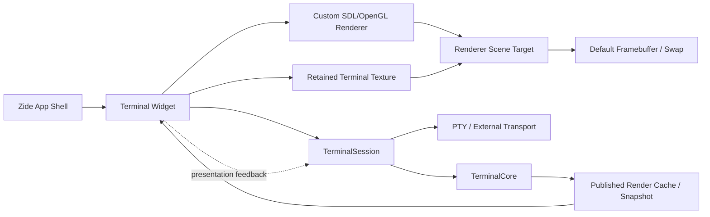
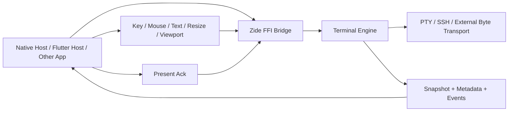
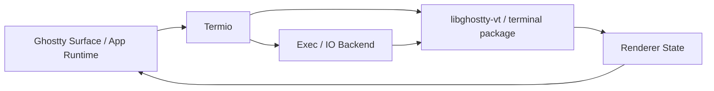
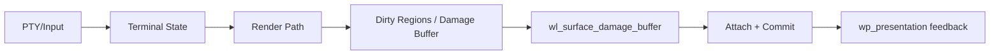
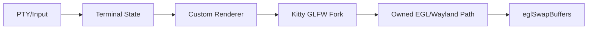
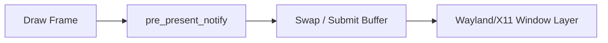
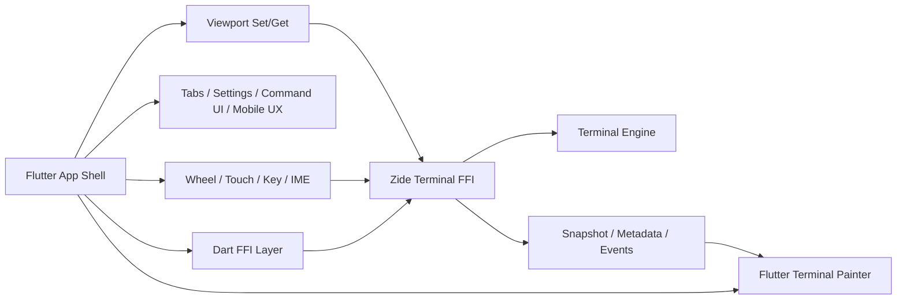

# Terminal Architecture Comparison

Date: 2026-03-14

Purpose: visualize how Zide's terminal architecture compares to the strongest
native terminal references, with emphasis on:

- VT/core ownership
- transport/runtime ownership
- render/present ownership
- embeddability

This doc is intentionally high-level. It is not a protocol audit or a
performance benchmark report.

## Summary

Zide is currently closest to the "serious native terminal" family
(`ghostty`, `foot`, `kitty`, `wezterm`, `rio`) rather than framework-led or
browser-led terminal apps.

Its unusual trait is not that it is custom, but that it is trying to make the
terminal backend a real embeddable engine while also keeping a strong native
renderer path.

Compared to the references:

- `ghostty-vt` is cleaner today as a VT library boundary.
- `foot` is the clearest native damage/commit/presentation reference.
- `kitty` is the clearest "own the backend seam directly" reference.
- `rio` / `wezterm` are the clearest references for explicit pre-present
  discipline.
- Zide is currently the most architecture-rich at the host-contract layer:
  snapshot, metadata, events, redraw/publication generations, and a growing
  viewport/presentation contract.

## Zide Today

### Notes

- Zide already has a real `TerminalCore`, but `TerminalSession` is still the
  main runtime-facing owner.
- The native renderer is custom and retains widget-local targets where they
  still pay off.
- The renderer now also owns an authoritative scene target before the final
  present step.

## Zide Target Embedded Shape

### Notes

- This is where Zide has a real architectural advantage over many terminals.
- The host should not interpret terminal semantics itself.
- The host should render engine-owned state and acknowledge presentation.

## Ghostty / libghostty-vt

### Notes

- `libghostty-vt` is a curated public package over Ghostty's terminal code.
- `Termio` is the runtime and transport shell around the VT layer.
- This split is cleaner today than Zide's current `TerminalCore` /
  `TerminalSession` split.

## Foot

### Notes

- `foot` is the strongest lightweight native presentation reference.
- It is explicit about damage, commit, and presentation timing.
- It solves a narrower problem than Zide, but solves it very directly.

## Kitty

### Notes

- `kitty` is highly custom and backend-explicit.
- Its main lesson for Zide is backend ownership, not host embeddability.

## Rio / WezTerm Present Discipline

### Notes

- These projects are strong references for explicit present-boundary
  discipline.
- The main signal is not "which GL call" but "presentation is a first-class
  phase."

## Direct Comparison

```mermaid
flowchart TD
    subgraph Zide
        ZHost[Host] --> ZFFI[Explicit FFI Contract]
        ZFFI --> ZEngine[Engine]
        ZEngine --> ZViewport[Published / Acknowledged / Viewport State]
    end

    subgraph Ghostty
        GHost[Host Runtime] --> GTermio[Termio]
        GTermio --> GVT[VT Library]
    end

    subgraph Foot
        FPTY[PTY/Input] --> FTerm[Terminal]
        FTerm --> FRender[Render + Damage + Commit]
    end

    subgraph Kitty
        KPTY[PTY/Input] --> KTerm[Terminal]
        KTerm --> KBackend[Renderer + GLFW/EGL Backend]
    end
```

## What Is Most Home-Grown?

Roughly:

- `foot`: very home-grown
- `kitty`: very home-grown
- `ghostty`: very home-grown in the terminal/render path
- `rio`: very custom-heavy
- `wezterm`: custom terminal/render stack with more reusable window/runtime
  layers
- `zide`: very home-grown end-to-end, because the IDE shell, terminal widget,
  terminal engine, and renderer are all evolving together

Zide is not unusually custom relative to the strongest native references.
What is unusual is that it is trying to combine:

- native renderer ownership
- embeddable terminal engine goals
- explicit publication/presentation semantics

## Current Tradeoffs

### Zide strengths

- Strong host-facing contract direction
- Explicit redraw/publication/presentation concepts
- Real path toward embedded hosts such as Flutter
- Strong potential for low memory and scalable many-session workloads

### Zide weaknesses

- Less mature and less battle-tested than the references
- Render/present path still carries active bug-hunt and diagnostic complexity
- `TerminalCore` is not yet the fully dominant public center of the runtime

## Flutter Embedding View

### Notes

- Flutter should be the host shell, not the terminal engine.
- Zide should remain the source of truth for:
  - terminal semantics
  - viewport state
  - redraw state
  - metadata and event state

## Practical Conclusions

1. Zide is architecturally closer to `ghostty` / `foot` / `kitty` than to any
   framework-driven terminal app.
2. `libghostty-vt` is still cleaner today as a reusable VT package.
3. Zide's main unique advantage is the explicit host contract direction.
4. If `TerminalCore` becomes the clear public engine center and the FFI
   contract keeps growing cleanly, Zide can become more embed-oriented than
   most native terminals without giving up the native renderer path.
