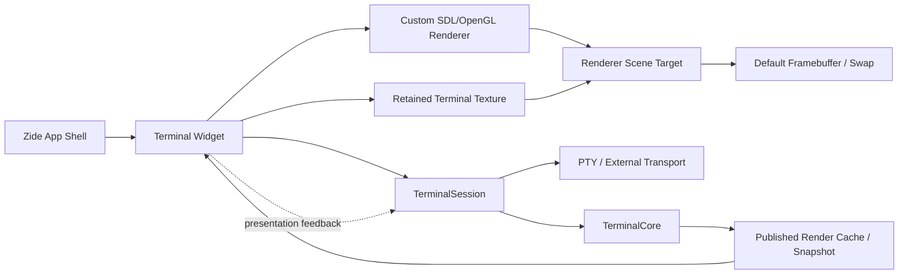
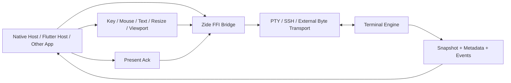
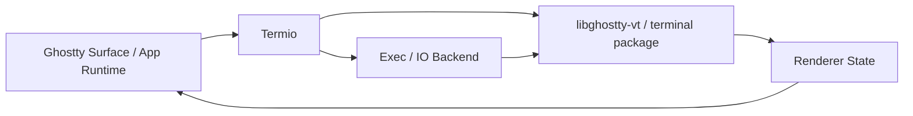
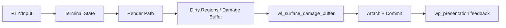
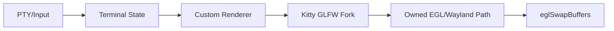
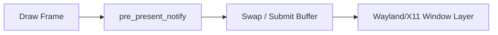
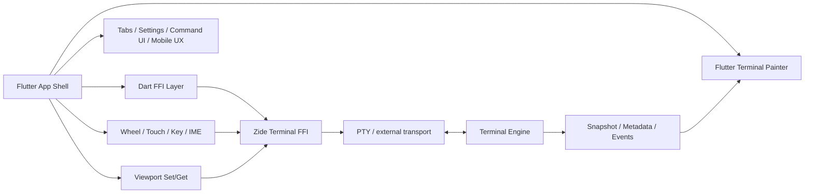

# Terminal Architecture Comparison

Date: 2026-03-14

Purpose: visualize how Zide's terminal architecture compares to the strongest
native terminal references, with emphasis on:

- VT/core ownership
- transport/runtime ownership
- render/present ownership
- embeddability

This doc is intentionally high-level. It is not a protocol audit or a
performance benchmark report.

## Summary

Zide is currently closest to the "serious native terminal" family
(`ghostty`, `foot`, `kitty`, `wezterm`, `rio`) rather than framework-led or
browser-led terminal apps.

Its unusual trait is not that it is custom, but that it is trying to make the
terminal backend a real embeddable engine while also keeping a strong native
renderer path.

Compared to the references:

- `ghostty-vt` is cleaner today as a VT library boundary.
- `ghostty-vt` is cleaner as an engine/library center, but its current public C
  umbrella is still much narrower than Zide's current host-facing FFI
  contract.
- `foot` is the clearest native damage/commit/presentation reference.
- `kitty` is the clearest "own the backend seam directly" reference.
- `rio` / `wezterm` are the clearest references for explicit pre-present
  discipline.
- Zide is currently the most architecture-rich at the host-contract layer:
  snapshot, metadata, events, redraw/publication generations, and a growing
  viewport/presentation contract.

## Zide Today

```mermaid
flowchart LR
    App[Zide App Shell] --> Widget[Terminal Widget]
    Widget --> Renderer[Custom SDL/OpenGL Renderer]
    Widget --> Session[TerminalSession]
    Session --> Core[TerminalCore]
    Session --> Transport[PTY / External Transport]
    Core --> ViewCache[Published Render Cache / Snapshot]
    ViewCache --> Widget
    Renderer --> Scene[Renderer Scene Target]
    Widget --> Tex[Retained Terminal Texture]
    Tex --> Scene
    Scene --> Present[Default Framebuffer / Swap]
    Widget -. presentation feedback .-> Session
```

### Notes

- This diagram is now historical shape evidence, not the current live shape.
- The live VT shape is now:
  - [TerminalCore](/home/home/personal/zide/src/terminal/core/terminal_core.zig)
  - [TerminalRuntimeShell](/home/home/personal/zide/src/terminal/core/session/terminal_runtime_shell.zig)
- `TerminalSession` is gone.
- `PtyTerminalRuntime` is gone.
- The current remaining gap versus Ghostty/WezTerm is no longer fake-center
  sludge; it is VT maturity purity:
  - library-center sufficiency
  - contract normalization
  - first-glance terminal-object maturity
- The native renderer is custom and retains widget-local targets where they
  still pay off.
- The renderer now also owns an authoritative scene target before the final
  present step.
- The native path should be read as the reference host implementation for the
  engine contract, not as a privileged terminal path that FFI is expected to
  trail permanently.

## Zide Target Embedded Shape

```mermaid
flowchart LR
    Host[Native Host / Flutter Host / Other App] --> FFI[Zide FFI Bridge]
    FFI --> Transport[PTY / SSH / External Byte Transport]
    Transport <--> Engine[Terminal Engine]
    Engine --> Snapshot[Snapshot + Metadata + Events]
    Snapshot --> Host
    Host --> Input[Key / Mouse / Text / Resize / Viewport]
    Input --> FFI
    Host --> PresentAck[Present Ack]
    PresentAck --> FFI
```

### Notes

- This is where Zide has a real architectural advantage over many terminals.
- The host should not interpret terminal semantics itself.
- The host should render engine-owned state and acknowledge presentation.
- Native and FFI should converge toward this same host shape, with native being
  the lowest-friction reference implementation rather than a special-case
  semantic owner.

## Ghostty / libghostty-vt

```mermaid
flowchart LR
    Surface[Ghostty Surface / App Runtime] --> Termio[Termio]
    Termio --> VT[libghostty-vt / terminal package]
    Termio --> Backend[Exec / IO Backend]
    Backend --> VT
    VT --> RenderState[Renderer State]
    RenderState --> Surface
```

### Notes

- `libghostty-vt` is a curated public package over Ghostty's terminal code.
- `Termio` is the runtime and transport shell around the VT layer.
- This split is cleaner today than Zide's current `TerminalCore` /
  `TerminalSession` split.
- Current local reference bias from
  [`dev_references/terminals/ghostty`](dev_references/terminals/ghostty):
  - [`include/ghostty/vt.h`](../../dev_references/terminals/ghostty/include/ghostty/vt.h)
    stays intentionally narrow and does not try to expose runtime/presentation
    churn as public contract
  - [`src/terminal/Terminal.zig`](../../dev_references/terminals/ghostty/src/terminal/Terminal.zig)
    keeps scrollback, modes, parser-owned semantics, and terminal state centered
    in the engine object
  - [`src/terminal/Screen.zig`](../../dev_references/terminals/ghostty/src/terminal/Screen.zig)
    keeps dirty/selection/screen mutation state local to the engine-side screen
    model
  - [`src/input/key_encode.zig`](../../dev_references/terminals/ghostty/src/input/key_encode.zig)
    is a peer subsystem derived from terminal state, not UI-owned glue
- Important nuance:
  - Ghostty is still ahead on making the engine obviously be the engine.
  - Zide is currently ahead on the explicit host-contract surface:
    - snapshot
    - metadata
    - events
    - redraw/publication generations
    - backend-owned viewport control
  - so the gap is not "Ghostty exposes more host ABI than Zide."
  - the gap is that Ghostty's terminal/library center is structurally cleaner,
    especially around runtime ownership and publication ownership.
  - for Zide's current diff/publication lane, that means:
    - keep the foreign-host contract centered on settled visible state
    - avoid widening the public ABI just to encode startup/runtime churn
    - prefer explicit full-refresh fallback when a case is still dominated by
      unretired full-dirty publication state

## Foot

```mermaid
flowchart LR
    Input[PTY/Input] --> Terminal[Terminal State]
    Terminal --> Render[Render Path]
    Render --> Damage[Dirty Regions / Damage Buffer]
    Damage --> Wayland[wl_surface_damage_buffer]
    Wayland --> Commit[Attach + Commit]
    Commit --> Feedback[wp_presentation feedback]
```

### Notes

- `foot` is the strongest lightweight native presentation reference.
- It is explicit about damage, commit, and presentation timing.
- It solves a narrower problem than Zide, but solves it very directly.

## Kitty

```mermaid
flowchart LR
    Input[PTY/Input] --> Terminal[Terminal State]
    Terminal --> Renderer[Custom Renderer]
    Renderer --> GLFW[Kitty GLFW Fork]
    GLFW --> EGL[Owned EGL/Wayland Path]
    EGL --> Swap[eglSwapBuffers]
```

### Notes

- `kitty` is highly custom and backend-explicit.
- Its main lesson for Zide is backend ownership, not host embeddability.

## Rio / WezTerm Present Discipline

```mermaid
flowchart LR
    Draw[Draw Frame] --> PrePresent[pre_present_notify]
    PrePresent --> Submit[Swap / Submit Buffer]
    Submit --> Windowing[Wayland/X11 Window Layer]
```

### Notes

- These projects are strong references for explicit present-boundary
  discipline.
- The main signal is not "which GL call" but "presentation is a first-class
  phase."

## Direct Comparison

```mermaid
flowchart TD
    subgraph Zide
        ZHost[Host] --> ZFFI[Explicit FFI Contract]
        ZFFI --> ZEngine[Engine]
        ZEngine --> ZViewport[Published / Acknowledged / Viewport State]
    end

    subgraph Ghostty
        GHost[Host Runtime] --> GTermio[Termio]
        GTermio --> GVT[VT Library]
    end

    subgraph Foot
        FPTY[PTY/Input] --> FTerm[Terminal]
        FTerm --> FRender[Render + Damage + Commit]
    end

    subgraph Kitty
        KPTY[PTY/Input] --> KTerm[Terminal]
        KTerm --> KBackend[Renderer + GLFW/EGL Backend]
    end
```

## What Is Most Home-Grown?

Roughly:

- `foot`: very home-grown
- `kitty`: very home-grown
- `ghostty`: very home-grown in the terminal/render path
- `rio`: very custom-heavy
- `wezterm`: custom terminal/render stack with more reusable window/runtime
  layers
- `zide`: very home-grown end-to-end, because the IDE shell, terminal widget,
  terminal engine, and renderer are all evolving together

Zide is not unusually custom relative to the strongest native references.
What is unusual is that it is trying to combine:

- native renderer ownership
- embeddable terminal engine goals
- explicit publication/presentation semantics

## Current Tradeoffs

### Zide strengths

- Strong host-facing contract direction
- Explicit redraw/publication/presentation concepts
- Real path toward embedded hosts such as Flutter
- Strong potential for low memory and scalable many-session workloads
- Native and FFI host semantics are converging more honestly now; recent bridge
  work closed most of the obvious "native can do this, FFI cannot" gaps in the
  basic host contract
- `TerminalCore` now owns materially more real engine behavior than it did in
  the earlier review window:
  - viewport/scrollback access
  - palette/default-color mutation
  - reset/save-state/parser control seams
  - selection and reflow-selection restoration
  - OSC title/cwd buffer semantics

### Zide weaknesses

- Less mature and less battle-tested than the references
- Render/present path still carries active bug-hunt and diagnostic complexity
- `TerminalCore` is not yet the fully dominant public center of the runtime
- The remaining center-of-gravity gap is now more specifically:
  - runtime/thread/transport assembly in `session_runtime.zig`
  - publication/present choreography in `session_rendering.zig` and
    `session_rendering_retirement.zig`
- Remaining bridge work is now more about ABI maturity and verifier depth than
  about obvious missing host semantics
- Snapshot/export cost is still heavier than ideal; the request-based metadata
  improvement landed, but full snapshot acquire remains the clearest remaining
  FFI boundary-cost hotspot

## Flutter Embedding View

```mermaid
flowchart LR
    Flutter[Flutter App Shell] --> Dart[Dart FFI Layer]
    Dart --> ZideFFI[Zide Terminal FFI]
    ZideFFI --> Transport[PTY / external transport]
    Transport <--> Engine[Terminal Engine]
    Flutter --> Painter[Flutter Terminal Painter]
    Engine --> Snapshot[Snapshot / Metadata / Events]
    Snapshot --> Painter
    Flutter --> UX[Tabs / Settings / Command UI / Mobile UX]
    Flutter --> Input[Wheel / Touch / Key / IME]
    Input --> ZideFFI
    Flutter --> Viewport[Viewport Set/Get]
    Viewport --> ZideFFI
```

### Notes

- Flutter should be the host shell, not the terminal engine.
- Zide should remain the source of truth for:
  - terminal semantics
  - viewport state
  - redraw state
  - metadata and event state

## Practical Conclusions

1. Zide is architecturally closer to `ghostty` / `foot` / `kitty` than to any
   framework-driven terminal app.
2. `libghostty-vt` is still cleaner today as a reusable VT package and engine
   center.
3. Zide's main unique advantage is the explicit host contract direction; it is
   already shipping a broader host-facing contract than Ghostty's current
   public C umbrella.
4. The comparison gap is therefore mostly structural:
   - Ghostty: cleaner engine-first center
   - Zide: richer host contract, but heavier runtime center
5. If `TerminalCore` becomes the clear public engine center and the FFI
   contract keeps growing cleanly, Zide can become more embed-oriented than
   most native terminals without giving up the native renderer path.
