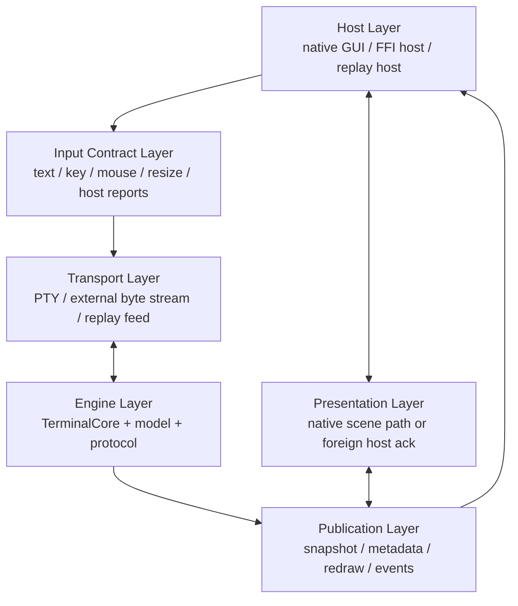
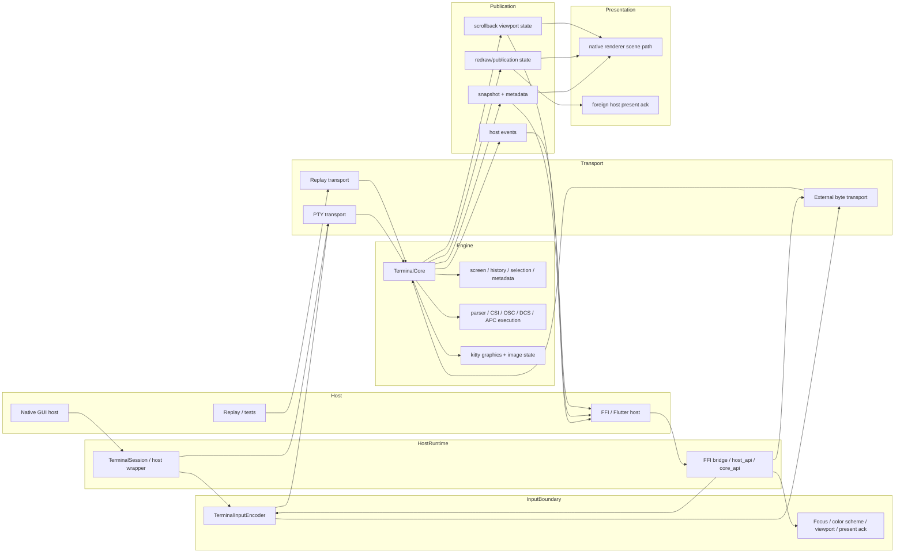
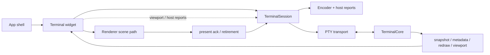
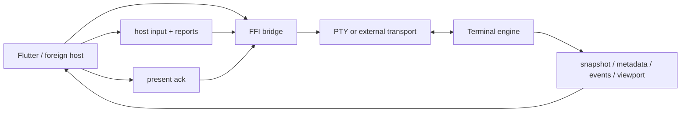

# Terminal Subsystem Layers

Date: 2026-03-15

Purpose: document the finer-grained subsystem layering inside Zide's terminal
stack so cleanup/restructure work can be judged against an explicit ownership
map instead of only against the top-level `TerminalCore` / `TerminalSession`
split.

This doc complements, but does not replace:

- `app_architecture/terminal/VT_CORE_DESIGN.md`
- `app_architecture/terminal/TERMINAL_ARCHITECTURE_COMPARISON.md`
- `docs/todo/terminal/vt_core_rearchitecture.md`

Use this file when the question is:

- "which layer should own this behavior?"
- "is native reaching deeper than a peer FFI host should need?"
- "does this change belong to transport, engine, publication, or host code?"

## Layer Stack

## Ownership Rule

The architectural rule for this phase is:

- engine semantics belong to the engine
- transport owns byte movement and host-fed delivery, not terminal meaning
- publication owns host-facing state exposure and redraw/present bookkeeping
- hosts consume the contract and report external state honestly

If native reaches through those layers in a way that a high-quality FFI host
cannot, that is a boundary bug.

## Subsystem Map

## Layer Responsibilities

### 1. Host Layer

This is where the embedding environment lives.

Examples:

- native desktop app shell
- terminal widget + renderer
- FFI/Flutter host
- replay/test harnesses

Host responsibilities:

- provide external state changes honestly
  - focus
  - color scheme
  - resize
  - viewport navigation
- consume snapshots/metadata/events/redraw state
- acknowledge presentation honestly

Host non-responsibilities:

- parsing terminal output
- inventing terminal semantics
- reconstructing backend truth from multiple ad hoc surfaces if one canonical
  state surface should exist

### 2. Input Contract Layer

This layer turns host interaction into backend-owned terminal input/reporting.

Includes:

- text input
- key encoding
- mouse encoding
- resize
- host focus reports
- host color-scheme reports
- viewport pin / follow-live-bottom control

Design rule:

- hosts should use the same semantic contract whether they are native or FFI
- the host may differ in how it obtains input, but not in what backend
  semantics it can express

### 3. Transport Layer

This is the non-semantic byte movement layer.

Examples:

- PTY-backed session transport
- external host-fed transport
- replay/fixture transport

Transport responsibilities:

- move bytes to/from the engine
- carry resize/lifecycle signals
- wake the host/runtime appropriately

Transport must not:

- become a second redraw scheduler
- contain protocol semantics
- become the source of truth for viewport or render state

### 4. Engine Layer

This is the VT engine proper and should become the obvious center of gravity.

Includes:

- parser + protocol execution
- screen model
- scrollback/history
- selection semantics
- title/cwd/semantic prompt state
- terminal modes
- kitty graphics / image semantics
- sync updates, scrollback offset, and other terminal-owned state

This is the layer Zide wants to compare more directly with `libghostty-vt`.

### 5. Publication Layer

This layer exposes engine-owned state to hosts in stable, consumable forms.

Includes:

- snapshot acquisition
- metadata acquisition
- event drain/latest-state getters
- redraw/publication pending state
- viewport state as a host-facing control/state surface

Design rule:

- publication should expose authoritative state
- hosts should not need to infer the truth by combining stale, partially
  overlapping surfaces unless the contract explicitly says so

### 6. Presentation Layer

This layer is where displayed frames become retired/presented.

Native path:

- renderer-owned scene path
- native present submission
- present feedback and retirement

Embedded/FFI path:

- host renders snapshot-owned state
- host explicitly acks present through the bridge

Design rule:

- present acknowledgement is host participation in the same contract, not a
  native-only private behavior

## Native Reference Host View

Interpretation:

- native is allowed to be the lowest-friction proving ground
- native is not allowed to become a different semantic terminal
- if a host-facing semantic is only reachable because native digs deeper than
  the contract, the contract is incomplete

## FFI Host View

Interpretation:

- FFI should consume the same semantics native proves
- differences between native and FFI should mostly be renderer/runtime
  ownership differences, not engine-truth differences

## Current High-Value Questions

Use this doc to evaluate whether a proposed change is in the right layer:

1. Does this move terminal meaning behind `TerminalCore`, or is it still
   session-owned behavior?
2. Does this make a host-facing semantic explicit in the shared contract, or
   does it rely on native-only reach?
3. Does this strengthen publication as the canonical truth for hosts, or does
   it create another side channel?
4. Is a transport concern staying transport-only, or is it absorbing redraw or
   semantic policy?
5. Is a renderer/present concern staying in the presentation layer, or leaking
   back into engine semantics?

## Current Phase Guidance

For the current cleanup/restructure phase:

- prefer changes that make the layer boundaries sharper
- prefer changes that make native and FFI more obviously peer hosts
- avoid widening FFI casually when PTY-backed verifier maturity is the real
  remaining need
- avoid `TerminalSession` cleanup that only shortens files without moving
  ownership or clarifying shared host semantics
