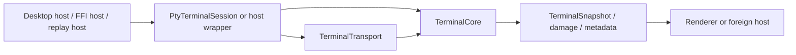
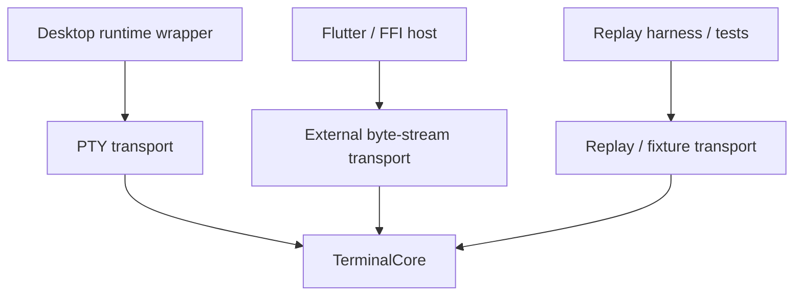
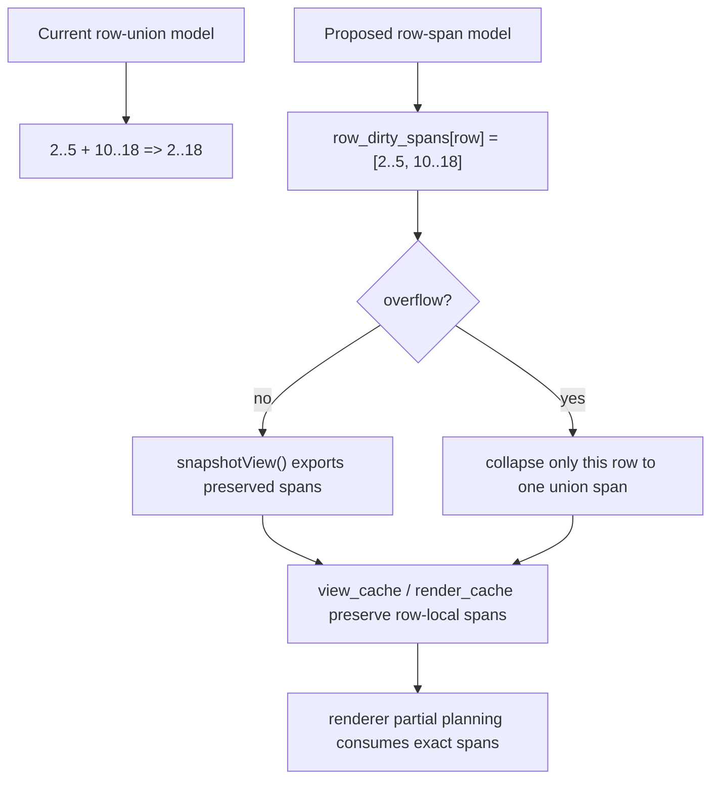
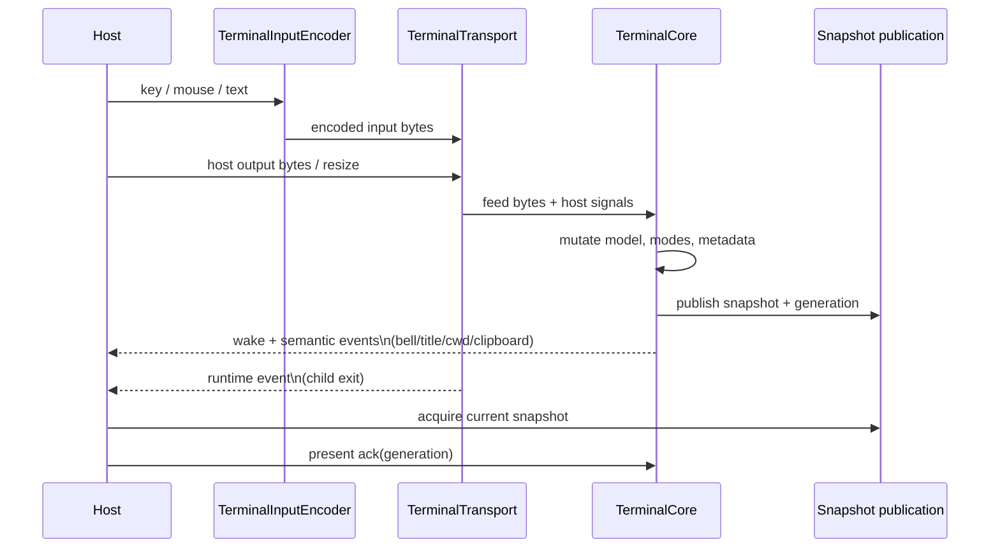

# VT Core Design

Date: 2026-03-10

Status note, 2026-03-14:

- The initial VT/render rewrite phase is no longer the main active lane.
- The current phase is post-rewrite bug hunting, compatibility hardening, and
  native/FFI convergence against the rewritten architecture.
- Recently closed native compatibility bugs:
  - Codex inline resume history now feeds real primary scrollback on the
    rewritten path instead of collapsing to the visible pre-viewport band.
  - Zig `std.Progress` redraw now rewrites in place correctly because
    reverse-index (`ESC M`) dispatch no longer falls through a dead C1 control
    path.
  - Focused native input latency is back in the good pre-rewrite band because
    idle waiting now wakes on SDL events instead of sleeping blindly through
    focused input windows.

Purpose: define the exact ownership split for the next terminal-core redesign
lane so code changes do not drift between "session cleanup", "FFI cleanup", and
"embed-friendly cleanup".

This doc is the concrete follow-up to:

- `app_architecture/review/TERMINAL_CORE_ARCHITECTURE_REVIEW_2026-03-10.md`
- `docs/todo/terminal/vt_core_rearchitecture.md`

Authority note:

- This file is the active design authority for the engine/core split.
- Replay-lane evidence, renderer bug forensics, and one-off compatibility
  investigations should live in `app_architecture/review/` or
  `app_architecture/terminal/research/` once they stop changing the engine
  ownership model directly.

## Target Boundary Diagram

## Host Variants

## Main Goal

Turn Zide's terminal backend into a real embeddable VT engine with:

- a pure terminal emulation core
- a first-class FFI boundary
- transport-agnostic host integration
- renderer-agnostic snapshots and damage

Desktop PTY-backed Zide remains a supported host, but it must stop defining the
architectural center.

## Target Types

```mermaid
flowchart LR
    Host["Host wrapper / PTY session"] -- host signals, lifecycle --> Transport["TerminalTransport"]
    Host -- key, mouse, text --> Encoder["TerminalInputEncoder"]
    Encoder -- encoded input bytes --> Transport
    Transport -- output bytes, resize --> Core["TerminalCore"]
    Core -- snapshot + damage --> Snapshot["TerminalSnapshot"]
    Snapshot --> Consumer["Renderer / FFI host / replay harness"]

    Host:::host
    Transport:::boundary
    Encoder:::boundary
    Core:::core
    Snapshot:::core
    Consumer:::host

    classDef core fill:#1d3b31,stroke:#79c9a7,color:#ecfff6;
    classDef boundary fill:#2d3047,stroke:#99a8ff,color:#f4f7ff;
    classDef host fill:#443328,stroke:#ffb56b,color:#fff5ea;
```

### 1. `TerminalCore`

This becomes the engine-owned center.

It owns:

- parser state
- protocol execution
- primary/alt screens
- history/scrollback
- selection semantics
- terminal modes
- OSC/CSI/DCS/APC state
- kitty graphics state
- title/cwd/semantic prompt/backend metadata that belongs to terminal semantics
- damage generation
- snapshot generation

It does not own:

- PTY
- host threads
- workspace tabs
- SDL/widget/render state
- process lifecycle policy

Expected direction:

- `src/terminal/core/terminal_session.zig` stops being the owner of the above
- the future public engine center should live under `src/terminal/core/` or
  `src/terminal/engine/`

### 2. `TerminalTransport`

This is the byte-stream boundary around the core.

It owns host-specific delivery of:

- input bytes into the terminal
- output bytes from the host side into the core
- resize notifications
- host lifecycle/wakeup integration

There should be multiple implementations:

- PTY transport
- external transport adapter
- test/replay transport

This is the key requirement for:

- Flutter hosts
- mobile SSH-backed sessions
- non-PTY embedded environments

`TerminalTransport` should not own terminal semantics. It only moves bytes and
host signals.

Important flood-handling bias:

- transport/read ingress should stay aggressive and non-semantic
- flood fairness should be solved by bounded parser/publication/render wake
  policy, not by teaching the reader to pace itself heuristically
- startup flood behavior may still need a host/runtime policy layer, but the
  transport itself should not become a second redraw scheduler

## Historical Investigation Pointer

The large live `nvim`/Wayland ghosting investigation that originally motivated
parts of this split no longer belongs in the active core-authority narrative.

Current rule:

- use this file for durable engine ownership and migration decisions
- use `app_architecture/review/TERMINAL_CORE_ARCHITECTURE_REVIEW_2026-03-10.md`
  for the architecture review that led to this split
- use `docs/todo/terminal/wayland_present.md` for
  current present-path ownership and post-rewrite renderer/present status
- use `app_architecture/terminal/research/wayland_present/` for issue-specific
  present research and evidence

Current conclusion relevant to this file:

- the rewritten path is now the baseline
- remaining terminal quality work should default to compatibility hardening and
  contract convergence, not reopening settled ownership boundaries without new
  evidence

## Multi-Span Row Damage Direction

The current backend damage model is too weak for the real-config ghosting lane.
Today the terminal keeps only:

- `dirty_rows[row]`
- `dirty_cols_start[row]`
- `dirty_cols_end[row]`

That means each dirty row can represent only one union span. For the current
`nvim` symptom class, that is exactly where quality is lost:

- one small earlier region on the row is dirtied first
- a later broad body-text write lands farther right on the same row
- backend damage collapses both into one large row union

The next backend-quality step should therefore be structural, not heuristic:

- row damage should support multiple spans per row
- overflow/coarsening should be explicit and local to that row
- publication/refinement/rendering should consume backend-authored spans rather
  than reconstructing them heuristically later

### Proposed Shape

Start with a fixed-cap per-row span set in the backend:

- `dirty_rows[row]` remains as the cheap row activity bit
- replace `dirty_cols_start/end[row]` as the primary truth with:
  - `row_dirty_span_counts[row]`
  - `row_dirty_span_overflow[row]`
  - `row_dirty_spans[row][N]`

Initial design constraints:

- keep `N` small and fixed first, for example `4`
- merge overlapping/touching spans in-row
- if a row exceeds `N`, mark only that row as overflow and collapse that row to
  one union span
- do not collapse unrelated rows or the whole frame because one row overflowed

### Ownership Rules

Best-quality contract for this lane:

- `TerminalGrid` owns authoritative multi-span dirty truth
- `snapshotView()` exports that truth without reinterpreting it
- `view_cache` carries/refines spans but does not invent them
- row-hash refinement remains optimization-only
- renderer partial planning consumes spans directly

### Migration Order

Implement this in reviewable backend-first steps:

1. Add multi-span data structures to `TerminalGrid` while keeping the old
   single-span fields as compatibility/export mirrors.
2. Teach `markDirtyRange...()` to append/merge spans instead of widening one
   union span immediately.
3. Export spans through snapshot/view-cache/publication.
4. Switch renderer partial planning to consume spans.
5. Only then retire the old single-span row truth.

### First Authority To Lock

Before implementation, lock one focused authority for:

- small earlier row-local region
- later same-row body rewrite
- expected result: two preserved row-local spans, not one huge row union

That authority is now the right next backend target for the ghosting lane.

The current before-state is now also locked in a backend unit test at
`src/terminal/model/screen/grid.zig`: the same-row sequence currently collapses
from `2..5` plus `10..18` down to one union span `2..18`. That is the exact
behavior the future multi-span row model is meant to replace.

Current state:

- `TerminalGrid` owns fixed-cap per-row span storage
- `snapshotView()` exports that span truth
- `view_cache` / `render_cache` preserve it end-to-end
- projected diff, row-hash refinement, and selection-dirty expansion preserve
  multi-span row truth instead of collapsing back to one `rowDiffSpan(...)`
- renderer partial-plan construction and partial draw loops consume backend row
  spans directly
- old `dirty_cols_start/end` union fields remain compatibility mirrors only

### 3. `PtyTerminalSession`

This is the desktop-host runtime wrapper.

It owns:

- PTY creation/start/stop
- read/write pumping
- child exit observation
- optional threads
- host polling and pressure hints

It wraps:

- `TerminalCore`
- one PTY transport implementation

This is the likely future role of today's `TerminalSession`.

### 4. `TerminalSnapshot`

This remains renderer-agnostic and becomes more explicitly core-owned.

It should expose:

- rows/cols
- flat cell state
- cursor state
- damage summary
- title/cwd metadata needed by hosts
- selection state needed by hosts/renderers
- kitty image placement metadata needed by renderers

The snapshot contract should be valid for:

- SDL/OpenGL renderer
- Flutter renderer
- FFI consumers
- replay/test tooling

### 5. `TerminalInputEncoder`

This remains a peer subsystem.

It consumes:

- terminal mode state
- key/mouse/text events

It emits:

- encoded terminal input bytes

It should be usable:

- from PTY-backed desktop hosts
- from FFI hosts
- without pulling in session/runtime code

Current landed direction:

- the encoder now targets a writer surface rather than raw `Pty` ownership
- keyboard and mouse encoding in `src/terminal/input/` only assumes
  `write(...)`, while the existing session/runtime writer guard still owns
  locking and host selection
- this keeps behavior unchanged on the desktop path while moving the encoder
  toward a real host-agnostic peer subsystem

## Ownership Map

### Core-owned behavior

These behaviors must move toward `TerminalCore` ownership:

- parser feed
- protocol dispatch
- screen mutation
- history/scrollback mutation
- selection mutation semantics
- alt-screen behavior
- terminal mode state
- protocol-triggered title/cwd/clipboard metadata
- kitty graphics protocol state
- snapshot generation

### Host/runtime-owned behavior

These must stay outside the core:

- PTY open/start/stop
- thread creation
- child process shutdown
- desktop polling cadence
- workspace tab management
- SDL widget gesture orchestration
- GPU upload policy

### Shared boundary behavior

These must be explicit contracts:

- feed terminal output bytes into the core
- request encoded input bytes from host events
- consume snapshots and damage
- drain host-visible events
- resize core state

## Event Model

The core should own a narrow event queue for host-visible state changes.

Candidate core-visible events:

- title changed
- cwd changed
- clipboard write request
- bell
- child exit observed by host wrapper
- wake/dirty

Important distinction:

- `bell`, `title`, `cwd`, `clipboard` are terminal/core-facing semantics
- `child exit` is host/runtime-facing and may be injected into the same exported
  event stream by a host wrapper

## FFI Direction

The current `zide_terminal_ffi.h` surface is still effectively session-backed.

Future shape:

### Core-facing operations

- create/destroy core-backed handle
- feed output bytes
- resize
- encode/send key/mouse/text
- snapshot acquire/release
- scrollback acquire/release
- event drain/free
- state getters

### Optional host/runtime operations

- create PTY-backed host session
- start child
- poll runtime
- query child exit

This should become two layers in the API model even if they are initially
exported from one shared library:

- core API
- optional PTY host API

That keeps Flutter and mobile consumers from depending on PTY/session semantics
they do not need.

### Current FFI and transport state

- shared terminal FFI ABI types, handle state, event/string helpers, and
  glyph-class metadata helpers live in `src/terminal/ffi/shared.zig`
- PTY-host/runtime-facing operations live in `src/terminal/ffi/host_api.zig`
- core-facing snapshot/scrollback/metadata/event/text-export operations live in
  `src/terminal/ffi/core_api.zig`
- `src/terminal/ffi/bridge.zig` is a thin facade over `core_api` + `host_api`
- `src/terminal/core/terminal_transport.zig` has an in-memory external
  transport implementation alongside the PTY-backed transport facade
- FFI-created terminal sessions attach that external transport by default
- `zide_terminal_feed_output(...)` enqueues bytes into that transport and runs
  the normal session poll path instead of bypassing backend transport
- external transport is core-tested and no longer FFI-only: the replay harness
  uses it for normal non-reply fixtures, while PTY attachment remains only for
  the reply-capture subset that genuinely needs a writable transport sink
- reply-capture PTY attachment in the replay harness now also goes through
  `TerminalSession` host-wrapper methods instead of raw transport assembly
- at this point higher-level setup callers no longer need raw
  `terminal_transport.attach*/detach*` for normal session assembly paths

The external-host lifecycle contract also moved forward:

- terminal FFI now exposes `zide_terminal_close_input(...)` for no-PTY hosts
  that want to signal end-of-stream without destroying the terminal
- the derived event contract now includes `alive_changed`
- the mock-service Python smoke now validates that closing external input:
  - flips metadata `alive` to false
  - emits an `alive_changed` event
  - preserves snapshot readability for final rendered content

Embedded-host wake semantics also moved forward:

- the derived terminal event stream now emits `redraw_ready` whenever terminal
  snapshot generation advances
- this gives non-PTY hosts a minimal "pull snapshot now" wake signal without
  inventing a second damage model in the FFI layer
- damage and generation still remain authoritative in snapshot acquisition;
  `redraw_ready` is only a scheduling hint for host event loops
- host-side `resize(...)` now also goes through that derived wake path, so
  PTY-backed foreign hosts and no-PTY embedded hosts both get an immediate
  redraw signal after visible size changes

This matches the general shape used by stronger reference terminals:

- Ghostty's termio/renderer split wakes the renderer after stream-handling and
  mailbox publication, not just at process start
- Alacritty marks the terminal/window dirty and requests redraw after actual
  visible-state changes, especially resize and PTY-driven updates

So the current Zide FFI direction is:

- no synthetic wake on `start(...)` alone
- wake on visible-state transitions such as streamed output, poll-driven PTY
  updates, and resize

The `TerminalSession` root also shed another non-runtime owner:

- the input-mode query/toggle surface now routes through
  `src/terminal/core/session_interaction.zig`
- the root session facade still exports the same API, but it no longer carries
  that interaction/mode-management block inline

Protocol execution also moved another step toward core ownership:

- saved-cursor restore and alt-screen core state transitions now live behind
  `src/terminal/core/terminal_core_modes.zig`
- `session_protocol.zig` now only layers the remaining session-owned side
  effects around that core transition, such as selection clearing and input
  snapshot publication
- RIS/reset core mutation now also lives behind
  `src/terminal/core/terminal_core_reset.zig`, with `session_protocol.zig`
  keeping only the session-owned input-mode snapshot republish step
- hyperlink allocation, kitty image clearing, and scroll-region mutation now
  also live behind `src/terminal/core/terminal_core_protocol.zig`, leaving
  `session_protocol.zig` closer to a session-owned publication/selection wrapper
  instead of another mixed core-mutation owner
- the remaining session-owned alt-screen/reset side effects now also live in
  `src/terminal/core/session_mode_effects.zig`, making those selection/input-
  snapshot/presentation consequences explicit instead of leaving them embedded
  inline in `session_protocol.zig`
- alt-screen exit presentation timing now also routes through
  `src/terminal/core/session_rendering.zig`, so mode-side effects no longer
  mutate render/publication timing state inline

## Compatibility Strategy

We do not go from zero to hero in one patch.

Migration approach:

1. define `TerminalCore` contract in docs
2. introduce a new internal core type without changing behavior
3. make current `TerminalSession` wrap that core
4. move protocol execution and state ownership onto the core
5. move FFI to target the core boundary first
6. keep PTY-backed desktop behavior working through the wrapper

## Current Internal State

- `src/terminal/core/terminal_core.zig` owns the engine-centered terminal state
- `TerminalSession` wraps `core: TerminalCore`
- PTY/runtime/thread/render-publication ownership still lives in
  `TerminalSession` for now
- session construction and host/runtime assembly route through
  `src/terminal/core/session_runtime.zig`
- replay/test-only debug helpers live in
  `src/terminal/core/terminal_session_debug.zig`
- host-facing metadata, liveness, and close-confirm queries live under
  `src/terminal/core/session_host_queries.zig`
- publication/diff, selection projection, plan/refinement, selection-dirty
  expansion, and damage helpers are split across focused `view_cache_*` modules
- presented-generation acknowledgement and damage retirement live under
  `src/terminal/core/session_rendering_retirement.zig`
- replay-backed redraw coverage now includes narrow partial publication,
  dense clear+repaint loops, and live-bottom full-region scroll behavior
- replay-backed redraw coverage now also includes a multi-row narrow rewrite
  case that currently widens to full-row damage across the viewport, which is
  exactly the kind of over-broad invalidation we want the later publication
  lane to reduce for gutter/scope-guide-heavy TUIs
- replay-backed redraw coverage now also includes a denser built-in `nvim`
  movement probe (`redraw_nvim_dynamic_builtin_probe.*`) with `statuscolumn`,
  `signcolumn`, `foldcolumn`, `cursorline`, `cursorcolumn`, and a dynamic
  statusline enabled from startup; its observed backend contract is broad, but
  it still preserves the distant statusline row in the same non-shift frame,
  which is useful because it shows backend publication can already carry one
  secondary remote region when the upstream dirty-row truth contains it
- replay-backed redraw coverage now also includes two probes captured against
  the local real Neovim config (`redraw_nvim_real_config_probe.*` and
  `redraw_nvim_real_config_symbols_probe.*`); both preserve remote chrome in
  non-shift frames, and the symbol-aware probe is broad across almost the full
  viewport, which is useful because it shows at least one plugin-heavy config
  path is genuinely emitting broad body-plus-chrome redraws rather than merely
  dropping a remote invalidation region
- deeper live tracing on the same plugin-heavy lane now also shows the
  broadening mechanism more directly: the offending rows are being widened in
  `TerminalGrid.markDirtyRange(...)` by unioning multiple same-row requests,
  not by `view_cache` refinement, widget planning, or skipped dirty retirement
- a scripted capture wrapper now exists for that same lane in
  `tools/terminal_capture_nvim_real_config_cursor_repro.py`, which automates
  the current dashboard -> `:e src/app_logger.zig` -> settle -> slow `j`
  cursor-step repro against the real local Neovim config
- that automation now also has a replay-safe reduced mode (`--open-directly`,
  `16x100`, one aggregate late cursor-step update), and the resulting
  single-session authority is now checked in as
  `redraw_nvim_real_config_cursor_step_probe.*`
- a later-step tuned variant is now also checked in as
  `redraw_nvim_real_config_cursor_step_probe_tuned.*`; it waits longer before
  capturing the first step and keeps one later update chunk, which makes it a
  better automated base for the next narrowing pass even though it is still
  broad overall
- the sharper automated base is now the heavier
  `redraw_nvim_real_config_cursor_step_app_logger_tuned.*` authority captured
  against the real `src/app_logger.zig` file; it comes back as a partial
  viewport-shift-exposed update (`rows 7..15 cols 0..99`, `shift_rows=9`),
  which is closer to the live ghosting lane than the smaller synthetic sample
- follow-up scripted `app_logger.zig` captures now tighten that scope further:
  the attempted "pre-shift" variants still replay as shift-path updates too,
  including a single-step `20Gzt` capture that comes back as
  `viewport_shift_rows=3`, `viewport_shift_exposed_only=true`
- the low-level grid trace on that one-step case now attributes the broad rows
  directly to `origin=scroll_region_up_full`
- a lower-level idle control narrows that further: an open-direct
  `app_logger.zig` capture with `20G` and no cursor-step at all still replays
  as a smaller shift-path update (`rows 14..15`, `shift_rows=2`), again
  attributed to `origin=scroll_region_up_full`
- a longer-settle split now separates startup churn from real movement:
  - idle after a long settle goes empty
  - same-line `l` after settle stays narrow and non-shift
    (`row 15 cols 75..76`, `shift_rows=0`)
  - same-row `w` after settle also stays narrow and non-shift
    (`row 15 cols 11..21`, `shift_rows=0`)
  - vertical `j`/`k` cases in the same settled lane still publish broad
    full-width shift-path updates
  - left/backward motion is asymmetric there too: `h` and `b` still blow out
    to the same bottom-band shift class, while `l` and `w` stay narrow
- current interpretation:
  - the scripted real-config `app_logger` lane is good authority for
    shift/scroll ghosting
  - it is currently dominated by async post-open shift churn
  - after the long settle, movement class matters: forward/rightward motions
    (`l`, `w`) are true narrow non-shift controls, while backward/leftward or
    vertical motions (`h`, `b`, `j`, `k`) currently belong to the broad
    bottom-band shift-path class
  - it is not yet valid authority for the user-reported true small-move
    non-shift ghosting path
  - the next missing capture is therefore a genuine pre-shift real-config
    cursor-step authority
- replay harness fixture metadata loading was widened from `64 KiB` to
  `1 MiB` so legitimate plugin-heavy redraw fixtures like this can be loaded
  directly instead of forcing another side channel
- stale private root-session shims for SGR application and key-mode flag reads
  are now removed too, keeping the root session file closer to a real facade
  instead of a pile of dead internal forwarding

### 2026-03-10 protocol split follow-up

The next extraction-only step moved pure engine-side protocol helpers behind
`src/terminal/core/terminal_core_protocol.zig`.

This module currently owns the protocol behaviors that are already clearly
core/model-centered:

- screen erase/insert/delete helpers
- palette lookups
- core cursor and cell queries
- cursor style changes
- tab-stop-at-cursor
- DECRQSS reply formatting that only depends on core state

`session_protocol.zig` now remains focused on the still session-coupled pieces:

- parser feed/dispatch entrypoints
- alt-screen transitions
- selection/cache invalidation coordination
- runtime-facing protocol side effects

### 2026-03-10 dispatch split follow-up

Parser/control dispatch ownership is now partially split again:

- `src/terminal/core/terminal_core_dispatch.zig` owns control, CSI, OSC, APC,
  DCS, codepoint, and ASCII dispatch entry helpers
- `session_protocol.zig` now keeps the session-coupled pieces that still depend
  on session-owned locking and publication

The main remaining reason parser feed still lives in `session_protocol.zig` is
that byte feed currently owns:

- state mutex acquisition
- output generation increments
- view-cache publication updates

That is the next real boundary to cleanly separate if we want parser feed to
become fully core-owned.

### 2026-03-10 feed split follow-up

Parser byte feed is now split one step further:

- `src/terminal/core/terminal_core_feed.zig` owns the actual parser feed call
- `src/terminal/core/terminal_core_feed.zig` now also returns an explicit
  `FeedResult` carrying publication-relevant state
- `session_protocol.zig` now only wraps that feed with:
  - state mutex ownership
  - delegation of generation/view-cache publication to
    `src/terminal/core/session_rendering.zig`

This makes the remaining session-owned part of parser feed explicit: it is not
parsing anymore, it is lock and publication choreography.

### `TerminalTransport`

The internal `TerminalTransport` contract lives in
`src/terminal/core/terminal_transport.zig`.

Current scope:

- PTY open/start wiring
- transport resize delivery
- has-data checks
- child-exit polling
- aliveness checks
- foreground-process label and close-confirm metadata
- transport deinit

Current PTY-backed runtime code now consumes that contract in:

- `session_runtime.zig`
- `resize_reflow.zig`
- `session_queries.zig`

This was intentionally not the final transport split at first: host lifecycle
and metadata were moved behind the contract before byte IO.

### 2026-03-10 writer contract follow-up

The transport boundary now also owns the main locked writer contract:

- `terminal_transport.Writer` replaces the old raw `Pty` writer guard
- input send paths now call transport-owned writer methods for:
  - key actions
  - key action events
  - keypad sends
  - char actions
  - char action events
  - mouse reports
  - plain text sends
  - raw byte writes

This means the common protocol/input write surface no longer depends on a raw
`Pty*` shape.

What still remains PTY-direct:

- a smaller set of transport setup/existence paths

### 2026-03-10 read path follow-up

The transport boundary now also owns the common read side:

- `terminal_transport.Transport.read(...)`
- `terminal_transport.Transport.waitForData(...)`

Current PTY-backed runtime code now uses those methods in:

- `io_threads.zig`
- `pty_io.zig`

This means the main byte pump no longer depends on raw `Pty` ownership in the
runtime helpers. The remaining PTY-direct uses are narrower and mostly about
transport existence checks plus setup paths that have not been re-cut yet.

### 2026-03-10 transport presence follow-up

The remaining low-risk presence gates are now also routed through
`terminal_transport` helpers:

- `terminal_transport.Writer.exists(...)`
- `terminal_transport.Transport.exists(...)`

Current session-side users no longer peek at `self.pty` directly just to answer
"is there a writable transport?" for the mouse-report and OSC 5522 paste-event
paths.

The protocol-side OSC 5522 reply/read path now also uses the locked transport
writer contract instead of reaching into raw `self.pty` ownership directly.

### 2026-03-10 attach/detach follow-up

PTY setup now also has a transport-owned attach/detach seam:

- `terminal_transport.attachPty(...)`
- `terminal_transport.detachPty(...)`

Current users:

- `terminal_transport.openPty(...)`
- `replay_harness.zig` reply-capture setup

That removes another direct `session.pty = ...` / `session.pty = null` setup
pair from callers outside the transport owner.

## Immediate Naming Direction

These names are recommended to avoid ambiguity:

- `TerminalCore`
- `TerminalCoreSnapshot`
- `TerminalCoreEvent`
- `TerminalTransport`
- `PtyTerminalSession`

Avoid continuing to use `TerminalSession` as the name of the engine center once
the new boundary exists.

## Non-goals

- no Flutter-specific rendering API
- no renderer rewrite in this lane
- no protocol behavior change just to fit the new names
- no broad workspace/UI redesign mixed into the core move

## First Code-Cut Intent

The first implementation slice should be:

- introduce a new internal `TerminalCore` owner
- move no UI behavior
- keep current PTY-backed session behavior identical
- leave FFI surface stable for that slice

That gives the redesign a real center without forcing a full bridge rewrite in
the same patch.
