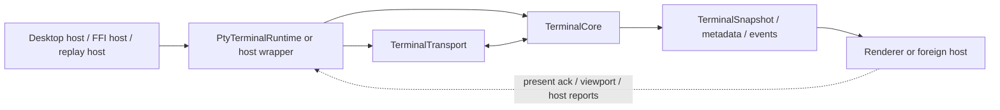
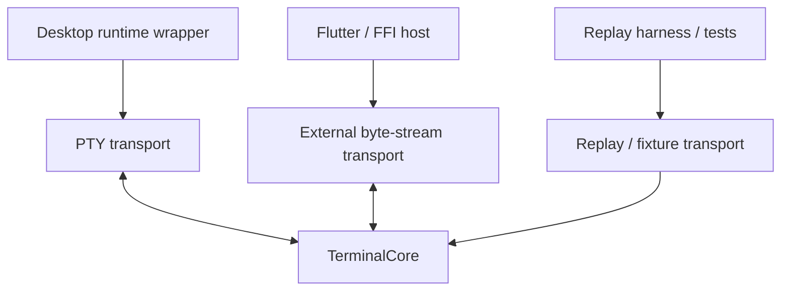
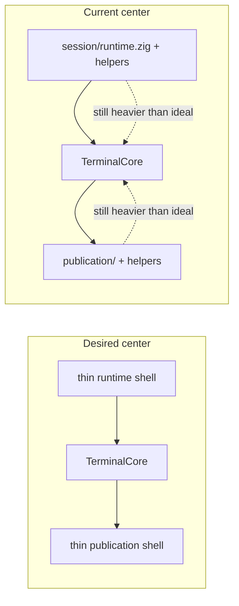
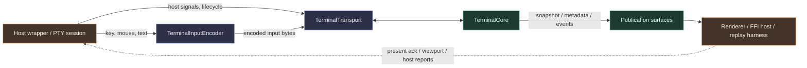
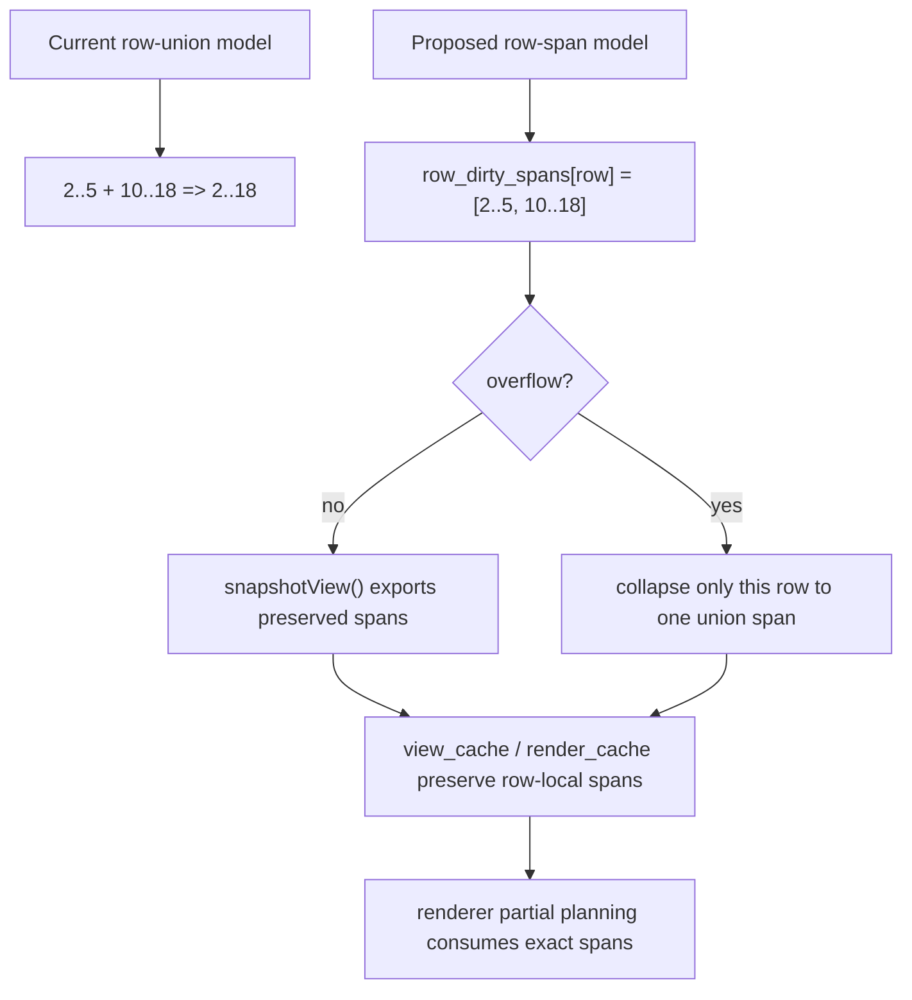
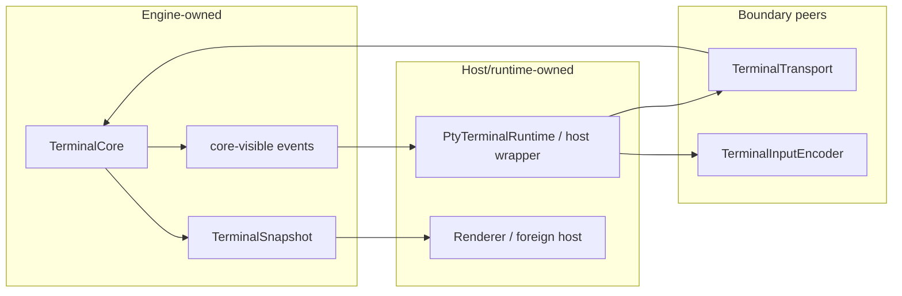
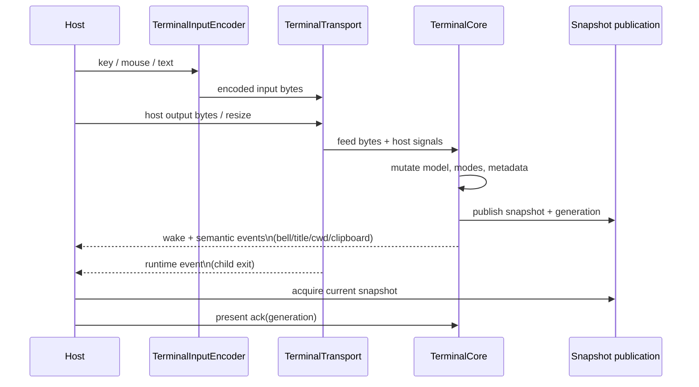
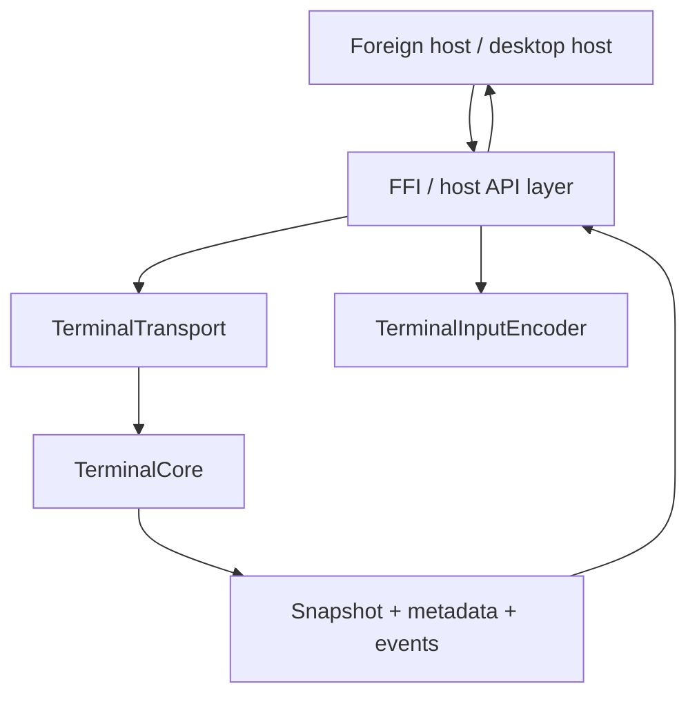

# VT Core Design

Date: 2026-03-10

Status note, 2026-03-14:

- Current phase:
  - the initial VT/render rewrite phase is no longer the main active lane
  - the active lane is now post-rewrite cleanup/restructure plus native/FFI
    convergence
- Recently closed native bugs:
  - Codex inline resume history now feeds real primary scrollback on the
    rewritten path instead of collapsing to the visible pre-viewport band
  - Zig `std.Progress` redraw now rewrites in place correctly because
    reverse-index (`ESC M`) dispatch no longer falls through a dead C1 control
    path
  - focused native input latency is back in the good pre-rewrite band because
    idle waiting now wakes on SDL events instead of sleeping blindly through
    focused input windows
- Landed ownership cuts now include:
  - session-facade cleanup
    - input-mode snapshot state, presentation-feedback structs, init options,
      host-query structs, and public type aliases now live in dedicated
      `session_*` modules instead of inline in `pty_terminal_runtime.zig`
    - the content, selection, host-query, and interaction facades now alias
      focused modules instead of being hand-redeclared on the root session
  - engine ownership
    - host metadata, close-confirm, clipboard, sync-update, viewport,
      scrollback, column-mode reset, palette/default-color mutation, parser
      control/reset, OSC title/cwd buffers, selection, resize/reflow
      selection restoration, and full reset now route through `TerminalCore`
      instead of direct session-side field or history mutation
  - runtime/publication cleanup
    - lifecycle truth now lives behind `session/lifecycle.zig`
    - transport attach/open/close, writer access, outgoing drain, and resize
      reporting now live behind `session/transport_runtime.zig`
    - thread teardown and queued-IO/backlog observation now live behind
      `session/thread_runtime.zig`
    - publication generation state, publication updates, presentation handoff,
      and PTY poll publication wake/update choreography now live behind
      focused helper seams instead of one large session blob
- Input encoding remains on the dedicated subsystem path:
  - writer-agnostic encoder coverage exists at both the fake-writer level and
    the real PTY-backed `PtyTerminalRuntime` writer boundary
- Current architectural read:
  - Ghostty is still ahead on making the engine obviously be the engine
  - Zide is no longer obviously behind on host-facing contract richness; the
    public FFI surface is already broader than Ghostty's current public
    `libghostty-vt` umbrella
  - the main remaining gap is therefore center-of-gravity and ownership
    clarity, not "export more API"
- Current highest-value remaining gap:
  - raw VT semantics are no longer scattered mainly across the root session
    facade
  - the stronger remaining weight is the runtime/publication shell around
    `TerminalCore`, especially the orchestration still centered in
    `session/runtime.zig` and the publication shell
  - after the recent extractions, those files are closer to orchestration
    shells than semantic owners, so the next strongest lane is likely FFI
    snapshot/export maturity unless another comparably coherent engine-ownership
    seam appears

Status note, 2026-03-31:

- The architecture campaign has been re-focused aggressively.
- The old "post-rewrite cleanup" framing is no longer strong enough.
- The new standard is not "improve the current split a bit more." The new
  standard is:
  - destroy every false center
  - delete fallback-path thinking that survives only from inertia
  - make the engine so obvious that strong terminal maintainers can read the
    shape at first glance
- The current strategic enemies are now explicit:
  - `PtyTerminalRuntime` as a broad fake center
  - semantic text handling that still reaches above the engine boundary
  - the first correction is now in: printable text no longer routes through
    `parser_hooks.zig`
  - the next correction is also in: `terminal_core_text.zig` now reads
    core-owned text state directly from `TerminalCore`
  - the remaining gap is narrower now:
    only owner-level effects like wrap-newline and insert-chars still cross a
    callback seam
  - that seam is now protocol-owned instead of text-owned:
    `terminal_core_protocol.zig` defines the effect boundary used by
    `terminal_core_text.zig`
  - the extra `TextContext` adapter layer is now gone too:
    `terminal_core_text.zig` talks directly to `self.core` plus those
    protocol-owned effects instead of routing through one more wrapper-shaped
    contract
  - the parser-facing forwarding shell is gone too:
    `terminal_protocol_api.zig` now routes DCS/APC/OSC/CSI traffic directly to
    the real protocol owners instead of stepping through `parser_hooks.zig`
  - the `TextEffects` adapter layer is gone too:
    `terminal_core_text.zig` already calls protocol-owned functions directly,
    so `terminal_core_protocol.zig` no longer carries that extra wrapper type
  - the outer CSI forwarding shell is gone too:
    `terminal_protocol_api.zig` now routes CSI directly into
    `src/terminal/protocol/csi.zig` without stepping through an extra
    `SessionFacade`
  - the outer OSC forwarding shell is gone too:
    `terminal_protocol_api.zig` now routes OSC directly into
    `src/terminal/protocol/osc.zig` without stepping through an extra
    aggregate `SessionFacade`
  - the outer DCS/APC forwarding shell is gone too:
    `terminal_protocol_api.zig` now routes DCS/APC directly into
    `src/terminal/protocol/dcs_apc.zig` without stepping through an extra
    `SessionFacade`
  - the first tiny inner OSC wrappers are gone too:
    `osc_progress.zig`, `osc_semantic.zig`, and `osc_title.zig` now run
    directly on the live core/runtime object instead of wrapping it in tiny
    per-module `SessionFacade` shells
  - the next OSC wrapper batch is gone too:
    `palette.zig`, `osc_clipboard.zig`, and `osc_hyperlink.zig` now run
    directly on the live core/runtime object instead of wrapping it in tiny
    per-module `SessionFacade` shells
  - the OSC cwd wrapper chain is gone too:
    `osc_cwd.zig` and `osc_util.zig` now run directly on the live
    core/runtime object instead of stacking `SessionFacade` wrappers
  - the outer kitty clipboard wrapper entrypoints are gone too:
    `osc_kitty_clipboard.zig` still carries internal reply/state helpers, but
    its public entrypoints now take the live core/runtime object directly
    instead of requiring an outer `SessionFacade`
  - the remaining inner `SessionFacade` in `osc_kitty_clipboard.zig` is gone
    too; clipboard reads, allocator use, and reply generation now run directly
    on the live session object instead of bouncing through one more manual
    facade shell
  - the remaining OSC 5522 writer shell is gone too:
    `WriterFacade` is deleted from `osc_kitty_clipboard.zig`, and clipboard
    reply generation now writes directly to the live writer object instead of
    routing one-method writes through another `anyopaque` adapter
  - the parser's own `SessionFacade` shell is gone too:
    `src/terminal/parser/parser.zig` now operates directly on the live
    runtime object, and feed/poll/debug entrypoints call `handleSlice(...)`
    without wrapping the runtime in one more callback facade
  - wrapper-owned runtime helpers no longer import
    `src/terminal/core/pty_terminal_runtime.zig` for their own defaults,
    snapshots, or PTY writer types; those now come from direct owners under
    `session/` and `runtime/`
  - workspace and core runtime test entrypoints now import
    `src/terminal/core/terminal_runtime.zig` instead of
    `src/terminal/core/pty_terminal_runtime.zig`, which is a better match for
    the claimed stable public runtime surface
  - `src/terminal/core/pty_terminal_runtime.zig` no longer exports a broad
    top-level type/constant barrel; only `PtyTerminalRuntime` remains public
    there, which makes the wrapper file read much more honestly
  - the oversized `src/terminal/core/session/surface_api.zig` aggregate shell
    is gone too; the wrapper now binds directly to the real session-owned
    content/query/selection/host-query/interaction modules instead of routing
    those through one more export facade
  - `src/terminal/core/terminal_runtime.zig` dropped the dead
    `keyModeFlagsValue` re-export too; callers already use the runtime-instance
    method, so the stable public surface no longer carries that gratuitous
    alias
  - duplicated publication/cache truth
  - oversized native widget/render coordination around terminal publication
- The current operating rule is sequential but ruthless:
  - define the replacement shape
  - cut through the real surface area
  - validate hard
  - delete the old seam
  - First public-surface slice landed under that rule:
  - `src/terminal/core/terminal_runtime.zig` now acts as the explicit runtime
    surface for native app/runtime, replay-harness, and FFI consumers
  - that runtime surface now pulls shared input/selection/progress types from
    their direct owners under `session/` instead of laundering them through
    `pty_terminal_runtime.zig`
  - selection gesture types and key-mode flag access also now come from their
    direct owners instead of reinforcing wrapper gravity through the same
    public surface
  - the stable runtime surface is narrower now too:
    `src/terminal/core/terminal_runtime.zig` no longer re-exports
    `ActivityMetadata`, `ProgressMetadata`, `ProgressState`,
    `SelectionGesture`, or `ClickSelectionResult`; active callers now import
    those names from `session/host_types.zig` and `selection.zig` directly
  - the widget-facing input/selection type barrel is narrower too:
    `src/terminal/core/terminal_runtime.zig` no longer re-exports
    `Modifier`, `MouseButton`, `MouseEventKind`, `MouseEvent`,
    `SelectionPos`, or `TerminalSelection`; widget callers now use
    `terminal/model/types.zig` directly while the stable runtime surface keeps
    only the remaining key/mod constant surface
  - the stable runtime surface no longer launders workspace ownership either:
    `src/terminal/core/terminal_runtime.zig` no longer re-exports
    `TerminalWorkspace`, `TerminalTabId`, `TerminalTabSyncEntry`, or
    `TerminalTabSyncState`; active app/test callers now import those names
    from `src/terminal/core/workspace.zig` directly
  - the stable runtime surface no longer acts as the key/mod constant barrel:
    `src/terminal/core/terminal_runtime.zig` no longer re-exports
    `VTERM_KEY_*`, `VTERM_MOD_*`, `KeyAction`, or `KeypadKey`; active widget,
    smoke, and test callers now use `terminal/model/types.zig` and
    `terminal/input/input.zig` directly
  - that leaves `src/terminal/core/terminal_runtime.zig` as a nearly minimal
    stable entrypoint: it now exposes only `PtyTerminalRuntime`, not a broad
    wrapper-adjacent type/constant/workspace barrel
  - one more wrapper-gravity cut is now in: `src/terminal/core/terminal_runtime.zig`
    is literally just the stable wrapper entrypoint with no dead import
    residue, and `src/terminal/core/pty_terminal_runtime.zig` dropped the dead
    type/constant alias slab that no longer had live repo callers
  - parser dispatch is now flatter too: `src/terminal/parser/parser.zig` and
    local-echo input call the real protocol/text owners directly, so
    `src/terminal/core/pty_terminal_runtime.zig` no longer has to advertise the
    old parser-facing method slab for control/CSI/OSC/DCS/printable text
  - after that cut, `src/terminal/core/pty_terminal_runtime.zig` also dropped a
    dead local alias block for parser/snapshot/debug/type scaffolding that was
    no longer part of the live wrapper surface
  - the last inline wrapper helper bodies in that lane are gone too:
    `feedOutputBytes`, `resetState`, and the fixed-limit `appendHyperlink`
    helper now live in their real owner modules instead of inline on
    `src/terminal/core/pty_terminal_runtime.zig`
  - `saveCursor` / `restoreCursor` now route through
    `src/terminal/core/terminal_core_modes.zig` directly too, so the wrapper no
    longer claims that mode-state seam
  - protocol-only helpers now route through
    `src/terminal/core/protocol/terminal_core_protocol.zig` directly too:
    `paletteColor`, `setCursorStyle`, and DECRQSS reply generation no longer
    inflate the wrapper surface
  - the same is now true for the edit/scroll/sync-update protocol cluster:
    protocol modules and runtime tests use
    `terminal_core_protocol.zig` / `terminal_publication.zig` directly for
    erase/edit/scroll-region and sync-update operations, so those no longer
    inflate the wrapper surface either
  - the protocol-side input-mode mutation slab is thinner too:
    parser keypad mode, CSI key-mode control, DECSTR input-mode reset, and
    private mode mutation now call `src/terminal/core/input_modes.zig` and
    `src/terminal/core/session/config.zig` directly, so the stable runtime
    surface no longer advertises key-mode, mouse-mode, bracketed-paste,
    keypad/app-cursor, or column-mode mutation as part of the host runtime
    contract
  - the same is now true for the palette/config mutation slab:
    OSC palette and dynamic-color handlers now call
    `src/terminal/core/session/config.zig` directly, so the stable runtime
    surface no longer advertises palette reset/mutation, dynamic-color
    mutation, or dead ANSI color setters that are not part of the real host
    contract
  - the CSI reply dispatch slab is flatter too:
    `src/terminal/protocol/csi.zig` no longer routes DSR and window-op replies
    through `handleDsrQuery(...)` / `handleWindowOpQuery(...)` in
    `src/terminal/protocol/csi_reply.zig`; CSI now calls the writer-owned reply
    functions directly instead of keeping another forwarding layer alive
  - the same is now true for DECRQM reply dispatch:
    `src/terminal/protocol/csi.zig` no longer routes DECRQM replies through
    `handleDecrqmQuery(...)` in `src/terminal/protocol/csi_mode_query.zig`;
    CSI now computes the mode state and calls the writer-owned DECRQM reply
    function directly
  - the DECRQM snapshot path is thinner too:
    `src/terminal/protocol/csi_mode_query.zig` now reads mouse-mode snapshot
    bits directly from `interaction.input_snapshot`, so the stable runtime
    surface no longer carries one-consumer mouse-mode query helpers or the dead
    `getDamage` export
  - the same is now true for single-caller app/FFI convenience exports:
    `displayTitleText`, `setConfiguredCursorStyle`, `setLaunchShellPath`, and
    `launchShellPath` now route through their direct owners in
    `session/host_queries.zig`, `session/config.zig`, and `session/runtime.zig`
    instead of inflating the stable runtime surface with app-only convenience
    methods
  - the stable runtime surface also no longer carries low-level input-encoder
    plumbing:
    `sendKeyActionWithMetadata`, `sendKeypadAction`, `sendCharAction`, and
    `sendCharActionWithMetadata` now route through
    `src/terminal/core/session/input.zig` directly from the key encoder and
    widget keyboard path instead of pretending to be host-level runtime
    contract
  - widget and FFI copy/query helpers are shrinking the same way too:
    OSC clipboard copy and hyperlink URI copy now route through
    `src/terminal/core/session/queries.zig` directly from widget and FFI
    callers instead of sitting on the stable runtime surface as thin
    convenience exports
  - config-owned screen/palette mutation is off the runtime surface too:
    `setDefaultColors`, `applyThemePalette`, and `setCellSize` now route
    through `src/terminal/core/session/config.zig` from app, workspace, FFI,
    and test callers instead of pretending to be stable host-level runtime
    contract
  - protocol query helpers are shrinking the same way too: runtime/focus tests
    now use `terminal_core_protocol.zig` directly for `getCell` /
    `getCursorPos`, so those no longer inflate the wrapper surface
  - wrapper-owned screen access is thinner too:
    `src/terminal/core/pty_terminal_runtime.zig` no longer exports
    `activeScreen`, `activeScreenConst`, `isAltActive`, or its local
    `scrollUp` helper; protocol/session/kitty internals now read screen state
    from `self.core` or direct engine owners instead of pretending the wrapper
    owns the screen seam
  - the last inline runtime/control helper bodies are thinner too:
    launch-shell path access now lives in
    `src/terminal/core/session/runtime.zig`, and lock/tryLock/unlock now live
    in `src/terminal/core/session/control.zig` instead of remaining inline on
    `pty_terminal_runtime.zig`
  - the focus-reporting/runtime tests no longer lean on an implicit
    wrapper-looking method surface for `getCell` / `getCursorPos`; they now
    call `terminal_core_protocol.zig` directly, so the test surface no longer
    suggests those query helpers belong to `PtyTerminalRuntime`
  - publication-owner flag usage is tighter too:
    `src/terminal/core/runtime/pty_poll_publication.zig` and the locked-scroll
    reflow test now use publication-owned helpers like `markOutputPending()`
    and `viewRefreshPending()` instead of peeking at raw publication flags, and
    the dead constant residue at the bottom of
    `src/terminal/core/pty_terminal_runtime.zig` is gone
  - the published-view builder now follows that same owner rule too:
    `src/terminal/core/publication/view_cache.zig` consumes pending refresh
    work through `takePendingViewRefresh()` and `pendingGeneration()` instead of
    swapping raw publication fields itself
  - publication snapshot/capture now follow that same owner rule too:
    `src/terminal/core/publication/terminal_publication.zig` routes pending
    refresh work through `applyPendingViewRefreshLocked(...)` instead of
    open-coding `view_cache_pending` checks and direct locked refresh
    consumption inside `snapshot()` and `captureCopy()`
  - presented-generation retirement now follows that same owner rule too:
    `src/terminal/core/publication/terminal_publication.zig` handles
    presented-generation acknowledgement, sync-update retirement policy, and
    dirty retirement in one locked publication-owned path instead of splitting
    that contract across multiple helpers
  - the damage-clear step is now publication-internal too:
    published damage is retired through publication-owned locked flow instead
    of remaining exposed as a separate storage-oriented helper
  - the same publication-owned refresh rule now covers FFI export too:
    snapshot/diff export in `src/terminal/ffi/core_api.zig` now asks
    `terminal_publication.zig` for locked current/generation cache access
    instead of reimplementing publication refresh choreography in host code
  - publication acknowledgement is no longer treated as wrapper-owned test
    control surface:
    replay, FFI present-ack, and runtime tests now target
    `terminal_publication.zig` directly for presented-generation note/ack flow,
    and the dead wrapper exports are removed
  - published render-cache reads now follow that same owner rule in replay,
    debug, and runtime tests:
    those paths use `terminal_publication.renderCache(...)` directly instead of
    treating the wrapper as publication storage owner
  - raw generation-cache lookup is now publication-internal too:
    host code only gets the locked publication contract for generation lookup,
    not the raw unlocked storage walk
  - the CSI reply/query path is flatter too:
    `src/terminal/protocol/csi.zig` now routes directly to
    `csi_reply.zig` / `csi_mode_query.zig` without carrying another local
    forwarding slab for DA/DSR/window-op reply and query handling
  - DECRQM reply formatting now lives with the DECRQM query owner too:
    `csi_mode_query.zig` owns both DECRQM state derivation and DECRQM reply
    formatting, so `csi.zig` no longer has to masquerade as the reply owner
  - duplicate test-facing reply wrappers are dead too:
    `csi_reply.zig` no longer exposes `pty`-shaped wrapper entrypoints that
    only forwarded into its real writer-owned reply helpers, and
    `csi_mode_query.zig` no longer carries the same duplicate
    `writeDecrqmReply(...)` wrapper over `writeDecrqmReplyWithWriter(...)`;
    the reply owners now expose one honest writer-shaped surface and the CSI
    reply tests target that contract directly
  - the remaining same-object protocol trampolines are thinner too:
    `csi.zig` no longer routes `handleCsi(...)` through a private
    `handleCsiOnSession(...)`, and `osc_kitty_clipboard.zig` no longer routes
    `parseOsc5522(...)` / `sendPasteEventMimes(...)` through duplicate
    `*OnSession` bounce helpers; those entrypoints now execute directly
  - the dead presentation-feedback alias seam is gone too:
    `src/terminal/core/session/presentation_feedback.zig` is deleted, so
    presentation-feedback types now live only at the publication owner instead
    of surviving as one more wrapper-side alias shell
  - frame-presentation feedback now follows that same owner rule too:
    the duplicate `finishFramePresentation(...)` bounce is gone from both
    `terminal_publication.zig` and `pty_terminal_runtime.zig`, and the app
    draw-surface runtime now calls
    `terminal_publication.completePresentationFeedback(...)` directly
  - publication-only generation/capture/sync reads now follow that same owner
    rule too:
    widget draw, workspace/workspace-polling, FFI redraw tracking, poll
    runtime, and PTY runtime regression tests now call the publication owner
    directly for generation state, presentation capture, and sync-update
    state; `pty_terminal_runtime.zig` no longer re-exports that
    publication-only query/control slab
  - scroll-driven view-cache refresh now follows that same owner rule too:
    replay harness, reflow tests, resize reflow, and scrollback view now call
    `terminal_publication.updateViewCacheForScroll{Locked}(...)` directly, and
    `pty_terminal_runtime.zig` no longer re-exports that publication mutator
    slab either
  - publication mutation authority is explicit in the PTY runtime regression
    tests now too:
    `pty_terminal_runtime_tests.zig` no longer stages publication through
    `session.bumpGeneration()` / `session.publishCurrentViewLocked(...)`; the
    regression authority now calls `terminal_publication.bumpGeneration(...)`
    and `terminal_publication.publishCurrentViewLocked(...)` directly
  - wrapper-owned protocol internals are thinner too:
    parser `RIS`, OSC hyperlink handling, FFI feed-output fallback, and the
    PTY runtime protocol/reset regression tests now call the real owners
    directly via `terminal_core_feed`, `mode_effects`, and
    `terminal_core_protocol`; `pty_terminal_runtime.zig` no longer re-exports
    that internal feed/reset/hyperlink slab
  - the same direct-owner cleanup now applies in `workspace.zig`: wrapper
    composition reads as runtime/workspace ownership, and progress-state typing
    no longer comes through `pty_terminal_runtime.zig`
  - the PTY runtime regression tests now follow the same rule for snapshot,
    cell/color, dirty-state, and progress-state imports instead of treating the
    wrapper as a type barrel
  - `src/terminal/core/publication/terminal_publication.zig` now acts as the explicit
    publication/type surface for native widget, replay-harness, and FFI
    consumers
  - test/replay debug imports now target
    `src/terminal/core/session/debug_ops.zig` directly instead of going
    through a flat `terminal_debug.zig` shim or a wrapper-side debug export
    shell
  - `src/terminal/core/session_public_types.zig` is gone, so
    `pty_terminal_runtime.zig` no longer gets to hide direct ownership behind a
    mixed alias hub
  - the thin wrapper-side API shells are now dead too:
    `src/terminal/core/session/runtime_api.zig` and
    `src/terminal/core/session/lifecycle_api.zig` are deleted, so
    `pty_terminal_runtime.zig` binds straight to
    `src/terminal/core/session/runtime.zig` plus its few genuinely local
    screen/lock helpers instead of routing through one more forwarding layer
  - publication/present methods no longer route through a wrapper API seam;
    `pty_terminal_runtime.zig` now re-exports them straight from
    `src/terminal/core/publication/terminal_publication.zig`
  - `src/terminal/core/session/runtime.zig`,
    `src/terminal/core/session/input.zig`,
    `src/terminal/core/session/config.zig`, and
    `src/terminal/core/session/interaction.zig` now carry the wrapper behavior
    seams without repeating `session_` inside the subtree
  - the thin wrapper-side input/config API shells are now dead too:
    `src/terminal/core/session/input_api.zig` and
    `src/terminal/core/session/config_api.zig` are deleted, so
    `pty_terminal_runtime.zig` binds straight to
    `src/terminal/core/session/input.zig` and
    `src/terminal/core/session/config.zig`
  - protocol/VT mutation methods no longer route through a separate wrapper
    shell; `pty_terminal_runtime.zig` now points straight at the real protocol
    owners
  - the local CSI reply callback shell is dead too:
    `ReplyCsiContext` is deleted from `src/terminal/protocol/csi.zig`, so
    DSR/DA/window-op/DECRQM/DECSTR reply handling now executes directly in
    `handleCsiOnSession(...)` instead of bouncing through one more adapter
    layer
  - the local CSI execution callback shells are dead too:
    `SimpleCsiContext` and `SpecialCsiContext` are deleted from
    `src/terminal/protocol/csi.zig`, and
    `src/terminal/protocol/csi_exec.zig` now operates on the live runtime
    object directly instead of routing simple/special CSI execution through
    two more adapter structs
  - the DECRQM mode-query shell is dead too:
    `ModeQueryContext` is deleted from
    `src/terminal/protocol/csi_mode_query.zig`, and DECRQM now snapshots mode
    state directly from the live runtime object via
    `csi_mode_query.modeSnapshot(self)`
  - the CSI reply query shells are dead too:
    `QueryContext` and `ScreenQueryContext` are deleted from
    `src/terminal/protocol/csi_reply.zig`, and DSR/window-op reply handling
    now passes raw query/screen state instead of bouncing through callback
    wrappers for three values at a time
  - the SGR query shell is dead too:
    `SgrContext` is deleted from
    `src/terminal/protocol/csi_style_reset.zig`, and SGR application now reads
    palette/default/current attribute state directly from the live runtime
    object instead of routing those three reads through another callback shell
  - the DECSTR reset shell is dead too:
    `DecstrContext` is deleted from
    `src/terminal/protocol/csi_style_reset.zig`, and soft terminal reset now
    runs directly on the live runtime object instead of bouncing through a
    large callback wrapper
  - the CSI mode-mutation shell is dead too:
    `ModeMutationContext` is deleted from
    `src/terminal/protocol/csi_mode_mutation.zig`, and CSI SM/RM mutation now
    applies directly on the live runtime object instead of routing a giant
    callback wrapper through `csi.zig`
  - the CSI writer shell is dead too:
    `CsiWriter` is deleted from `src/terminal/protocol/csi_reply.zig`, and
    CSI reply/query helpers now operate on direct writer objects instead of
    routing one-method writes through an `anyopaque` adapter
  - the DECRQM capture shell is dead too:
    `ModeCaptureContext` is deleted from
    `src/terminal/protocol/csi_mode_query.zig`, and DECRQM mode snapshots now
    construct `ModeSnapshot` directly instead of cloning it through a
    duplicate intermediate struct
  - the remaining publication/view-cache helper stubs and the special-case
    `appendHyperlink` wrapper now also route through explicit API modules
    instead of living as root-session exceptions
  - the thin wrapper-side debug/content API shells are now dead too:
    `src/terminal/core/session/debug_api.zig` and
    `src/terminal/core/session/content_api.zig` are deleted, so replay/tests
    import `src/terminal/core/session/debug_ops.zig` directly and
    `pty_terminal_runtime.zig` binds straight to
    `src/terminal/core/session/content.zig`
  - `src/terminal/core/session/surface_api.zig` is gone too; the wrapper now
    binds directly to the content, selection, host-query, and interaction
    owners instead of routing through one more umbrella shell
  - the thin shared type/constant alias slab is now dead too:
    `src/terminal/core/session/types_api.zig` is deleted, so
    `src/terminal/core/terminal_runtime.zig`,
    `src/terminal/core/pty_terminal_runtime.zig`, and
    `src/terminal/core/session/runtime.zig` now pull shared constants and
    types from their direct owners instead of routing them through one more
    wrapper-side export file
  - the flat root state has now been grouped into explicit subsystem-owned
    embedded structs:
    - `src/terminal/core/session/publication_fields.zig`
    - `src/terminal/core/session/runtime_fields.zig`
    - `src/terminal/core/session/interaction_fields.zig`
    - `src/terminal/core/session/control_fields.zig`
  - the first honest directory cut is now in:
    those truly session-owned API/field/debug seams live under
    `src/terminal/core/session/` instead of pretending to be a flat sibling
    taxonomy for the whole terminal core
  - that cut is no longer just API/field scaffolding:
    runtime, lifecycle, publication-state, publication-update, presentation-
    handoff, content, queries, selection, interaction, and config helpers that
    are still truly wrapper-owned also live under `src/terminal/core/session/`
  - the last obviously wrapper-owned flat residue is now there too:
    host types/metadata, init options, input send/report helpers, input
    snapshot state, and presentation feedback structs now also live under
    `src/terminal/core/session/`
  - the next honest peer subtree is now real too:
    publication-owned cache, snapshot, and publication helper files now live
    under `src/terminal/core/publication/` instead of continuing to squat as a
    flat cluster beside engine-owned files
  - that publication home is now broader and more honest:
    the published-view builder and its plan/damage/selection helpers now also
    live under `src/terminal/core/publication/`
  - dead core wrapper residue is now being deleted too:
    `state_reset.zig` and `terminal_core_reset.zig` no longer exist as
    one-line pass-through seams
  - the next honest peer subtree is now real too:
    parser/protocol execution files now live under
    `src/terminal/core/protocol/` instead of continuing to squat as a flat
    execution cluster beside engine-owned files
  - the next honest peer subtree is now real too:
    transport/poll/thread runtime execution files now live under
    `src/terminal/core/runtime/` instead of continuing to squat as a flat
    runtime cluster beside engine-owned files
  - that matters because `pty_terminal_runtime.zig` no longer reads like a bag of
    every field in the system; it reads like allocator/core plus grouped
    subsystems
  - that cut matters because it removed the need for a root barrel import
    entirely
  - `src/terminal/core/terminal.zig` has now been deleted
  - first-class native/replay/FFI/widget/tests/smoke consumers must now choose
    an explicit runtime, publication, or debug surface instead of flowing
    through one fake "terminal center"
- the new decision point is therefore sharper:
  - the public rename is now complete:
    - the PTY-backed host wrapper type is `PtyTerminalRuntime`
    - the old `TerminalSession` public type name is gone from live code paths
    - the old `terminal_session.zig` module path is gone from live code paths
  - the next question is no longer whether the wrapper deserves a runtime name
  - the next question is whether the remaining `pty_terminal_runtime.zig` module
    and shell shape are honest enough to survive under that runtime identity
- publication authority also became sharper in the current war lane:
  - generation vocabulary now distinguishes:
    - `pendingGeneration`
    - `publishedGeneration`
    - `presentedGeneration`
  - `snapshot().generation` now reports the published render-cache generation
    of the snapshot payload it returns
  - publication now owns more of:
    - generation bumping
    - queued view-refresh state
    - output-pending state
    - alt-exit pending state
    - render-cache slot selection
  - mirror-heavy cache metadata is now being cut, not just criticized:
    - `RenderCache.total_lines` is gone
    - `RenderCache.selection_active` is gone
    - published cache metadata now stores `history_len` plus `rows`, and
      callers derive total line count instead of trusting one more redundant
      aggregate field
    - published selection presence is now derived from the projected selection
      rows instead of trusting one more redundant cache flag
  - publication fast-path matching is now less smeared:
    - `RenderCache.matchesPublishedState(...)` centralizes the published-state
      equality contract that `view_cache.zig` used to open-code inline
  - publication fast-path decisions are also starting to move behind explicit
  helper seams instead of remaining as one large inline `view_cache.zig`
  conditional block
  - the same seam now also owns projected-diff gating and full-dirty metadata
    assignment, which reduces the amount of publication rule text still smeared
    through `view_cache.zig`
  - baseline dirty-row/span/scroll-shift bookkeeping is also moving behind the
    publication helper seam, shrinking the amount of raw cache-array
    choreography still written inline in `view_cache.zig`
  - the copied-from-view dirty-column path now lives there too, including its
    broad-span/full-width logging behavior
  - published cache finalization now lives there too, which further reduces
    the amount of raw cache-state mutation written inline in `view_cache.zig`
  - visible-cell population now lives there too, which means the published
    cache builder no longer hand-copies history/grid rows inline
  - row-hash refinement gating and broad-span refinement logging now live with
    the refinement seam instead of staying inline in the main cache builder
  - widget/publication interaction is now beginning to use explicit publication
  queries for viewport, scrollbar eligibility, cursor-at-live-bottom, and
  alt-state transition instead of re-deriving those answers ad hoc from raw
  cache fields
  - widget lifecycle logging/transition labels should come from
    publication-owned transition summaries like `lifecycleTransitionInfo(...)`
    instead of repeating inline alt-state interpretation in draw code
  - that same helper layer now also owns partial-capture interpretation for
    viewport-shift use and capture reason
  - render-state interpretation for widget draw is also moving there, reducing
    more raw cache-flag reads in the UI path
  - dirty/render summary interpretation should also come from publication-owned
    summaries like `dirtySummary(...)` instead of another inline cache-state
    reconstruction in widget draw; that includes damage bounds as well as
    coarse dirty spans
  - baseline widget draw state should also come from publication-owned
    summaries like `drawStateInfo(...)` instead of reading rows/cols/viewport/
    render/sync/kitty/cursor facts piecemeal from the cache
  - that same draw-state summary should also own generation bookkeeping used
    by draw planning and handoff logs instead of leaving raw cache generation
    reads scattered through widget draw
  - it should also own the live published cell/kitty slices consumed by widget
    draw so UI code stops reaching into cache storage directly for those arrays
  - first-cell base background interpretation should also be publication-owned
    via helpers like `baseColorInfo(...)` instead of being reconstructed in
    multiple widget draw branches
  - widget-owned planning/accounting blobs should still be extracted into
  - surviving widget-local planning state should follow the same rule; if it
    threads through multiple planning/logging sites, group it instead of
    letting it leak as loose locals
  - the same applies to recent-input/full-frame pressure planning state; if it
  - stale render-defect probe machinery should not survive in the live widget
    path once the investigation session is over
  - old Scroll Lock capture triggers, presented-generation shadow tracking,
    row-pass probe logs, and frame-provenance/column-probe logging are not
    part of a best-in-class terminal architecture; they are temporary probes
    and should be deleted once the session that needed them is over
  - low-level draw/cache/parser/poll narration is not architecture either; if
    a log is not defending a contract, warning path, lifecycle edge, or
    subsystem boundary, it should be deleted instead of normalized
  - the same standard applies to input/runtime/publication seams too; send-key
    chatter, scroll/resize/init narration, disabled-feature debug logs, and
    dirty-retirement storytelling should not survive in the live code path
  - handoff/log snapshot state inside draw should also be grouped once it feeds
    multiple logging sites, instead of repeating the same session-generation
    reads inline
  - formatting scratch buffers and logger-handle slabs that only existed to
    support low-level draw narration should be deleted once that narration is
    no longer justified
  - once a publication helper exists, widget draw should consume its direct
    truth completely; it should not keep mixing helper-owned state with raw
    reads like `cache.alt_active` or repeated `cache.dirty == .none`
  - widget debug/background-run interpretation is also moving there, reducing
    more raw cache-flag reads in support/debug helpers too
  - widget visible-view dump metadata should come from publication-owned
    summaries like `visibleViewDumpInfo(...)` instead of another open-coded
    cache header assembly in the widget layer
  - widget scroll models should also consume publication-owned summaries like
    `scrollbarInfo(...)` instead of rebuilding the same state from multiple
    cache-derived calls
- This doc should now be read as authority for a terminal-core offensive, not
  as permission to preserve the current center with smaller helper files.

Purpose: define the exact ownership split for the next terminal-core redesign
lane so code changes do not drift between "session cleanup", "FFI cleanup", and
"embed-friendly cleanup".

This doc is the concrete follow-up to:

- `docs/review/TERMINAL_CORE_ARCHITECTURE_REVIEW_2026-03-10.md`
- `docs/todo/terminal/vt_core_rearchitecture.md`
- `app_architecture/terminal/TERMINAL_SUBSYSTEM_LAYERS.md`
- `app_architecture/terminal/BOUNDARY_SMELL_CHECKLIST.md`

Authority note:

- This file is the active design authority for the engine/core split.
- `app_architecture/terminal/TERMINAL_SUBSYSTEM_LAYERS.md` is the companion
  authority for finer subsystem layering inside that split.
- Replay-lane evidence, renderer bug forensics, and one-off compatibility
  investigations should live in `docs/review/` or
  `docs/research/terminal/` once they stop changing the engine
  ownership model directly.

## Target Boundary Diagram

```mermaid
flowchart LR
    Host["Desktop host / FFI host / replay host"] --> Session["PtyTerminalRuntime or host wrapper"]
    Session --> Transport["TerminalTransport"]
    Session --> Core["TerminalCore"]
    Transport <--> Core
    Core --> Publication["TerminalSnapshot / metadata / events"]
    Publication --> Renderer["Renderer or foreign host"]
    Renderer -. present ack / viewport / host reports .-> Session
```

## Host Variants

```mermaid
flowchart TD
    Core["TerminalCore"]

    Pty["PTY transport"] <--> Core
    External["External byte-stream transport"] <--> Core
    Replay["Replay / fixture transport"] --> Core

    Desktop["Desktop runtime wrapper"] --> Pty
    Flutter["Flutter / FFI host"] --> External
    Tests["Replay harness / tests"] --> Replay
```

## Current Center-Of-Gravity Gap

```mermaid
flowchart LR
    subgraph Desired["Desired center"]
        DRuntime["thin runtime shell"] --> DCore["TerminalCore"]
        DCore --> DPublication["thin publication shell"]
    end

    subgraph Current["Current center"]
        CRuntime["session/runtime.zig + helpers"] --> CCore["TerminalCore"]
        CCore --> CPublication["publication/ + helpers"]
        CRuntime -. still heavier than ideal .-> CCore
        CPublication -. still heavier than ideal .-> CCore
    end
```

## Finer Layering

Use `app_architecture/terminal/TERMINAL_SUBSYSTEM_LAYERS.md` when the question
is not "where is the core boundary?" but "which subsystem layer should own this
exact behavior?" That companion doc breaks the stack into:

- host layer
- input contract layer
- transport layer
- engine layer
- publication layer
- presentation layer

and provides finer diagrams for native and FFI host flows.

## Main Goal

Turn Zide's terminal backend into a real embeddable VT engine with:

- a pure terminal emulation core
- a first-class FFI boundary
- transport-agnostic host integration
- renderer-agnostic snapshots and damage

Desktop PTY-backed Zide remains a supported host, but it must stop defining the
architectural center and stop receiving sentimental protection as the old
default shape.

## Host Principle

The native GUI is the reference host implementation for the engine contract.
It is not exempt from architectural discipline just because it is fast or
convenient.

That means:

- native should give the backend a near-zero-friction proving ground, with as
  little externally controlled runtime/render behavior in the way as practical
- native should be optimized to prove that the engine, publication pipeline,
  input path, and presentation contract can compete with the best reference
  terminals
- native must not become a privileged semantic path that treats FFI as a
  second-class interface
- FFI and native should be two host forms over the same engine truth, with
  native serving as the clearest high-performance reference implementation of
  what a host needs to do well

The architectural target is therefore not:

- "desktop path first, embedded path later"

It is:

- "one strong engine contract, proven first in the native reference host, then
  consumed honestly by FFI/embedded hosts"

## Target Types

```mermaid
flowchart LR
    Host["Host wrapper / PTY session"] -- host signals, lifecycle --> Transport["TerminalTransport"]
    Host -- key, mouse, text --> Encoder["TerminalInputEncoder"]
    Encoder -- encoded input bytes --> Transport
    Transport <--> Core["TerminalCore"]
    Core -- snapshot / metadata / events --> Snapshot["Publication surfaces"]
    Snapshot --> Consumer["Renderer / FFI host / replay harness"]
    Consumer -. present ack / viewport / host reports .-> Host

    Host:::host
    Transport:::boundary
    Encoder:::boundary
    Core:::core
    Snapshot:::core
    Consumer:::host

    classDef core fill:#1d3b31,stroke:#79c9a7,color:#ecfff6;
    classDef boundary fill:#2d3047,stroke:#99a8ff,color:#f4f7ff;
    classDef host fill:#443328,stroke:#ffb56b,color:#fff5ea;
```

Host responsibilities should stay explicit and shared across native and FFI:

- feed transport/output into the engine
- send encoded input through the engine-owned input contract
- consume snapshots/metadata/events/viewport state
- participate in redraw/publication/present acknowledgement honestly

The native host may be lower-friction and more directly controlled, but it
should not rely on different terminal semantics or privileged hidden state.

Operationally, this means:

- if native reaches into core-owned behavior in a way that a high-quality FFI
  host cannot, that is a boundary bug to remove, not a perk to preserve
- every meaningful `PtyTerminalRuntime` shrink should be evaluated against whether
  it also clarifies the shared host contract
- every meaningful host-facing FFI expansion should be checked against whether
  native is still cheating through deeper session access instead of the same
  engine truth
- every fallback path, compatibility mirror, or helper seam that survives from
  earlier cuts should now be treated as an explicit deletion target unless it
  still proves its worth

### 1. `TerminalCore`

This becomes the engine-owned center.

It owns:

- parser state
- protocol execution
- primary/alt screens
- history/scrollback
- selection semantics
- terminal modes
- OSC/CSI/DCS/APC state
- kitty graphics state
- title/cwd/semantic prompt/backend metadata that belongs to terminal semantics
- damage generation
- snapshot generation

It does not own:

- PTY
- host threads
- workspace tabs
- SDL/widget/render state
- process lifecycle policy

Expected direction:

- `src/terminal/core/pty_terminal_runtime.zig` stops being the owner of the above
- the future public engine center should live under `src/terminal/core/` or
  `src/terminal/engine/`

### 2. `TerminalTransport`

This is the byte-stream boundary around the core.

It owns host-specific delivery of:

- input bytes into the terminal
- output bytes from the host side into the core
- resize notifications
- host lifecycle/wakeup integration

There should be multiple implementations:

- PTY transport
- external transport adapter
- test/replay transport

This is the key requirement for:

- Flutter hosts
- mobile SSH-backed sessions
- non-PTY embedded environments

`TerminalTransport` should not own terminal semantics. It only moves bytes and
host signals.

Current remaining gap:

- the transport split is real and external transport is no longer second-class
- but `session/runtime.zig` still owns much of the runtime center-of-gravity
  around that split:
  - thread lifecycle
  - parse/read loop assembly
  - PTY vs external transport switching
  - child-exit truth assembly
- that means transport is no longer the main missing invention, but the runtime
  ownership around it is still part of why Zide reads heavier than Ghostty's
  engine-centered boundary

Important flood-handling bias:

- transport/read ingress should stay aggressive and non-semantic
- flood fairness should be solved by bounded parser/publication/render wake
  policy, not by teaching the reader to pace itself heuristically
- startup flood behavior may still need a host/runtime policy layer, but the
  transport itself should not become a second redraw scheduler

## Historical Investigation Pointer

The large live `nvim`/Wayland ghosting investigation that originally motivated
parts of this split no longer belongs in the active core-authority narrative.

Current rule:

- use this file for durable engine ownership and migration decisions
- use `docs/review/TERMINAL_CORE_ARCHITECTURE_REVIEW_2026-03-10.md`
  for the architecture review that led to this split
- use `app_architecture/terminal/present/WAYLAND_TECHNICAL_WRITEUP.md` and
  `app_architecture/terminal/present/WAYLAND_DESIGN_BRIEF.md` for current
  present-path ownership and landed renderer/present design authority
- use `docs/todo/terminal/wayland_present.md` for the present execution queue
- use `docs/research/terminal/wayland_present/` for issue-specific
  present research and evidence

Current conclusion relevant to this file:

- the rewritten path is now the baseline
- remaining terminal quality work should default to compatibility hardening and
  contract convergence, not reopening settled ownership boundaries without new
  evidence
- the strongest remaining structural ownership question is now publication and
  runtime assembly around `TerminalCore`, not whether the old raw terminal
  semantics still belong on `PtyTerminalRuntime`

## Publication/Present Ownership Gap

The publication contract is now explicit and far stronger than the early
rewrite period, but it is also the clearest remaining center-of-gravity gap in
the current codebase.

Today, the publication-state seam, the publication-updates seam, and the
presentation-handoff seam still own much of the choreography around:

- published vs acknowledged generation bookkeeping
- render-cache handoff
- view-cache update sequencing
- sync-update publication behavior
- presentation capture / feedback handoff

That is not a bug in the current design, but it is now the strongest remaining
reason Zide still reads heavier than Ghostty's engine-centered split. The next
high-value restructure work should therefore prefer publication/runtime
ownership cleanup over cosmetic root-facade trimming.

## Multi-Span Row Damage Direction

```mermaid
flowchart TD
    Before["Current row-union model"] --> Union["2..5 + 10..18 => 2..18"]
    After["Proposed row-span model"] --> SpanSet["row_dirty_spans[row] = [2..5, 10..18]"]
    SpanSet --> Overflow{"overflow?"}
    Overflow -- no --> Export["snapshotView() exports preserved spans"]
    Overflow -- yes --> RowLocal["collapse only this row to one union span"]
    Export --> Cache["view_cache / render_cache preserve row-local spans"]
    RowLocal --> Cache
    Cache --> Renderer["renderer partial planning consumes exact spans"]
```

The current backend damage model is too weak for the real-config ghosting lane.
Today the terminal keeps only:

- `dirty_rows[row]`
- `dirty_cols_start[row]`
- `dirty_cols_end[row]`

That means each dirty row can represent only one union span. For the current
`nvim` symptom class, that is exactly where quality is lost:

- one small earlier region on the row is dirtied first
- a later broad body-text write lands farther right on the same row
- backend damage collapses both into one large row union

The next backend-quality step should therefore be structural, not heuristic:

- row damage should support multiple spans per row
- overflow/coarsening should be explicit and local to that row
- publication/refinement/rendering should consume backend-authored spans rather
  than reconstructing them heuristically later

### Proposed Shape

Start with a fixed-cap per-row span set in the backend:

- `dirty_rows[row]` remains as the cheap row activity bit
- replace `dirty_cols_start/end[row]` as the primary truth with:
  - `row_dirty_span_counts[row]`
  - `row_dirty_span_overflow[row]`
  - `row_dirty_spans[row][N]`

Initial design constraints:

- keep `N` small and fixed first, for example `4`
- merge overlapping/touching spans in-row
- if a row exceeds `N`, mark only that row as overflow and collapse that row to
  one union span
- do not collapse unrelated rows or the whole frame because one row overflowed

### Ownership Rules

Best-quality contract for this lane:

- `TerminalGrid` owns authoritative multi-span dirty truth
- `snapshotView()` exports that truth without reinterpreting it
- `view_cache` carries/refines spans but does not invent them
- row-hash refinement remains optimization-only
- renderer partial planning consumes spans directly

### Migration Order

Implement this in reviewable backend-first steps:

1. Add multi-span data structures to `TerminalGrid` while keeping the old
   single-span fields as compatibility/export mirrors.
2. Teach `markDirtyRange...()` to append/merge spans instead of widening one
   union span immediately.
3. Export spans through snapshot/view-cache/publication.
4. Switch renderer partial planning to consume spans.
5. Only then retire the old single-span row truth.

### First Authority To Lock

Before implementation, lock one focused authority for:

- small earlier row-local region
- later same-row body rewrite
- expected result: two preserved row-local spans, not one huge row union

That authority is now the right next backend target for the ghosting lane.

The current before-state is now also locked in a backend unit test at
`src/terminal/model/screen/grid.zig`: the same-row sequence currently collapses
from `2..5` plus `10..18` down to one union span `2..18`. That is the exact
behavior the future multi-span row model is meant to replace.

Current state:

- `TerminalGrid` owns fixed-cap per-row span storage
- `snapshotView()` exports that span truth
- `view_cache` / `render_cache` preserve it end-to-end
- projected diff, row-hash refinement, and selection-dirty expansion preserve
  multi-span row truth instead of collapsing back to one `rowDiffSpan(...)`
- renderer partial-plan construction and partial draw loops consume backend row
  spans directly
- old `dirty_cols_start/end` union fields remain compatibility mirrors only

### 3. `PtyTerminalRuntime`

This is the desktop-host runtime wrapper.

It owns:

- PTY creation/start/stop
- read/write pumping
- child exit observation
- optional threads
- host polling and pressure hints

It wraps:

- `TerminalCore`
- one PTY transport implementation

This is the likely future role of today's `PtyTerminalRuntime`.

### 4. `TerminalSnapshot`

This remains renderer-agnostic and becomes more explicitly core-owned.

It should expose:

- rows/cols
- flat cell state
- cursor state
- damage summary
- title/cwd metadata needed by hosts
- selection state needed by hosts/renderers
- kitty image placement metadata needed by renderers

The snapshot contract should be valid for:

- SDL/OpenGL renderer
- Flutter renderer
- FFI consumers
- replay/test tooling

### 5. `TerminalInputEncoder`

This remains a peer subsystem.

It consumes:

- terminal mode state
- key/mouse/text events

It emits:

- encoded terminal input bytes

It should be usable:

- from PTY-backed desktop hosts
- from FFI hosts
- without pulling in session/runtime code

Current landed direction:

- the encoder now targets a writer surface rather than raw `Pty` ownership
- keyboard and mouse encoding in `src/terminal/input/` only assumes
  `write(...)`, while the existing session/runtime writer guard still owns
  locking and host selection
- this keeps behavior unchanged on the desktop path while moving the encoder
  toward a real host-agnostic peer subsystem

## Ownership Map

### Core-owned behavior

These behaviors must move toward `TerminalCore` ownership:

- parser feed
- protocol dispatch
- screen mutation
- history/scrollback mutation
- selection mutation semantics
- alt-screen behavior
- terminal mode state
- protocol-triggered title/cwd/clipboard metadata
- kitty graphics protocol state
- snapshot generation

### Host/runtime-owned behavior

These must stay outside the core:

- PTY open/start/stop
- thread creation
- child process shutdown
- desktop polling cadence
- workspace tab management
- SDL widget gesture orchestration
- GPU upload policy

### Shared boundary behavior

These must be explicit contracts:

- feed terminal output bytes into the core
- request encoded input bytes from host events
- consume snapshots and damage
- drain host-visible events
- resize core state

```mermaid
flowchart LR
    subgraph Engine["Engine-owned"]
        Core["TerminalCore"]
        Snapshot["TerminalSnapshot"]
        Events["core-visible events"]
    end

    subgraph Boundary["Boundary peers"]
        Transport["TerminalTransport"]
        Encoder["TerminalInputEncoder"]
    end

    subgraph Host["Host/runtime-owned"]
        Session["PtyTerminalRuntime / host wrapper"]
        Renderer["Renderer / foreign host"]
    end

    Session --> Transport
    Session --> Encoder
    Transport --> Core
    Core --> Snapshot
    Core --> Events
    Snapshot --> Renderer
    Events --> Session
```

## Event Model

```mermaid
sequenceDiagram
    participant Host
    participant Encoder as TerminalInputEncoder
    participant Transport as TerminalTransport
    participant Core as TerminalCore
    participant Snapshot as Snapshot publication

    Host->>Encoder: key / mouse / text
    Encoder->>Transport: encoded input bytes
    Host->>Transport: host output bytes / resize
    Transport->>Core: feed bytes + host signals
    Core->>Core: mutate model, modes, metadata
    Core->>Snapshot: publish snapshot + generation
    Core-->>Host: wake + semantic events\n(bell/title/cwd/clipboard)
    Transport-->>Host: runtime event\n(child exit)
    Host->>Snapshot: acquire current snapshot
    Host->>Core: present ack(generation)
```

The core should own a narrow event queue for host-visible state changes.

Candidate core-visible events:

- title changed
- cwd changed
- clipboard write request
- bell
- child exit observed by host wrapper
- wake/dirty

Important distinction:

- `bell`, `title`, `cwd`, `clipboard` are terminal/core-facing semantics
- `child exit` is host/runtime-facing and may be injected into the same exported
  event stream by a host wrapper

## FFI Direction

The current `zide_terminal_ffi.h` surface is still effectively session-backed.

Future shape:

### Core-facing operations

- create/destroy core-backed handle
- feed output bytes
- resize
- encode/send key/mouse/text
- snapshot acquire/release
- scrollback acquire/release
- event drain/free
- state getters

### Optional host/runtime operations

- create PTY-backed host session
- start child
- poll runtime
- query child exit

This should become two layers in the API model even if they are initially
exported from one shared library:

- core API
- optional PTY host API

That keeps Flutter and mobile consumers from depending on PTY/session semantics
they do not need.

### Current FFI and transport state

- shared terminal FFI ABI types, handle state, event/string helpers, and
  glyph-class metadata helpers live in `src/terminal/ffi/shared.zig`
- PTY-host/runtime-facing operations live in `src/terminal/ffi/host_api.zig`
- core-facing snapshot/scrollback/metadata/event/text-export operations live in
  `src/terminal/ffi/core_api.zig`
- `src/terminal/ffi/bridge.zig` is a thin facade over `core_api` + `host_api`
- `src/terminal/core/terminal_transport.zig` has an in-memory external
  transport implementation alongside the PTY-backed transport facade
- FFI-created terminal sessions attach that external transport by default
- `zide_terminal_feed_output(...)` enqueues bytes into that transport and runs
  the normal session poll path instead of bypassing backend transport
- external transport is core-tested and no longer FFI-only: the replay harness
  uses it for normal non-reply fixtures, while PTY attachment remains only for
  the reply-capture subset that genuinely needs a writable transport sink
- reply-capture PTY attachment in the replay harness now also goes through
  `PtyTerminalRuntime` host-wrapper methods instead of raw transport assembly
- at this point higher-level setup callers no longer need raw
  `terminal_transport.attach*/detach*` for normal session assembly paths

```mermaid
flowchart TD
    Host["Foreign host / desktop host"] --> API["FFI / host API layer"]
    API --> Transport["TerminalTransport"]
    API --> Encoder["TerminalInputEncoder"]
    Transport --> Core["TerminalCore"]
    Core --> Snapshot["Snapshot + metadata + events"]
    Snapshot --> API
    API --> Host
```

The external-host lifecycle contract also moved forward:

- terminal FFI now exposes `zide_terminal_close_input(...)` for no-PTY hosts
  that want to signal end-of-stream without destroying the terminal
- the derived event contract now includes `alive_changed`
- the mock-service Python smoke now validates that closing external input:
  - flips metadata `alive` to false
  - emits an `alive_changed` event
  - preserves snapshot readability for final rendered content

Embedded-host wake semantics also moved forward:

- the derived terminal event stream now emits `redraw_ready` whenever terminal
  snapshot generation advances
- this gives non-PTY hosts a minimal "pull snapshot now" wake signal without
  inventing a second damage model in the FFI layer
- damage and generation still remain authoritative in snapshot acquisition;
  `redraw_ready` is only a scheduling hint for host event loops
- host-side `resize(...)` now also goes through that derived wake path, so
  PTY-backed foreign hosts and no-PTY embedded hosts both get an immediate
  redraw signal after visible size changes

This matches the general shape used by stronger reference terminals:

- Ghostty's termio/renderer split wakes the renderer after stream-handling and
  mailbox publication, not just at process start
- Alacritty marks the terminal/window dirty and requests redraw after actual
  visible-state changes, especially resize and PTY-driven updates

So the current Zide FFI direction is:

- no synthetic wake on `start(...)` alone
- wake on visible-state transitions such as streamed output, poll-driven PTY
  updates, and resize

The `PtyTerminalRuntime` root also shed another non-runtime owner:

- the input-mode query/toggle surface now routes through
  `src/terminal/core/session/interaction.zig`
- the root session facade still exports the same API, but it no longer carries
  that interaction/mode-management block inline

Protocol execution also moved another step toward core ownership:

- saved-cursor restore and alt-screen core state transitions now live behind
  `src/terminal/core/terminal_core_modes.zig`
- the stale `src/terminal/core/session_protocol.zig` forwarding shell is now
  deleted
- `src/terminal/core/terminal_protocol_api.zig` now routes directly to the real
  owners instead of hiding them behind one more session-named hop
- the dead `src/terminal/core/terminal_core_dispatch.zig` middleman is now
  gone too; protocol API now talks to the real owners directly
- newline, wrap-newline, and reverse-index now also live under
  `src/terminal/core/terminal_core_protocol.zig` instead of staying split
  with `control_handlers.zig`
- RIS/reset core mutation now lives directly on `TerminalCore`, with the
  remaining session-owned input-mode snapshot republish step expressed through
  `src/terminal/core/session/mode_effects.zig`
- hyperlink allocation, kitty image clearing, and scroll-region mutation now
  also live behind `src/terminal/core/terminal_core_protocol.zig`
- the remaining session-owned alt-screen/reset side effects now also live in
  `src/terminal/core/session/mode_effects.zig`, making those selection/input-
  snapshot/presentation consequences explicit instead of leaving them embedded
  behind another protocol shell
- alt-screen exit presentation timing now routes through the focused session
  publication seam instead of inline root-state mutation

## Compatibility Strategy

We do not go from zero to hero in one patch.

Migration approach:

1. define `TerminalCore` contract in docs
2. introduce a new internal core type without changing behavior
3. make current `PtyTerminalRuntime` wrap that core
4. move protocol execution and state ownership onto the core
5. move FFI to target the core boundary first
6. keep PTY-backed desktop behavior working through the wrapper

## Current Internal State

- `src/terminal/core/terminal_core.zig` owns the engine-centered terminal state
- `PtyTerminalRuntime` wraps `core: TerminalCore`
- PTY/runtime/thread/render-publication ownership still lives in
  `PtyTerminalRuntime` for now
- session construction and host/runtime assembly route through
  `src/terminal/core/session/runtime.zig`
- input-mode snapshot state now also lives in
  `src/terminal/core/session/input_snapshot.zig` instead of being defined
  inline in `pty_terminal_runtime.zig`
- replay/test-only debug helpers now live under the wrapper-owned session home in
  `src/terminal/core/session/debug_ops.zig`
- wrapper-owned text export also lives under the same session home in
  `src/terminal/core/session/text_export.zig`
- the old shared snapshot adapter is gone; there is no longer a knowingly
  false placeholder mapping sitting in the live core tree
- host-facing metadata, liveness, and close-confirm queries live under
  `src/terminal/core/session/host_queries.zig`
- FFI/workspace host-facing title, cwd, and alt-screen reads now route through
  that explicit host-query surface instead of reaching through `session.core.*`
  from outer host layers
- app-side terminal cursor-style reload now routes through an explicit runtime
  config method too, instead of mutating `core.primary` and `core.alt`
  directly from reload code
- replay/tests now use explicit debug helpers for OSC 5522 clipboard seeding
  and kitty-state setup/counts instead of reaching through `core.kitty_*`
  internals from outer harness code
- publication/diff, selection projection, plan/refinement, selection-dirty
  expansion, and damage helpers are split across focused `view_cache_*` modules
- presented-generation acknowledgement, damage retirement, publication
  triggering, sync-update/view-cache update helpers, and presentation
  capture/copy/feedback now live directly
  under `src/terminal/core/publication/terminal_publication.zig`
- PTY/external poll publication wake/update choreography now partially lives
  under `src/terminal/core/pty_poll_publication.zig` instead of staying fully
  mixed into `pty_io.zig`
- PTY-threaded buffered parse polling and external-transport parse polling now
  live under `src/terminal/core/pty_poll_processing.zig` instead of staying
  open-coded in `pty_io.zig`
- replay-backed redraw coverage now includes narrow partial publication,
  dense clear+repaint loops, and live-bottom full-region scroll behavior
- replay-backed redraw coverage now also includes a multi-row narrow rewrite
  case that currently widens to full-row damage across the viewport, which is
  exactly the kind of over-broad invalidation we want the later publication
  lane to reduce for gutter/scope-guide-heavy TUIs
- replay-backed redraw coverage now also includes a denser built-in `nvim`
  movement probe (`redraw_nvim_dynamic_builtin_probe.*`) with `statuscolumn`,
  `signcolumn`, `foldcolumn`, `cursorline`, `cursorcolumn`, and a dynamic
  statusline enabled from startup; its observed backend contract is broad, but
  it still preserves the distant statusline row in the same non-shift frame,
  which is useful because it shows backend publication can already carry one
  secondary remote region when the upstream dirty-row truth contains it
- replay-backed redraw coverage now also includes two probes captured against
  the local real Neovim config (`redraw_nvim_real_config_probe.*` and
  `redraw_nvim_real_config_symbols_probe.*`); both preserve remote chrome in
  non-shift frames, and the symbol-aware probe is broad across almost the full
  viewport, which is useful because it shows at least one plugin-heavy config
  path is genuinely emitting broad body-plus-chrome redraws rather than merely
  dropping a remote invalidation region
- deeper live tracing on the same plugin-heavy lane now also shows the
  broadening mechanism more directly: the offending rows are being widened in
  `TerminalGrid.markDirtyRange(...)` by unioning multiple same-row requests,
  not by `view_cache` refinement, widget planning, or skipped dirty retirement
- a scripted capture wrapper now exists for that same lane in
  `tools/terminal/capture/terminal_capture_nvim_real_config_cursor_repro.py`, which automates
  the current dashboard -> `:e src/app_logger.zig` -> settle -> slow `j`
  cursor-step repro against the real local Neovim config
- that automation now also has a replay-safe reduced mode (`--open-directly`,
  `16x100`, one aggregate late cursor-step update), and the resulting
  single-session authority is now checked in as
  `redraw_nvim_real_config_cursor_step_probe.*`
- a later-step tuned variant is now also checked in as
  `redraw_nvim_real_config_cursor_step_probe_tuned.*`; it waits longer before
  capturing the first step and keeps one later update chunk, which makes it a
  better automated base for the next narrowing pass even though it is still
  broad overall
- the sharper automated base is now the heavier
  `redraw_nvim_real_config_cursor_step_app_logger_tuned.*` authority captured
  against the real `src/app_logger.zig` file; it comes back as a partial
  viewport-shift-exposed update (`rows 7..15 cols 0..99`, `shift_rows=9`),
  which is closer to the live ghosting lane than the smaller synthetic sample
- follow-up scripted `app_logger.zig` captures now tighten that scope further:
  the attempted "pre-shift" variants still replay as shift-path updates too,
  including a single-step `20Gzt` capture that comes back as
  `viewport_shift_rows=3`, `viewport_shift_exposed_only=true`
- the low-level grid trace on that one-step case now attributes the broad rows
  directly to `origin=scroll_region_up_full`
- a lower-level idle control narrows that further: an open-direct
  `app_logger.zig` capture with `20G` and no cursor-step at all still replays
  as a smaller shift-path update (`rows 14..15`, `shift_rows=2`), again
  attributed to `origin=scroll_region_up_full`
- a longer-settle split now separates startup churn from real movement:
  - idle after a long settle goes empty
  - same-line `l` after settle stays narrow and non-shift
    (`row 15 cols 75..76`, `shift_rows=0`)
  - same-row `w` after settle also stays narrow and non-shift
    (`row 15 cols 11..21`, `shift_rows=0`)
  - vertical `j`/`k` cases in the same settled lane still publish broad
    full-width shift-path updates
  - left/backward motion is asymmetric there too: `h` and `b` still blow out
    to the same bottom-band shift class, while `l` and `w` stay narrow
- current interpretation:
  - the scripted real-config `app_logger` lane is good authority for
    shift/scroll ghosting
  - it is currently dominated by async post-open shift churn
  - after the long settle, movement class matters: forward/rightward motions
    (`l`, `w`) are true narrow non-shift controls, while backward/leftward or
    vertical motions (`h`, `b`, `j`, `k`) currently belong to the broad
    bottom-band shift-path class
  - it is not yet valid authority for the user-reported true small-move
    non-shift ghosting path
  - the next missing capture is therefore a genuine pre-shift real-config
    cursor-step authority
- replay harness fixture metadata loading was widened from `64 KiB` to
  `1 MiB` so legitimate plugin-heavy redraw fixtures like this can be loaded
  directly instead of forcing another side channel
- stale private root-session shims for SGR application and key-mode flag reads
  are now removed too, keeping the root session file closer to a real facade
  instead of a pile of dead internal forwarding

## Historical Extraction Progress

The detailed 2026-03-10 extraction checkpoints now live in
[VT_CORE_SPLIT_PROGRESS_2026-03-10.md](../../docs/review/archive/terminal/VT_CORE_SPLIT_PROGRESS_2026-03-10.md).

## Immediate Naming Direction

These names are recommended to avoid ambiguity:

- `TerminalCore`
- `TerminalCoreSnapshot`
- `TerminalCoreEvent`
- `TerminalTransport`
- `PtyTerminalRuntime`

That naming cut is now landed in code: the PTY-backed wrapper is
`PtyTerminalRuntime`, not `TerminalSession`.

The dead extra alias file is gone too: `terminal_runtime.zig` now owns the
runtime type directly instead of forwarding through `pty_terminal_runtime.zig`.

It also no longer carries dead wrapper exports with no in-tree callers, so the
runtime surface keeps shrinking toward the actual stable contract instead of
pretending every historical alias is still live API.

Publication is tighter too: `view_cache.zig` no longer drives active/inactive
render-cache slot selection and publish-index storage through raw helper
exposure. `terminal_publication.zig` now owns that choreography behind
`beginCachePublication(...)` / `finishCachePublication(...)`.

The same rule now applies to publication flags: runtime/thread code no longer
consumes raw clear/take helpers for output-pending and alt-exit state when the
publication owner can expose one intent-shaped operation instead.

The same cleanup standard now applies to debug staging too: if a caller means
"discard pending refresh and publish the current view", publication owns that
intent directly instead of exposing raw verbs for the caller to compose.

The same rule now applies to pending refresh requests: publication exposes one
request object instead of forcing callers to separately pull offset and
generation from publication state.

The same cleanup standard now applies to generation status: publication now
owns the pending/published/presented triplet as one summary contract instead of
forcing callers to assemble it from three separate reads.

The same low-level rule still applies in the protocol lane too: if a reply path
only ferries a handful of fields across one call boundary, delete the adapter
structs and pass the raw owner-shaped values directly.

The same applies to tiny duplicate wrappers: if one protocol helper only bounces
straight into the real writer-shaped helper, delete it.

That includes tiny CSI reply hops too; the DA path now calls the writer-shaped
reply helper directly instead of routing through another duplicate function.

Avoid continuing to use `TerminalSession` as the name of the engine center once
the new boundary exists.

## Non-goals

- no Flutter-specific rendering API
- no renderer rewrite in this lane
- no protocol behavior change just to fit the new names
- no broad workspace/UI redesign mixed into the core move

## First Code-Cut Intent

The first implementation slice should be:

- introduce a new internal `TerminalCore` owner
- move no UI behavior
- keep current PTY-backed session behavior identical
- leave FFI surface stable for that slice

That gives the redesign a real center without forcing a full bridge rewrite in
the same patch.
