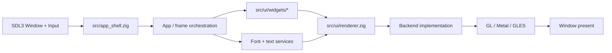
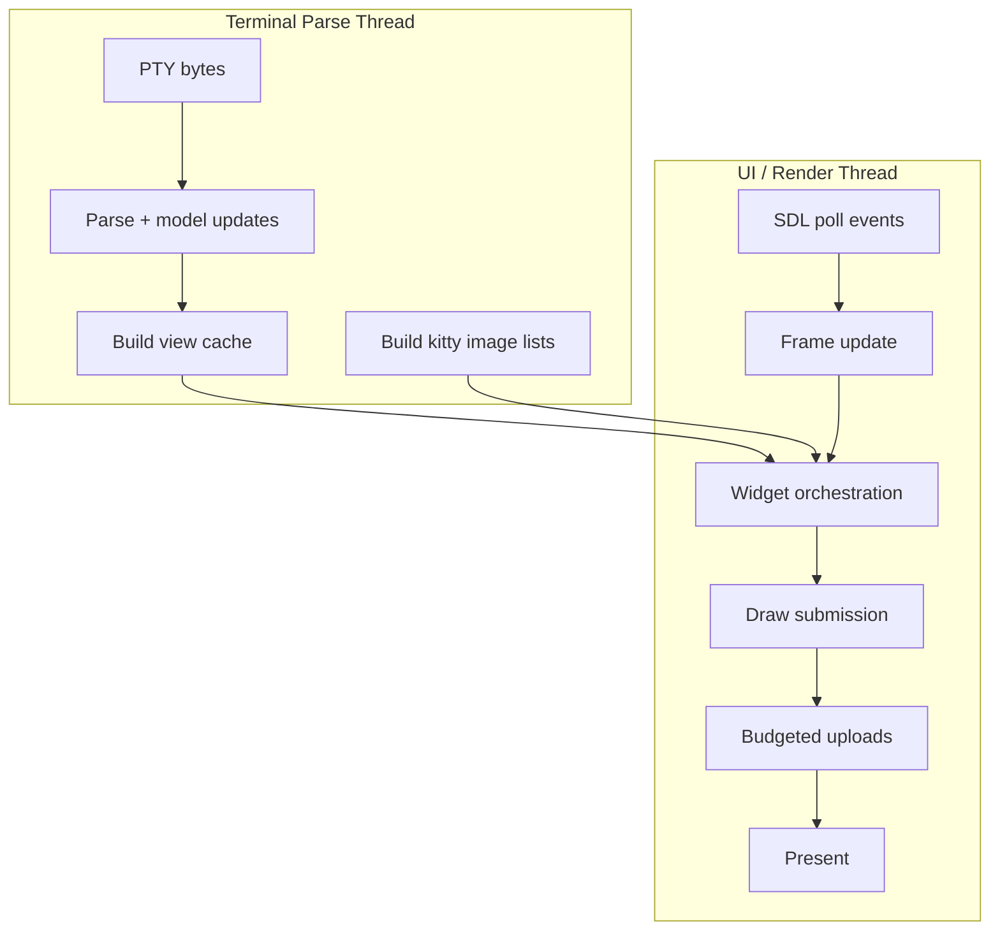

# UI Development Journey (Rendering Stack)

Goal
- Build a fast, reliable GUI rendering stack for Zide across Linux, Windows 11, macOS, and Android.
- Treat reference repos as canonical. We only diverge when required by Zide's code or to exceed the reference quality.

Status (2026-01-29)
- New focus (2026-03-07): UI-thread/backend decoupling and compute offload.
  - plan: `docs/review/PERFORMANCE_REVIEW_1.md`
  - task tracker: `docs/todo/ui/widget_modularization.md` (Phase 5)
- SDL3 window/input + OpenGL 3.3 renderer is now the active stack on Linux.
- Raylib has been removed from the build path; PNG decoding is handled via stb_image.
- Fixed texture UV orientation: CPU textures use top-left UVs; FBO blits flip Y at draw time.
- Wayland mouse scale uses SDL's drawable/window ratio only; avoid double-applying compositor scale.
- Undo repeat loop fixed by removing input-level undo grouping and ignoring text events while ctrl/alt/super are held.
- Key repeat now uses SDL's native key repeat events (no custom repeat timers) to align with terminal/editor input behavior.
- SDL event polling now runs on the main thread to match SDL3 thread-safety rules.
- Idle sleep uses SDL_Delay; input polling happens each frame.
- Added input latency logging (poll/build/update/draw timings) under `input.latency` for bottleneck tracing.
- Added terminal perf logs: `terminal.parse` (parse_ms/bytes) and `terminal.draw` (draw_ms + grid size) to isolate input latency bottlenecks.
- Parse loop now reduces work when input is pending, and perf logs are throttled to avoid spam.
- Terminal PTY parsing now runs on a dedicated parse thread (decoupled from UI update) to reduce input latency under heavy output.
- Terminal view cache is updated on the parse thread and reused by the renderer when not scrolled to avoid per-frame view rebuilds.
- Scrollback view cache rebuilds are queued to the parse thread on scroll changes to reduce render-thread work.
- Kitty image/placement view lists are built and sorted on the parse thread; renderer reuses the cached lists per frame.
- Selection highlight spans are cached alongside the view snapshot to avoid per-frame selection range scans.
- Kitty image uploads are now queued and uploaded in a per-frame budget to avoid large render-thread spikes.
- Renderer modularization + OS abstraction work is tracked in `docs/todo/ui/renderer.md` (now boundary-focused, extraction complete).
- UI widget modularization (splitting large widgets like TerminalWidget UI-side) is tracked in `docs/todo/ui/widget_modularization.md`.
- SDL3 migration: SDL3-only build path; SDL2 fallback removed.
- SDL3 terminal-only input now flows on Wayland when polling events on the main thread.
- SDL3 input diagnostics log event counts, struct layout offsets, and text payload pointer addresses to validate event parsing.
- Renderer cleanup continues: input constants, clipboard helpers, texture utilities, window event helpers, text input rect handling, timing helpers, input event helpers, SDL window/GL context init, input state helpers, mouse state helpers, window metrics helpers, input queue helpers, UI scale helpers, render target helpers, text draw helpers, GL resource helpers, draw batch helpers, target draw helpers, key state helpers, shape helpers, shape draw helpers, terminal glyph helpers, clipboard buffer helpers, terminal underline helpers, mouse button helpers, texture draw helpers, text composition helpers, window flag helpers, mouse wheel helpers, input logging helpers, window metrics state, and key queue helpers extracted into renderer/platform modules (see renderer_todo).

Canonical references (do not diverge without a documented reason)
- kitty: OpenGL renderer, glyph atlas, render loop discipline.
  - reference_repos/terminals/kitty/docs/overview.rst
  - reference_repos/terminals/kitty/docs/performance.rst
- ghostty: multi-backend renderer (OpenGL on Linux, Metal on macOS).
  - reference_repos/terminals/ghostty/README.md
- alacritty: OpenGL terminal renderer architecture.
  - reference_repos/terminals/alacritty/README.md
- lite-xl: SDL window/input layer for a GUI editor.
  - reference_repos/editors/lite-xl/README.md
- zed: Metal on macOS, Vulkan on Linux (GPU-first UI framework).
  - reference_repos/editors/zed/docs/src/macos.md
  - reference_repos/editors/zed/docs/src/linux.md

Non-negotiable rules
- We do not invent new rendering paradigms. We follow the reference repos unless forced by Zide's architecture.
- Any deviation must be recorded in app_architecture/DECISIONS.md with a concrete reason.
- A renderer backend is only added if a reference repo uses the same API on that OS or the OS requires it.

Architecture (modular, interface-driven)

UI layering + import guardrails
- Layer boundaries are enforced by import checks; keep UI modularization within the widget layer.
- Relevant doc: `app_architecture/APP_LAYERING.md` (widget boundaries + allowed import directions).
- Enforcement: `zig build check-app-imports` (widgets + main/renderer boundary), plus `zig build check-input-imports` / `zig build check-editor-imports`.
- Practical rule of thumb: keep `src/ui/widgets/*_widget.zig` as an orchestrator and push draw/input details into widget-local modules; do not introduce cross-widget imports.

1) Windowing + input (SDL3)
- SDL3 provides window creation, input, and platform glue.
- This is directly aligned with lite-xl.
- Android uses SDL's Android backend (SDL handles the activity and surface lifecycle).

2) Renderer API (backend-agnostic)
- The UI code talks to a small, stable renderer interface.
- Backends implement the interface and translate draw ops to native GPU calls.

Renderer interface (required surface area)
- init(renderer_config)
- deinit()
- create_surface(window_handle)
- resize_surface(width_px, height_px)
- begin_frame(frame_id)
- submit_draw_list(draw_list)
- end_frame()
- present()

Draw primitives (minimal, GPU-friendly)
- rects (filled, optional rounded corners later)
- text runs (glyph atlas + per-glyph quads)
- images (for terminal graphics and UI icons)
- clip rects (nested clip stack)

3) Backends (multi-backend but minimal)
- Linux: OpenGL 3.3 (via EGL for Wayland; GLX or EGL for X11)
- Windows 11: OpenGL via WGL or EGL/ANGLE (keep the OpenGL path for parity with kitty/alacritty)
- macOS: Metal (matches ghostty and zed)
- Android: OpenGL ES 3.x (native and stable)

Rendering model (from kitty/alacritty)
- GPU glyph atlas with cached glyph bitmaps.
- Batch draw calls into large vertex buffers per frame.
- Damage tracking to minimize work on unchanged regions.
- Render loop decoupled from input where possible (kitty pattern).

Module layout (target)
- src/app_shell.zig
  - SDL window and input, owns renderer instance
- src/ui/renderer/
  - renderer.zig (backend-agnostic interface)
  - draw_list.zig (ops + batching format)
  - text_cache.zig (glyph atlas + font metrics)
- src/ui/renderer/backends/
  - gl.zig (Linux/Windows)
  - metal.zig (macOS)
  - gles.zig (Android)
- src/ui/widgets/
  - editor_widget.zig
  - terminal_widget.zig
  - other UI widgets

Per-OS implementation plan (Linux first)

Phase 1 - Linux (SDL3 + OpenGL)
- Create SDL window and OpenGL context. (done)
- Implement the renderer interface with OpenGL 3.3. (done; immediate-mode quad pipeline)
- Bring up text rendering with a GPU atlas (kitty/alacritty model). (done; FreeType + GL atlas)
- Add SDL text composition (IME) handling + text input rect updates for editor/terminal. (done)
- Draw list supports rects, text runs, and clip rects. (pending; immediate-mode for now)
- Replace raylib usage in renderer only (no UI behavior changes). (done)

Phase 2 - Windows 11 (SDL3 + OpenGL)
- Use same OpenGL backend via WGL or EGL/ANGLE.
- Validate input, DPI scaling, and swapchain behavior.

Phase 3 - macOS (SDL3 + Metal)
- Add a Metal backend and keep the renderer interface identical.
- Use CoreText only if required; otherwise keep FreeType/HarfBuzz.

Phase 4 - Android (SDL3 + OpenGL ES)
- GLES backend with the same draw list format.
- Handle activity pause/resume, surface loss, and context recreation.

Phase 5 - Parity and quality
- Match kitty-level glyph caching behavior and render loop stability.
- Add fine-grained damage tracking for editor and terminal widgets.

What we do not do
- No heavy UI frameworks.
- No new experimental render tech that is not in the reference repos.
- No backend proliferation.

Validation
- Compare render output and perf against reference repos and previously tagged/known-good Zide commits.
- Add per-OS smoke tests for window create, text render, and input.

Open questions (to resolve later)
- Decide whether Windows should use WGL or EGL/ANGLE.
- Decide if macOS requires CoreText for font discovery or if FreeType is sufficient.
