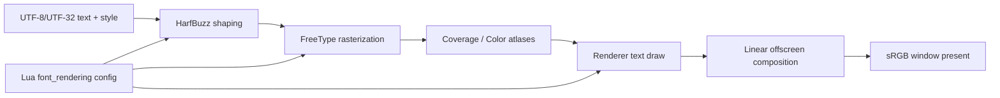
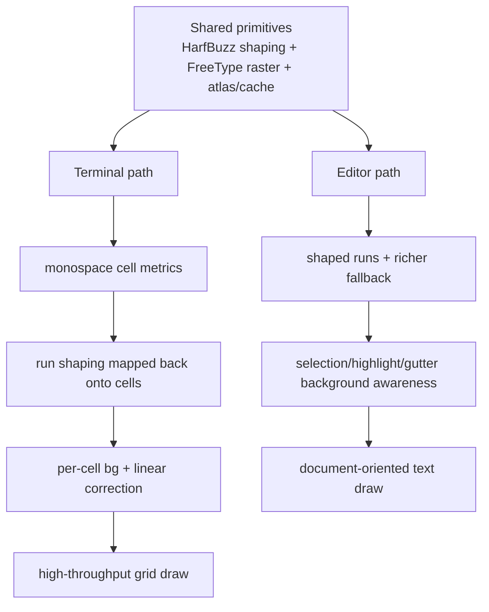
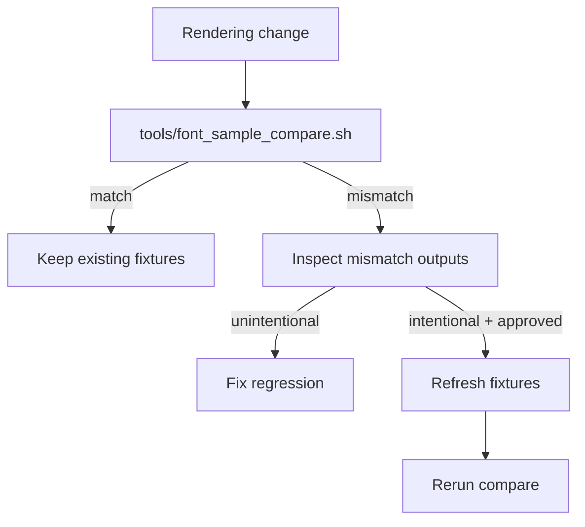

# Font Rendering Architecture

This doc describes the intended architecture for Zide text rendering. It is
written to support a renderer that is competitive with modern terminals
(kitty/ghostty-tier) without relying on fragile tuning.

## Goals

- Crisp small text without halos or weight shifts across backgrounds.
- Stable metrics (cell width/height, advances) across fonts and fallbacks.
- Predictable color pipeline: coverage in linear, blending in linear, explicit
  conversion boundaries.
- Separate optimization profiles:
  - Editor: correctness for selection/highlights, shaped runs, large documents.
  - Terminal: monospace grid discipline, high throughput, low latency.

## Non-Goals

- Perfect LCD/subpixel AA on all displays (must be explicitly designed and is
  opt-in).
- Making editor and terminal share the same font stack or fallback chain. They
  may diverge.

## Modules and Contracts

Zide should treat text rendering as a pipeline with clear boundaries:

1) Shaping (HarfBuzz)
- Input: text (UTF-8/UTF-32), style (font face selection), direction/script,
  features.
- Output: glyph ids, per-glyph positions (advances/offsets), clusters.
- Contract: shaping uses the same FreeType load flags that the rasterizer uses
  for consistent advances.

2) Rasterization (FreeType)
- Input: (face, glyph id), load flags, render mode.
- Output: either coverage bitmap (grayscale) or BGRA bitmap (color glyph).
- Contract: coverage values are linear coverage, not gamma-baked.

3) Atlas + Cache
- Two atlases:
  - Coverage atlas: R8 (mask only)
  - Color atlas: RGBA8 (color glyphs)
- Contract: atlas uploads are incremental; eviction/compaction is bounded.

4) Renderer
- All coverage glyph draws output premultiplied alpha.
- Blending:
  - Premultiplied: ONE, ONE_MINUS_SRC_ALPHA
  - Straight-alpha RGBA textures: SRC_ALPHA, ONE_MINUS_SRC_ALPHA
- Color space:
  - Rendering into offscreen targets happens in linear.
  - Presenting to the window unlinearizes to sRGB explicitly.

5) Optional Linear Correction (ghostty-style)
- When blending coverage in linear space, small text can change perceived
  weight. A luminance-derived correction can compute an adjusted alpha based on
  the foreground and background luminance.
- Contract: shader needs to know the background color behind each glyph.
  Terminal has per-cell bg; editor must supply bg for selections/highlights.

## Terminal vs Editor

Terminal
- Monospace grid.
- Cell metrics are derived from representative ASCII advances, not from
  max_advance (Nerd Font builds can inflate max_advance).
- Shaping should occur in runs, but output must be mapped back onto cells.

Editor
- Can prioritize shaped runs and accurate selection/highlight rendering.
- Background-aware correction must work under selections, line highlights, and
  gutter overlays.
- Font stack may differ from terminal.

## Configuration Surface (Lua)

All appearance-affecting knobs should be in `assets/config/init.lua`:

- `font_rendering.lcd`
- `font_rendering.hinting`
- `font_rendering.autohint`
- `font_rendering.glyph_overflow`
- `font_rendering.text.gamma`
- `font_rendering.text.contrast`
- `font_rendering.text.linear_correction`

Terminal/editor font stacks are configured independently under:

- `app.font`
- `editor.font`
- `terminal.font`

For experiments, `ZIDE_FONT_RENDERING_LCD=1|0` can override LCD mode at
runtime without editing Lua config files.

## Verification Fixtures

Reference captures live under `fixtures/ui/font_sample/` as PPM files. They are
not called goldens yet; they serve as regression signals while the pipeline is
being redesigned.

Recommended fixture dimensions:
- Sizes: 12, 14, 16, 20
- Backgrounds: theme background, selection background, inverted cursor cell
- Strings: ASCII stems, punctuation, box drawing, braille, combining marks,
  Nerd Font icons, emoji sequences

The goal is to be able to make architectural changes (shaping, atlas,
correction) with confidence.

### Fixture Refresh Policy

- Default rule: if `tools/font_sample_compare.sh` reports a mismatch, treat it
  as a regression until the rendering behavior change is intentionally scoped
  and documented.
- Only refresh fixtures when all of these are true:
  - the rendering behavior change is intentional (not incidental);
  - the change is described in `docs/todo/ui/font_rendering.md`;
  - reviewer/user approval has been given for the visual baseline shift.
- Refresh workflow:
  - run `tools/font_sample_compare.sh` and inspect mismatch outputs in
    `zig-cache/font_sample_compare/`;
  - if approved, copy updated captures into `fixtures/ui/font_sample/`;
  - rerun `tools/font_sample_compare.sh` to confirm the repository is green.

## Phase 5 Findings

Current LCD experiment status (as of 2026-02-17):
- Capture workflow:
  - `tools/font_sample_capture_lcd.sh`
  - `tools/font_sample_lcd_report.sh`
- On Linux SDL3/OpenGL, default vs LCD captures differ for all tracked sizes
  (12/14/16/20), confirming the opt-in LCD path is active.
- Default policy remains unchanged: LCD stays off by default.

Acceptance criteria before enabling LCD by default:
- Visual QA sign-off for IosevkaTerm and JetBrainsMono at 12/14/16/20 on at
  least one standard RGB layout display.
- No obvious color fringing regressions in terminal/editor overlays.
- `tools/font_sample_compare.sh --strict-header` remains green for default
  captures and LCD experiment reports remain reproducible.

Experiment history should be recorded with dated snapshots under:
- `docs/review/archive/ui/font_sample_lcd_snapshots/`
- generated by `tools/font_sample_lcd_snapshot.sh`
