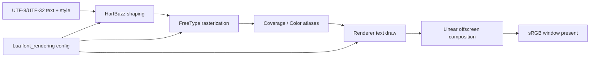
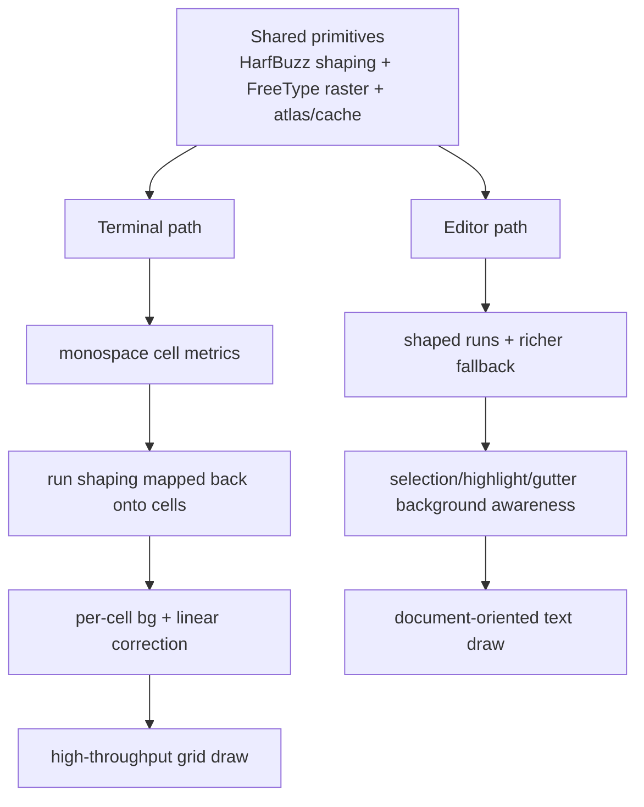
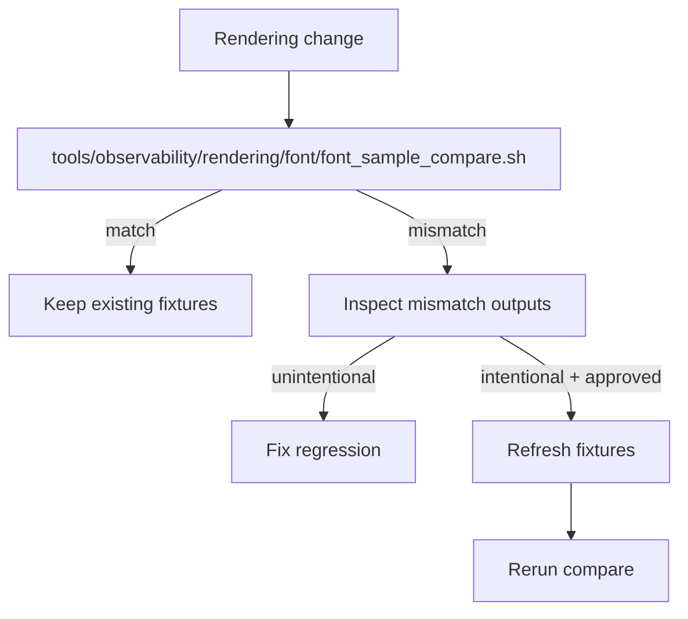

# Font Rendering Architecture

This doc describes the intended architecture for Zide text rendering. It is
written to support a renderer that is competitive with modern terminals
(kitty/ghostty-tier) without relying on fragile tuning.

## Goals

- Crisp small text without halos or weight shifts across backgrounds.
- Stable metrics (cell width/height, advances) across fonts and fallbacks.
- Predictable color pipeline: coverage in linear, blending in linear, explicit
  conversion boundaries.
- Separate optimization profiles:
  - Editor: correctness for selection/highlights, shaped runs, large documents.
  - Terminal: monospace grid discipline, high throughput, low latency.

## Non-Goals

- Perfect LCD/subpixel AA on all displays (must be explicitly designed and is
  opt-in).
- Making editor and terminal share the same font stack or fallback chain. They
  may diverge.

## Modules and Contracts

Zide should treat text rendering as a pipeline with clear boundaries:

```mermaid
flowchart LR
    Text[UTF-8/UTF-32 text + style] --> Shape[HarfBuzz shaping]
    Shape --> Raster[FreeType rasterization]
    Raster --> Atlas[Coverage / Color atlases]
    Atlas --> Render[Renderer text draw]
    Render --> Offscreen[Linear offscreen composition]
    Offscreen --> Present[sRGB window present]

    Config[Lua font_rendering config] --> Shape
    Config --> Raster
    Config --> Render
```

1) Shaping (HarfBuzz)
- Input: text (UTF-8/UTF-32), style (font face selection), direction/script,
  features.
- Output: glyph ids, per-glyph positions (advances/offsets), clusters.
- Contract: shaping uses the same FreeType load flags that the rasterizer uses
  for consistent advances.

2) Rasterization (FreeType)
- Input: (face, glyph id), load flags, render mode.
- Output: either coverage bitmap (grayscale) or BGRA bitmap (color glyph).
- Contract: coverage values are linear coverage, not gamma-baked.

3) Atlas + Cache
- Two atlases:
  - Coverage atlas: R8 (mask only)
  - Color atlas: RGBA8 (color glyphs)
- Contract: atlas uploads are incremental; eviction/compaction is bounded.

4) Renderer
- All coverage glyph draws output premultiplied alpha.
- Blending:
  - Premultiplied: ONE, ONE_MINUS_SRC_ALPHA
  - Straight-alpha RGBA textures: SRC_ALPHA, ONE_MINUS_SRC_ALPHA
- Color space:
  - Rendering into offscreen targets happens in linear.
  - Presenting to the window unlinearizes to sRGB explicitly.

5) Optional Linear Correction (ghostty-style)
- When blending coverage in linear space, small text can change perceived
  weight. A luminance-derived correction can compute an adjusted alpha based on
  the foreground and background luminance.
- Contract: shader needs to know the background color behind each glyph.
  Terminal has per-cell bg; editor must supply bg for selections/highlights.

## Terminal vs Editor

Terminal
- Monospace grid.
- Cell metrics are derived from representative ASCII advances, not from
  max_advance (Nerd Font builds can inflate max_advance).
- Shaping should occur in runs, but output must be mapped back onto cells.

Editor
- Can prioritize shaped runs and accurate selection/highlight rendering.
- Background-aware correction must work under selections, line highlights, and
  gutter overlays.
- Font stack may differ from terminal.

```mermaid
flowchart TD
    Shared["Shared primitives\nHarfBuzz shaping + FreeType raster + atlas/cache"] --> Terminal["Terminal path"]
    Shared --> Editor["Editor path"]

    Terminal --> T1["monospace cell metrics"]
    T1 --> T2["run shaping mapped back onto cells"]
    T2 --> T3["per-cell bg + linear correction"]
    T3 --> T4["high-throughput grid draw"]

    Editor --> E1["shaped runs + richer fallback"]
    E1 --> E2["selection/highlight/gutter background awareness"]
    E2 --> E3["document-oriented text draw"]
```

## Windows DPI Contract

Current Windows scale ownership is:

- `platform.display_metrics`
  - authoritative per-window snapshot from SDL
  - owns:
    - logical window size
    - drawable size
    - display index
    - DPI scale
    - SDL display scale
    - pixel density
    - derived render scale
  - current implementation:
    - `src/platform/display_metrics.zig`
    - consumed by `src/platform/window_metrics.zig`,
      `src/ui/renderer.zig`, and `src/ui/renderer/font_runtime.zig`
- `render_scale`
  - actual raster/backbuffer scale
  - on Windows this should follow SDL window pixel density / drawable ratio,
    not content scale
  - used to choose raster size and device-pixel alignment behavior
- `ui_scale`
  - app/layout scale
  - on Windows this now includes native SDL display/content scale before any
    optional `ZIDE_UI_SCALE` override

That means the corrected Windows path now splits the two responsibilities:

- content/display scale enlarges layout/UI size
- pixel density controls raster size and device-pixel alignment

Current implications:

- SDL display-scale changes should trigger font rebuilds and target invalidation
- if fractional-DPI bugs remain on Windows they are therefore more likely to be
  caused by:
  - glyph origin snapping
  - quad sizing
  - atlas UV/sampling rules
  - baseline/metric rebuild instability
- they are less likely to be caused by the top-level DPI/content-scale split
  itself

Current validation status, 2026-03-20:

- the corrected Windows scale split is now good enough that `125%` editor and
  terminal rendering are user-accepted on the active Windows validation
  machine
- the next Windows text work should focus on regression authority and startup
  cleanup, not reopening the core scale-ownership question without new
  evidence
- renderer startup should be seeded from loaded config before the first
  `initFonts(...)` pass so font path/size/render-policy truth is stable from
  the beginning, not corrected via immediate post-init rebuilds

This is an implementation truth, not a claim that the contract is already ideal.
If the current model proves insufficient, change it deliberately and document
the new ownership split here before spreading ad hoc fixes through the
renderer.

Current correction, 2026-04-04:

- the renderer/font contract correction was necessary but not sufficient
- the app still leaks raw scale and snap policy into widgets
- the exact public contract for that lane now lives in:
  - [WINDOW_SCALE_GEOMETRY_DESIGN.md](/home/home/personal/zide/app_architecture/ui/WINDOW_SCALE_GEOMETRY_DESIGN.md)
- the active execution queue for that broader lane is:
  - [window_scale_geometry.md](/home/home/personal/zide/docs/todo/ui/window_scale_geometry.md)

Current architectural direction:

- keep OS/backend truth acquisition inside `platform.display_metrics`
- let renderer/font code consume that snapshot instead of independently reading
  SDL/window state
- keep text quality policy separate from OS truth acquisition
- renderer should also own per-domain logical scaled-font metric snapshots for
  app chrome, editor text, and terminal text (`cell_width`, `cell_height`,
  `baseline_from_top`) so draw paths do not each reinterpret raw
  FreeType/HarfBuzz font fields independently

Current reference priority for runtime scaling work:

- `alacritty`
  - runtime scale-factor changes should intentionally update effective font
    size/layout state
- `wezterm`
  - render metrics should be an explicit, pixel-rounded set that keeps
    cell-size, descender, baseline, and underline positions coherent
- SDL renderer scale math
  - destination geometry should be scaled/rounded consistently from one view
    contract, not through ad hoc per-call adjustments
- Windows DPI/DirectWrite docs
  - define platform expectations, not the full renderer implementation

## Runtime Font Scaling Contract

Android pinch testing exposed a shared renderer truth: hinted bitmap glyphs are
not continuously scalable assets.

Current authoritative interpretation:

- FreeType raster output is tied to the committed pixel size and load flags.
  Grid-fitting/hinting can change bitmap dimensions, bearings, advances, and
  stem placement when the size changes.
- HarfBuzz FreeType integration depends on the `FT_Face` size and load flags,
  so shaping and rasterization must agree for each committed font state.
- A live-scaled atlas is only a preview. When the renderer later swaps to a
  freshly rasterized atlas at the settled size, visible stroke/thickness changes
  are expected with hinted text.
- Glyph warmup can reduce lazy upload misses, but it cannot make a stretched
  old-size atlas visually identical to a newly hinted target-size atlas.

Required direction:

- Treat terminal font states as size-keyed committed resources:
  font identity, rendering options, render scale, rounded raster pixel size,
  and domain.
- Reuse prepared `TerminalFont`/atlas instances across nearby committed sizes
  instead of destroying all active font state on every settled zoom.
- Keep live pinch/zoom geometry cheap, but do not claim hinted glyph weight is
  final until the committed size-keyed font state is active.
- Preserve integer pixel metric discipline for terminal cells, baseline, and
  glyph placement. Local reference notes from kitty/wezterm already point in
  that direction.

Current implementation checkpoint:

- `TerminalFont` records the committed raster pixel size that produced its
  atlas.
- The renderer now retains committed terminal-font atlases by render scale and
  raster pixel size across settled zoom commits.
- The renderer prepares a bounded neighbor set around the active committed
  terminal raster size: twelve raster-pixel intervals smaller and twelve
  larger.
- Terminal live visual scale remains continuous during pinch so glyph geometry
  stays coupled to live cell geometry.
- Active terminal pinch swaps to a prepared committed raster-size neighbor
  when available. This keeps the gesture path terminal-only and avoids a full
  app/editor/icon font rebuild while reducing release-only thickness snapping.
- Cache invalidation is tied to terminal font path/config and rendering-option
  changes.
- Validated boundary, 2026-04-12:
  - Android host gesture cleanup materially improved the interaction seam
  - the renderer-core follow-up work is now sufficient to treat the current
    Android terminal pinch path as accepted for the active product target
  - keep the architecture lesson: renderer-owned committed/live font cadence is
    the real authority, not more host gesture tuning
- The next ownership split is explicit:
  background work may prepare CPU font state plus the visible glyph-set plan,
  but GPU atlas upload/adoption must stay render-thread-owned.
- First code seam landed:
  - `TerminalFont` now exposes CPU-only prepared glyph raster payloads
  - atlas upload/adoption is now a separate step from glyph raster
    preparation
  - current behavior is intentionally unchanged; the render path still prepares
    and adopts inline for now
  - this cut exists to make worker-owned CPU preparation legal in the next
    step without moving GPU atlas mutation off the render thread
- Renderer ownership checkpoint:
  - renderer runtime now owns a dedicated terminal glyph-prep request/result
    state with generation tracking
  - this is the landing zone for worker-produced CPU glyph payloads
  - renderer now also exposes explicit queue/publish/take helpers for terminal
    glyph-prep requests/results
- the worker loop itself is not wired yet; this cut is storage/lifecycle
  authority only
- Visible-demand checkpoint:
  - the terminal widget draw path can now collect a deduped visible glyph-set
    plan from the same direct/shaped row-span decisions the product frame uses
  - the plan is expressed as `Renderer.TerminalGlyphPrepEntry`
    (`face`, `glyph_id`, `want_color`, `italic`, `hb_x_advance`)
  - this is the required authority for async preparation; worker scheduling
    should follow visible product demand, not speculative whole-font warmup
  - the terminal draw path now stages renderer-owned prep requests from that
    plan, keyed by committed raster size and render scale
  - renderer now owns a dedicated worker loop that consumes those requests and
    prepares CPU-only glyph rasters using a temporary committed-size font
    instance
  - worker results publish back into renderer-owned result state and are
    dropped if their generation is stale
  - render-thread adoption is now explicit too: ready worker rasters are
    resolved against the live committed terminal font by face slot and adopted
    into the live atlas before draw lookup falls back to inline realization

Kitty reference mapping, 2026-04-12:

- Kitty's `fonts.c` plus `glyph-cache.c` separates sprite identity from sprite
  readiness.
- `find_or_create_sprite_position(...)` creates a CPU-side sprite-position
  record keyed by glyph sequence, scale/subscale, multicell state, and
  alignment.
- That record carries readiness bits (`rendered`, `colored`) separately from
  the cache key, so the system can know "this glyph instance exists" before it
  is actually uploaded/adopted for rendering.
- GPU sprite upload/adoption is a separate step (`current_send_sprite_to_gpu`
  / `send_sprite_to_gpu`), not the cache-key definition itself.
- This maps cleanly to Zide's next seam:
  - terminal committed size + visible glyph-set key must exist independently of
    readiness
  - worker-owned CPU prep should produce "ready to upload" glyph payloads, not
    mutate live renderer atlases
  - render-thread code should only adopt/upload prepared glyph payloads and
    flip readiness for the current committed terminal size

Do not cargo-cult from kitty:

- kitty's current lazy render-on-demand path is still acceptable for its own
  architecture, but it is the exact behavior Android fast pinch is now proving
  too bursty for our live zoom contract
- the thing to copy is the ownership split between keying/readiness/upload, not
  the decision to realize every glyph lazily on the hot path

Renderer-core pressure resolved for the current Android boundary, 2026-04-12:

- Android exposed the missing seam first, but the fix belongs to shared font
  ownership:
  - CPU-only prepared terminal-font state
  - render-thread-owned GPU atlas allocation/upload/adoption
- That split is now part of the active renderer baseline:
  - worker-safe `TerminalFont.initCpuPrepared(...)`
  - async visible-glyph preparation
  - committed-target cache population
  - prepared-target promotion after adopt
- Remaining extreme-burst behavior is deferred. It is no longer the active
  correctness blocker for the Android terminal lane.

Why this is shared-core pressure:

- `TerminalFont.initWithAtlasUploadHooks(...)` still couples font-instance
  creation to atlas allocation
- without backend hooks it falls back to GL texture creation
- that makes committed target font-instance preparation worker-unsafe on
  Android/GLES today
- Android only exposed it first; the design gap is shared terminal/font
  lifecycle immaturity
- first `FR-6-03` cut is now in:
  - `TerminalFont.initCpuPrepared(...)` creates a worker-safe CPU-prepared font
    instance without GL texture allocation
  - the async terminal glyph-prep worker now uses that path
  - this is the first backend-agnostic prepared-font primitive, not a CPU-only
    renderer backend

Non-goal:

- Do not chase perfectly continuous hinted-stem thickness through ad hoc
  FreeType warmups. If the product later requires continuous text-scale preview
  without stroke-weight jumps, that is a separate SDF/vector-preview design.

## Configuration Surface (Lua)

All appearance-affecting knobs should be in `assets/config/init.lua`:

- `font_rendering.lcd`
- `font_rendering.hinting`
- `font_rendering.autohint`
- `font_rendering.glyph_overflow`
- `font_rendering.text.gamma`
- `font_rendering.text.contrast`
- `font_rendering.text.linear_correction`

Terminal/editor font stacks are configured independently under:

- `app.font`
- `editor.font`
- `terminal.font`

For experiments, `ZIDE_FONT_RENDERING_LCD=1|0` can override LCD mode at
runtime without editing Lua config files.

## Verification Fixtures

Reference captures live under `fixtures/ui/font_sample/` as PPM files. They are
not called goldens yet; they serve as regression signals while the pipeline is
being redesigned.

Recommended fixture dimensions:
- Sizes: 12, 14, 16, 20
- Backgrounds: theme background, selection background, inverted cursor cell
- Strings: ASCII stems, punctuation, box drawing, braille, combining marks,
  Nerd Font icons, emoji sequences

The goal is to be able to make architectural changes (shaping, atlas,
correction) with confidence.

```mermaid
flowchart TD
    Change[Rendering change] --> Compare[tools/observability/rendering/font/font_sample_compare.sh]
    Compare -->|match| Keep[Keep existing fixtures]
    Compare -->|mismatch| Review[Inspect mismatch outputs]
    Review -->|unintentional| Fix[Fix regression]
    Review -->|intentional + approved| Refresh[Refresh fixtures]
    Refresh --> Recheck[Rerun compare]
```

### Fixture Refresh Policy

- Default rule: if `tools/observability/rendering/font/font_sample_compare.sh` reports a mismatch, treat it
  as a regression until the rendering behavior change is intentionally scoped
  and documented.
- Only refresh fixtures when all of these are true:
  - the rendering behavior change is intentional (not incidental);
  - the current execution queue in `docs/todo/ui/font_rendering.md` describes
    the change;
  - reviewer/user approval has been given for the visual baseline shift.
- Refresh workflow:
  - run `tools/observability/rendering/font/font_sample_compare.sh` and inspect mismatch outputs in
    `zig-cache/font_sample_compare/`;
  - if approved, copy updated captures into `fixtures/ui/font_sample/`;
  - rerun `tools/observability/rendering/font/font_sample_compare.sh` to confirm the repository is green.

## Phase 5 Findings

Current LCD experiment status (as of 2026-02-17):
- Capture workflow:
  - `tools/observability/rendering/font/font_sample_capture_lcd.sh`
  - `tools/observability/rendering/font/font_sample_lcd_report.sh`
- On Linux SDL3/OpenGL, default vs LCD captures differ for all tracked sizes
  (12/14/16/20), confirming the opt-in LCD path is active.
- Default policy remains unchanged: LCD stays off by default.

Acceptance criteria before enabling LCD by default:
- Visual QA sign-off for IosevkaTerm and JetBrainsMono at 12/14/16/20 on at
  least one standard RGB layout display.
- No obvious color fringing regressions in terminal/editor overlays.
- `tools/observability/rendering/font/font_sample_compare.sh --strict-header` remains green for default
  captures and LCD experiment reports remain reproducible.

Experiment history should be recorded with dated snapshots under:
- `docs/review/archive/ui/font_sample_lcd_snapshots/`
- generated by `tools/observability/rendering/font/font_sample_lcd_snapshot.sh`
