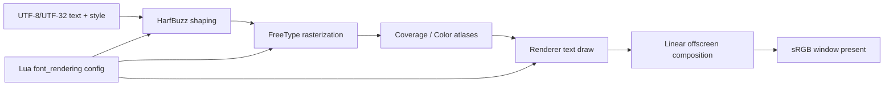
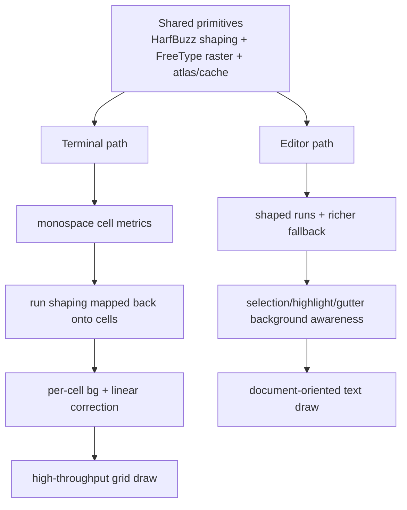
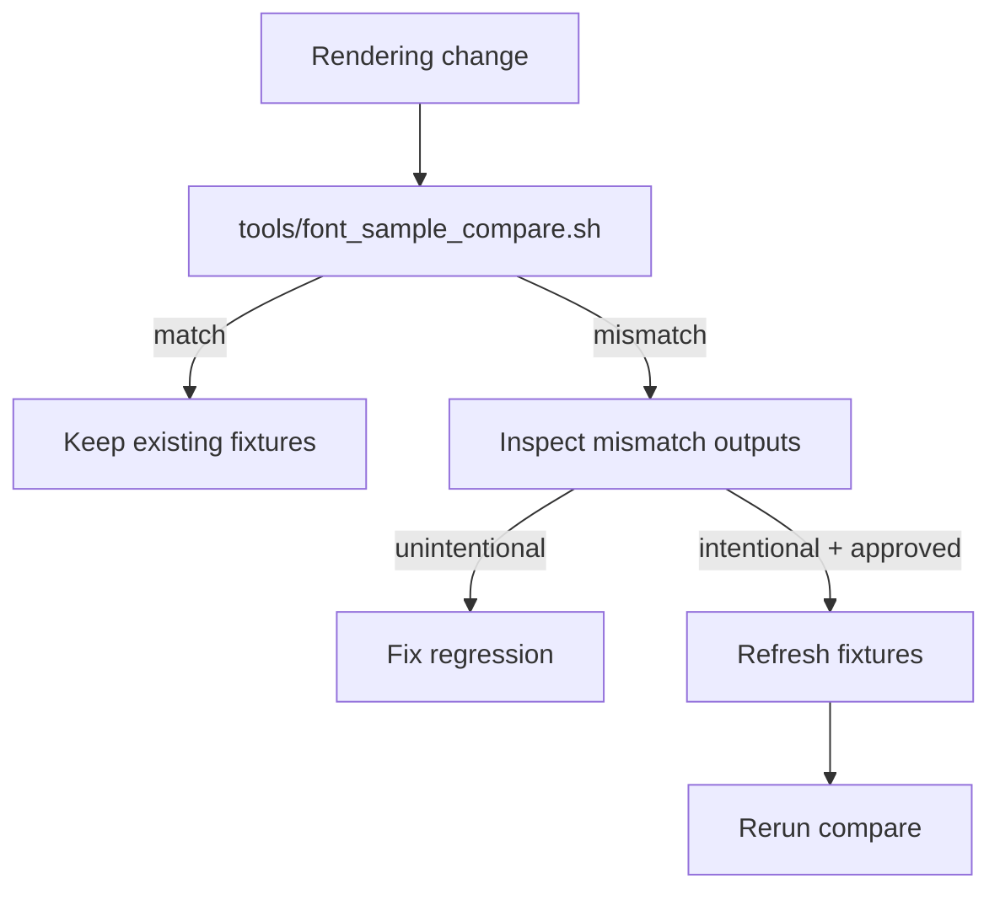

# Font Rendering Architecture

This doc describes the intended architecture for Zide text rendering. It is
written to support a renderer that is competitive with modern terminals
(kitty/ghostty-tier) without relying on fragile tuning.

## Goals

- Crisp small text without halos or weight shifts across backgrounds.
- Stable metrics (cell width/height, advances) across fonts and fallbacks.
- Predictable color pipeline: coverage in linear, blending in linear, explicit
  conversion boundaries.
- Separate optimization profiles:
  - Editor: correctness for selection/highlights, shaped runs, large documents.
  - Terminal: monospace grid discipline, high throughput, low latency.

## Non-Goals

- Perfect LCD/subpixel AA on all displays (must be explicitly designed and is
  opt-in).
- Making editor and terminal share the same font stack or fallback chain. They
  may diverge.

## Modules and Contracts

Zide should treat text rendering as a pipeline with clear boundaries:

```mermaid
flowchart LR
    Text[UTF-8/UTF-32 text + style] --> Shape[HarfBuzz shaping]
    Shape --> Raster[FreeType rasterization]
    Raster --> Atlas[Coverage / Color atlases]
    Atlas --> Render[Renderer text draw]
    Render --> Offscreen[Linear offscreen composition]
    Offscreen --> Present[sRGB window present]

    Config[Lua font_rendering config] --> Shape
    Config --> Raster
    Config --> Render
```

1) Shaping (HarfBuzz)
- Input: text (UTF-8/UTF-32), style (font face selection), direction/script,
  features.
- Output: glyph ids, per-glyph positions (advances/offsets), clusters.
- Contract: shaping uses the same FreeType load flags that the rasterizer uses
  for consistent advances.

2) Rasterization (FreeType)
- Input: (face, glyph id), load flags, render mode.
- Output: either coverage bitmap (grayscale) or BGRA bitmap (color glyph).
- Contract: coverage values are linear coverage, not gamma-baked.

3) Atlas + Cache
- Two atlases:
  - Coverage atlas: R8 (mask only)
  - Color atlas: RGBA8 (color glyphs)
- Contract: atlas uploads are incremental; eviction/compaction is bounded.

4) Renderer
- All coverage glyph draws output premultiplied alpha.
- Blending:
  - Premultiplied: ONE, ONE_MINUS_SRC_ALPHA
  - Straight-alpha RGBA textures: SRC_ALPHA, ONE_MINUS_SRC_ALPHA
- Color space:
  - Rendering into offscreen targets happens in linear.
  - Presenting to the window unlinearizes to sRGB explicitly.

5) Optional Linear Correction (ghostty-style)
- When blending coverage in linear space, small text can change perceived
  weight. A luminance-derived correction can compute an adjusted alpha based on
  the foreground and background luminance.
- Contract: shader needs to know the background color behind each glyph.
  Terminal has per-cell bg; editor must supply bg for selections/highlights.

## Terminal vs Editor

Terminal
- Monospace grid.
- Cell metrics are derived from representative ASCII advances, not from
  max_advance (Nerd Font builds can inflate max_advance).
- Shaping should occur in runs, but output must be mapped back onto cells.

Editor
- Can prioritize shaped runs and accurate selection/highlight rendering.
- Background-aware correction must work under selections, line highlights, and
  gutter overlays.
- Font stack may differ from terminal.

```mermaid
flowchart TD
    Shared["Shared primitives\nHarfBuzz shaping + FreeType raster + atlas/cache"] --> Terminal["Terminal path"]
    Shared --> Editor["Editor path"]

    Terminal --> T1["monospace cell metrics"]
    T1 --> T2["run shaping mapped back onto cells"]
    T2 --> T3["per-cell bg + linear correction"]
    T3 --> T4["high-throughput grid draw"]

    Editor --> E1["shaped runs + richer fallback"]
    E1 --> E2["selection/highlight/gutter background awareness"]
    E2 --> E3["document-oriented text draw"]
```

## Windows DPI Contract

Current Windows scale ownership is:

- `platform.display_metrics`
  - authoritative per-window snapshot from SDL
  - owns:
    - logical window size
    - drawable size
    - display index
    - DPI scale
    - SDL display scale
    - pixel density
    - derived render scale
  - current implementation:
    - `src/platform/display_metrics.zig`
    - consumed by `src/platform/window_metrics.zig`,
      `src/ui/renderer.zig`, and `src/ui/renderer/font_runtime.zig`
- `render_scale`
  - actual raster/backbuffer scale
  - on Windows this should follow SDL window pixel density / drawable ratio,
    not content scale
  - used to choose raster size and device-pixel alignment behavior
- `ui_scale`
  - app/layout scale
  - on Windows this now includes native SDL display/content scale before any
    optional `ZIDE_UI_SCALE` override

That means the corrected Windows path now splits the two responsibilities:

- content/display scale enlarges layout/UI size
- pixel density controls raster size and device-pixel alignment

Current implications:

- SDL display-scale changes should trigger font rebuilds and target invalidation
- if fractional-DPI bugs remain on Windows they are therefore more likely to be
  caused by:
  - glyph origin snapping
  - quad sizing
  - atlas UV/sampling rules
  - baseline/metric rebuild instability
- they are less likely to be caused by the top-level DPI/content-scale split
  itself

Current validation status, 2026-03-20:

- the corrected Windows scale split is now good enough that `125%` editor and
  terminal rendering are user-accepted on the active Windows validation
  machine
- the next Windows text work should focus on regression authority and startup
  cleanup, not reopening the core scale-ownership question without new
  evidence
- renderer startup should be seeded from loaded config before the first
  `initFonts(...)` pass so font path/size/render-policy truth is stable from
  the beginning, not corrected via immediate post-init rebuilds

This is an implementation truth, not a claim that the contract is already ideal.
If the current model proves insufficient, change it deliberately and document
the new ownership split here before spreading ad hoc fixes through the
renderer.

Current architectural direction:

- keep OS/backend truth acquisition inside `platform.display_metrics`
- let renderer/font code consume that snapshot instead of independently reading
  SDL/window state
- keep text quality policy separate from OS truth acquisition
- renderer should also own per-domain logical scaled-font metric snapshots for
  app chrome, editor text, and terminal text (`cell_width`, `cell_height`,
  `baseline_from_top`) so draw paths do not each reinterpret raw
  FreeType/HarfBuzz font fields independently

Current reference priority for runtime scaling work:

- `alacritty`
  - runtime scale-factor changes should intentionally update effective font
    size/layout state
- `wezterm`
  - render metrics should be an explicit, pixel-rounded set that keeps
    cell-size, descender, baseline, and underline positions coherent
- SDL renderer scale math
  - destination geometry should be scaled/rounded consistently from one view
    contract, not through ad hoc per-call adjustments
- Windows DPI/DirectWrite docs
  - define platform expectations, not the full renderer implementation

## Configuration Surface (Lua)

All appearance-affecting knobs should be in `assets/config/init.lua`:

- `font_rendering.lcd`
- `font_rendering.hinting`
- `font_rendering.autohint`
- `font_rendering.glyph_overflow`
- `font_rendering.text.gamma`
- `font_rendering.text.contrast`
- `font_rendering.text.linear_correction`

Terminal/editor font stacks are configured independently under:

- `app.font`
- `editor.font`
- `terminal.font`

For experiments, `ZIDE_FONT_RENDERING_LCD=1|0` can override LCD mode at
runtime without editing Lua config files.

## Verification Fixtures

Reference captures live under `fixtures/ui/font_sample/` as PPM files. They are
not called goldens yet; they serve as regression signals while the pipeline is
being redesigned.

Recommended fixture dimensions:
- Sizes: 12, 14, 16, 20
- Backgrounds: theme background, selection background, inverted cursor cell
- Strings: ASCII stems, punctuation, box drawing, braille, combining marks,
  Nerd Font icons, emoji sequences

The goal is to be able to make architectural changes (shaping, atlas,
correction) with confidence.

```mermaid
flowchart TD
    Change[Rendering change] --> Compare[tools/font_sample_compare.sh]
    Compare -->|match| Keep[Keep existing fixtures]
    Compare -->|mismatch| Review[Inspect mismatch outputs]
    Review -->|unintentional| Fix[Fix regression]
    Review -->|intentional + approved| Refresh[Refresh fixtures]
    Refresh --> Recheck[Rerun compare]
```

### Fixture Refresh Policy

- Default rule: if `tools/font_sample_compare.sh` reports a mismatch, treat it
  as a regression until the rendering behavior change is intentionally scoped
  and documented.
- Only refresh fixtures when all of these are true:
  - the rendering behavior change is intentional (not incidental);
  - the current execution queue in `docs/todo/ui/font_rendering.md` describes
    the change;
  - reviewer/user approval has been given for the visual baseline shift.
- Refresh workflow:
  - run `tools/font_sample_compare.sh` and inspect mismatch outputs in
    `zig-cache/font_sample_compare/`;
  - if approved, copy updated captures into `fixtures/ui/font_sample/`;
  - rerun `tools/font_sample_compare.sh` to confirm the repository is green.

## Phase 5 Findings

Current LCD experiment status (as of 2026-02-17):
- Capture workflow:
  - `tools/font_sample_capture_lcd.sh`
  - `tools/font_sample_lcd_report.sh`
- On Linux SDL3/OpenGL, default vs LCD captures differ for all tracked sizes
  (12/14/16/20), confirming the opt-in LCD path is active.
- Default policy remains unchanged: LCD stays off by default.

Acceptance criteria before enabling LCD by default:
- Visual QA sign-off for IosevkaTerm and JetBrainsMono at 12/14/16/20 on at
  least one standard RGB layout display.
- No obvious color fringing regressions in terminal/editor overlays.
- `tools/font_sample_compare.sh --strict-header` remains green for default
  captures and LCD experiment reports remain reproducible.

Experiment history should be recorded with dated snapshots under:
- `docs/review/archive/ui/font_sample_lcd_snapshots/`
- generated by `tools/font_sample_lcd_snapshot.sh`
