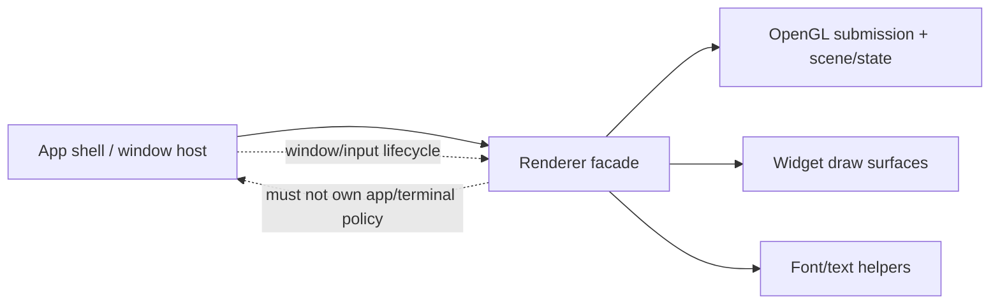
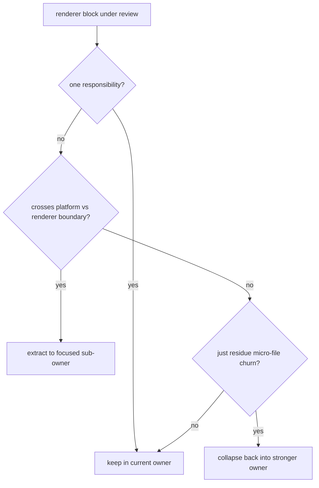

# Renderer TODO

## Scope

Renderer modularization and OS abstraction boundaries, with Linux SDL3 plus OpenGL as the stable baseline and Windows prep kept behind clear seams.

## Constraints

- Extraction-only refactors unless explicitly re-scoped.
- Keep OS window and input boundaries clear from renderer backend code.
- Preserve widget behavior and keep diffs reviewable.
- Run manual smoke checks after extraction steps.

## Entry Points

- `src/ui/renderer.zig`
- `src/app_shell.zig`
- `src/main.zig`

## Status

- [x] Extraction phase complete
- [x] `zig build` check passed on 2026-01-31

## Boundary Map

## Extraction Trigger

## Remaining Work

- [ ] Only extract when a renderer block exceeds one responsibility or crosses platform and renderer boundaries.
- [ ] Add focused tests once replay harness authority exists.
- [ ] Revisit Windows smoke-build dependencies when the `vcpkg` environment is ready.
