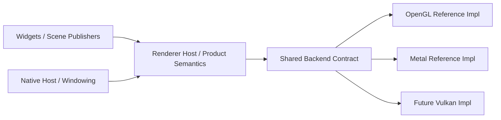

# Renderer Backend Abstraction Queue

## Scope

Turn OpenGL and Metal into the two reference implementations for a
best-in-class renderer backend abstraction.

This queue is no longer just renderer modularization maintenance. It is the
active execution lane for backend contract quality.

## Constraints

- OpenGL and Metal must converge toward one backend-neutral contract.
- Do not add a Vulkan story until the shared contract is strong enough that the
  implementation work is obvious.
- Keep OS/native-host concerns separate from pure backend contract work.
- Prefer reviewable backend-contract cuts over broad cleanup passes.

## Entry Points

- `app_architecture/ui/RENDER_BACKEND_CONTRACT.md`
- `app_architecture/ui/RENDER_BACKEND_CURRENT_STATE.md`
- `docs/research/RENDER_BACKEND_REFERENCE_SCAN_2026-04-05.md`
- `src/ui/renderer.zig`
- `src/ui/renderer/gl_backend.zig`
- `src/ui/renderer/metal_backend.zig`
- `src/ui/renderer/scene_frame_runtime.zig`
- `src/ui/renderer/retained_targets_runtime.zig`

## Status

- [x] OpenGL and Metal both exist as real renderer lanes
- [x] Capability truth is materially better than backend-label theater
- [~] Shared draw contract has started moving out of Metal ownership
- [ ] Shared draw/present contracts are still not backend-neutral end-to-end
- [~] Shared presentable target type has started moving out of GL ownership
- [ ] Shared retained/presentable ownership is still not backend-neutral
- [ ] `Renderer` still carries backend-native implementation state

Status note, 2026-04-05:

- This is now the main renderer roadmap.
- The active standard is no longer "Metal works well enough."
- The active standard is "OpenGL and Metal prove one strong backend contract."

## Campaign Goal

## Immediate Contradictions

- [ ] Remove backend-native draw payloads from shared renderer state.
- [ ] Replace GL-native retained target types in shared runtime code with a
  backend-neutral presentable contract.
- [ ] Move backend frame lifecycle dispatch behind a backend-owned seam instead
  of leaving dispatch in shared frame runtime code.
- [ ] Shrink backend-specific convenience APIs on `Renderer` once stronger
  neutral contracts exist.

## Execution Order

1. Define a shared surface draw contract outside `metal_backend.zig`, then make
   both GL and Metal consume it.
2. Define a shared presentable contract outside `gl_backend.zig`, then move
   retained/direct/snapshot behavior behind it.
3. Move backend frame begin/submit lifecycle into backend-owned dispatch
   surfaces instead of keeping those code paths inline in `Renderer`.
4. Delete backend-specific public renderer verbs after the neutral seams are
   real and callers no longer need backend-shaped requests.

Progress note, 2026-04-05:

- `src/ui/renderer/surface_draw.zig` now owns the shared draw payload types.
- Metal no longer owns the `SurfaceDraw` union definition.
- The next step is to push real submission and caller flow through that shared
  contract instead of leaving Metal-specific renderer verbs as the practical
  API.
- `src/ui/renderer/presentable_target.zig` now owns the presentable target
  type, so shared runtime code no longer imports a GL-owned target type
  directly.
- the shared runtime API now uses presentable-oriented names instead of the old
  retained-surface verbs.
- The next presentable step is lifecycle/behavior ownership, not just storage
  relocation.
- backend-specific frame begin/submit bodies now live in dedicated frame
  runtime modules instead of staying inline in `src/ui/renderer.zig`.
- the renderer-root wrapper methods are gone too; `scene_frame_runtime.zig`
  now dispatches directly to backend frame runtime modules.
- The next lifecycle step is to reduce shared-runtime ownership of dispatch and
  backend-native frame state, not just move code blocks around.

## Live Contradiction Centers

- `src/ui/renderer.zig`
  - still owns backend-native state
- `src/ui/renderer/metal_backend.zig`
  - still owns the only live consumer of the shared surface-draw queue
- `src/ui/renderer/scene_frame_runtime.zig`
  - still acts as a shared backend dispatch center
- `src/ui/renderer/retained_targets_runtime.zig`
  - still encodes the GL-shaped presentable model in shared runtime behavior

## Remaining Work

- [ ] Write and maintain the target contract and current-state contract as the
  two active backend architecture references.
- [ ] Use OpenGL and Metal as the proof pair for every structural backend cut.
- [ ] Keep terminal/text execution work subordinate to the shared contract
  instead of letting it redefine the backend architecture by momentum.
