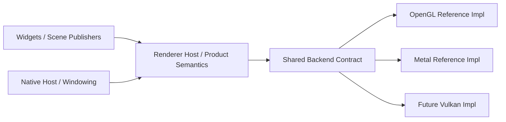

# Renderer Backend Abstraction Queue

## Scope

Turn OpenGL and Metal into the two reference implementations for a
best-in-class renderer backend abstraction.

This queue is no longer just renderer modularization maintenance. It is the
active execution lane for backend contract quality.

## Constraints

- OpenGL and Metal must converge toward one backend-neutral contract.
- Do not add a Vulkan story until the shared contract is strong enough that the
  implementation work is obvious.
- Keep OS/native-host concerns separate from pure backend contract work.
- Prefer reviewable backend-contract cuts over broad cleanup passes.

## Entry Points

- `app_architecture/ui/RENDER_BACKEND_CONTRACT.md`
- `app_architecture/ui/RENDER_BACKEND_CURRENT_STATE.md`
- `docs/research/RENDER_BACKEND_REFERENCE_SCAN_2026-04-05.md`
- `src/ui/renderer.zig`
- `src/ui/renderer/capability_contract.zig`
- `src/ui/renderer/gl_backend.zig`
- `src/ui/renderer/metal_backend.zig`
- `src/ui/renderer/present_trace_runtime.zig`

## Status

- [x] OpenGL and Metal both exist as real renderer lanes
- [x] Capability truth is materially better than backend-label theater
- [~] Shared draw contract has started moving out of Metal ownership
- [ ] Shared draw/present contracts are still not backend-neutral end-to-end
- [~] Shared presentable target type has started moving out of GL ownership
- [ ] Shared retained/presentable ownership is still not backend-neutral
- [ ] `Renderer` still carries backend-native implementation state

Status note, 2026-04-05:

- This is now the main renderer roadmap.
- The active standard is no longer "Metal works well enough."
- The active standard is "OpenGL and Metal prove one strong backend contract."

## Campaign Goal

## Immediate Contradictions

- [ ] Remove backend-native draw payloads from shared renderer state.
- [ ] Replace GL-native retained target types in shared runtime code with a
  backend-neutral presentable contract.
- [ ] Move backend frame lifecycle dispatch behind a backend-owned seam instead
  of leaving dispatch in shared frame runtime code.
- [ ] Shrink backend-specific convenience APIs on `Renderer` once stronger
  neutral contracts exist.

## Execution Order

1. Define a shared surface draw contract outside `metal_backend.zig`, then make
   both GL and Metal consume it.
2. Define a shared presentable contract outside `gl_backend.zig`, then move
   retained/direct/snapshot behavior behind it.
3. Move backend frame begin/submit lifecycle into backend-owned dispatch
   surfaces instead of keeping those code paths inline in `Renderer`.
4. Delete backend-specific public renderer verbs after the neutral seams are
   real and callers no longer need backend-shaped requests.

Progress note, 2026-04-05:

- `src/ui/renderer/surface_draw.zig` now owns the shared draw payload types.
- Metal no longer owns the `SurfaceDraw` union definition.
- `src/ui/renderer/capability_contract.zig` now owns the capability enums and
  struct, and `gl_backend.zig` / `metal_backend.zig` now report backend
  capability truth through that shared contract instead of `Renderer`
  hardcoding every backend capability shape itself.
- The next step is to push real submission and caller flow through that shared
  contract instead of leaving Metal-specific renderer verbs as the practical
  API.
- `BackendOps` now includes `enqueueSurfaceDraw`: Metal uses
  `appendSurfaceDrawToMetalQueue`; OpenGL implements `.solid` and `.atlas`
  immediately via `gl_backend.submitSurfaceDrawImmediate` when the GL text
  atlas path is active. `Renderer.enqueueSurfaceDraw` is the shared entrypoint.
  Metal `appendSolidRect` / `appendAtlasSample` / `appendRawImage` route through
  `enqueueSurfaceDraw`.
  OpenGL `.raw_image` through `enqueueSurfaceDraw` works when `RawImageTexture`
  is the `.opengl` branch; the `.metal` branch is still Metal-queue-only.
  OpenGL `drawRawImageRgba` / `drawRawImageRgb` upload ephemeral `GL_NEAREST`
  textures then call `submitSurfaceDrawImmediate` with `SurfaceDraw.raw_image`
  (Kitty placement path shares the same contract as explicit `.opengl` enqueues).
- `Renderer.drawRect` / `drawRectF` now submit through `enqueueSurfaceDraw`
  (raster `SurfaceDraw` solid + optional pixel clip), so common widget fills use
  the same contract path as Metal queue replay instead of bypassing via
  `drawSolidRect` only.
- `BackendOps.drawSolidRect` on both backends now calls
  `enqueueSolidSurfaceFromLogicalRect` / `enqueueSurfaceDraw` (Metal terminal
  rects still use `appendSolidRect` from `metal_backend.addTerminalRect`).
- The dead `BackendOps.drawSolidRect` function-pointer slot and per-backend
  dispatch methods are now removed from `renderer.zig`; solid submission only
  enters through `enqueueSurfaceDraw`.
- `Renderer.drawRawImageRgba` / `drawRawImageRgb` are now one
  `Renderer.drawRawImage(format, ...)` entrypoint (`RawImageFormat`), with one
  backend-op dispatch slot instead of two backend-specific method names.
- `Renderer.addTerminalRectF` uses the same `enqueueSolidSurfaceFromLogicalRect`
  helper (immediate solid); `addTerminalRect` (i32) still uses `BackendOps` so
  OpenGL keeps terminal batch quads instead of forcing an immediate path.
- `src/ui/renderer/gl_presentable_target.zig` owns the GL-shaped presentable
  target type (FBO + texture), so the name matches ownership; `renderer.zig` no
  longer re-exports `PresentableTargetState` (nothing outside the renderer
  package referenced it).
- `src/ui/renderer/presentable_contract.zig` now owns the shared presentable
  contract types instead of leaving them inside the shared runtime wrapper.
- the shared runtime API now uses presentable-oriented names instead of the old
  retained-surface verbs.
- the actual GL presentable mechanics now live directly under
  `src/ui/renderer/gl_backend.zig` instead of inside the shared presentable
  contract module.
- the neutral presentable facade no longer lives in a separate shared runtime
  wrapper; `Renderer` now owns that small dispatch surface directly and routes
  through backend-owned presentable entrypoints on the OpenGL and Metal
  modules.
- The next presentable step is lifecycle/behavior ownership, not just storage
  relocation.
- backend-specific frame begin/submit bodies now live in dedicated frame
  runtime modules instead of staying inline in `src/ui/renderer.zig`.
- the renderer-root wrapper methods are gone too; `Renderer.beginFrame()` /
  `Renderer.submitFrame()` now form the small top-level frame facade above the
  backend frame runtime modules.
- OpenGL-only scene target refresh/prep has moved out of the old shared frame
  wrapper shape and into `opengl_frame_runtime.zig`.
- The remaining OpenGL scene-target mechanics now also live directly under
  `src/ui/renderer/gl_backend.zig` instead of `src/ui/renderer/present_trace_runtime.zig`,
  which leaves the shared scene runtime closer to trace/present bookkeeping
  than GL composition ownership.
- Metal runtime storage on `Renderer` is now bundled under one
  `metal_runtime` state object instead of being scattered across separate peer
  fields.
- OpenGL runtime storage on `Renderer` is now bundled under one
  `opengl_runtime` state object instead of being scattered across separate peer
  fields.
- backend teardown now routes through `gl_backend.zig` and `metal_backend.zig`
  instead of `Renderer.deinit()` spelling out both cleanup paths inline.
- backend startup/init and startup-smoke probing now also route through
  `gl_backend.zig` and `metal_backend.zig` instead of `Renderer.init()` and
  `runStartupBackendSmoke()` spelling out both boot paths inline.
- the extra shared backend-frame dispatch wrapper is gone; the renderer facade
  now does the small shared bookkeeping directly and routes straight to
  backend-owned `beginFrame` / `submitFrame` entrypoints on the OpenGL and
  Metal modules.
- Metal-only queued-surface cleanup and diagnostic-font cleanup now route
  through `metal_backend.zig` instead of living as renderer-root helper
  methods.
- Shared draw/text code now routes several OpenGL-specific operations through
  `gl_backend.zig` helpers instead of directly reaching into
  `renderer.opengl_runtime` for white-brush access, batch binding, VBO growth,
  texture-kind uniform updates, and text-render uniform sync.
- Shared Metal-facing renderer code now routes runtime-context lookup,
  queued-surface append, and queued-surface count through `metal_backend.zig`
  helpers instead of open-coding those `renderer.metal_runtime` storage
  details.
- Renderer/font call sites that only need Metal atlas hooks, glyph-atlas
  readiness, or snapshot-presentable status now also route through
  `metal_backend.zig` helpers instead of manually unwrapping the backend
  context.
- Sampled-text and terminal-cell-run queue handoffs now also route through
  `metal_backend.zig` helpers instead of the renderer root passing the Metal
  queued-surface list directly into those builders.
- The Metal frame runtime now routes current-frame slot access and queued
  surface replay through `metal_backend.zig` helpers instead of directly
  mutating and iterating `renderer.metal_runtime` storage fields.
- The Metal diagnostic-font cache/ensure path now also routes through
  `metal_backend.zig` instead of living as renderer-root-owned backend logic.
- Metal snapshot-presentable draw and raw-image enqueue paths now also route
  through `metal_backend.zig` helpers instead of the renderer root assembling
  those backend draw requests inline.
- The one-off Metal smoke frame and basic Metal `SurfaceDraw` variant
  packaging now also route through `metal_backend.zig` helpers instead of
  `Renderer` spelling out those backend-specific assembly details itself.
- The Metal terminal snapshot-presentable path now participates in the shared
  presentable contract through `metal_backend.zig` entrypoints instead of the
  terminal presentation runtime carrying a separate Metal-only bypass branch
  for availability, ensure, draw, and scroll.
- Metal-only `*ForRenderer` terminal snapshot helper exports were removed from
  `metal_backend.zig`; diagnostics now query terminal snapshot state through
  `renderer.presentableAvailable(.terminal)` (shared presentable contract path).
- The remaining unused `terminalSnapshotAvailable(context)` helper was removed
  from `metal_backend.zig` to keep snapshot-presentable lifecycle surfaces
  contract-owned instead of helper-layered.
- Dead terminal snapshot wrappers (`appendTerminalSnapshotDraw` and
  `drawTerminalSnapshotPresentable`) were removed from `metal_backend.zig` once
  `drawPresentable(.terminal, ...)` became the single snapshot-present path.
- Metal cursor presentation now invalidates by design: fast snapshot-present
  reuse is disabled when cursor state changes, and partial plans force redraw of
  previous/current cursor rows when cursor visibility/row/col/shape changes.
- Fast-present reuse now also tracks overlay state (hover link + composing
  text signature). Reuse is blocked when those change, preventing stale overlay
  artifacts from skipping the overlay redraw phase.
- Removed remaining `renderer.backend == .metal` guard checks from
  `metal_backend.zig` helper paths; capability/context checks now gate behavior
  without backend-label branches inside backend-owned code.
- Added regression tests for cursor/overlay invalidation gates in
  `terminal_widget_surface_state.zig` to lock the new fast-present reuse rules.
- The tiny terminal-specific presentable wrapper module is gone too:
  `terminal_widget_presentation_runtime.zig` now talks to the renderer
  presentable contract directly instead of bouncing through one more
  forwarding layer.
- Metal glyph-atlas readiness, atlas preview source, and atlas-upload
  diagnostics no longer use dedicated `Renderer` wrappers; call sites now use
  `metal_backend.zig` helpers directly (with
  `metal_text_diagnostic_runtime.previewPlacement` where needed).
- The old Metal-only `Renderer` convenience verbs for sampled text,
  terminal-cell runs, raw image draws, and terminal snapshot draws are now
  gone from `src/ui/renderer.zig`; live callers route those operations
  through `metal_backend.zig` directly instead.
- The remaining renderer-root Metal text/atlas wrappers are gone too:
  `drawSampleTextRequest`, `drawTerminalCellRun`, and `drawAtlasSampleChar`
  were removed from `Renderer`/`BackendOps`, and call sites now invoke
  `metal_backend.zig` directly.
- The matching no-op OpenGL stubs for those Metal-only text helpers were
  removed from `gl_backend.zig` (plus now-unused imports).
- Metal atlas preview/debug state now also lives inside
  `src/ui/renderer/metal_runtime_state.zig` as part of the bundled Metal
  runtime state instead of as a separate backend-specific field on
  `Renderer`.
- The OpenGL retained-presentable cache now also lives under
  `src/ui/renderer/opengl_runtime_state.zig` instead of as a direct
  `Renderer` field, which makes the GL-owned retained-presentable model less
  obviously rooted in shared renderer storage.
- The offscreen scene-target contract/state now also lives in
  `src/ui/renderer/scene_target_state.zig` and is stored under
  `opengl_runtime.scene_target` instead of as a direct `Renderer` field,
  which makes the current OpenGL-owned scene-target model less obviously
  shared-state-by-default.
- The remaining renderer-root scene-target invalidation merges and Metal atlas
  preview lookup now also route through `gl_backend.zig` / `metal_backend.zig`
  instead of `Renderer` directly reaching into those backend runtime storage
  slots.
- Unused Shell forwards for macOS Metal attachment prep and smoke frames were
  removed, and atlas-preview/upload probes now route through
  `metal_backend.zig` directly instead of a renderer wrapper.
- The renderer root no longer owns private Metal queue-assembly helpers for
  solid rects / atlas samples or the OpenGL scissor implementation directly.
  Primitive solid-rect submission, terminal glyph/rect submission, theme
  background clear, and clip application now route through `gl_backend.zig` /
  `metal_backend.zig` instead of `renderer.zig` acting as the implementation
  center for those backend-specific mechanics.
- The OpenGL scene-target and presentable runtimes now also call
  `gl_backend.zig` directly for render-target begin/ensure/destroy instead of
  bouncing through GL-only helper methods on `Renderer`, which removes another
  pure-OpenGL helper surface from the renderer root.
- The shared frame prelude no longer clears the Metal queued draw list before
  backend dispatch; that queue reset now lives in
  `src/ui/renderer/metal_frame_runtime.zig` instead of shared renderer
  lifecycle code mutating Metal runtime state directly.
- The OpenGL frame, scene-target, and presentable runtimes now also bind the
  default target through `gl_backend.zig` directly instead of bouncing through
  another OpenGL-only helper on `Renderer`.
- Terminal presentation debug sampling now also uses renderer presentable
  contract info instead of reaching into
  `renderer.opengl_runtime.presentable_targets.terminal` from shared terminal
  code.
- The live renderer instance now selects one explicit backend ops table at
  init time and routes frame, presentable, screenshot, capability, clip, and
  primitive draw behavior through that table instead of repeating those
  backend switches across `src/ui/renderer.zig`.
- Startup window binding, backend configuration, and startup smoke execution
  now also route through a small backend bootstrap ops table instead of
  leaving one more cluster of backend startup switches in `src/ui/renderer.zig`.
- The unused renderer-root `deinitPresentables()` seam and its backend ops
  entry are gone too; presentable teardown now only exists in backend-owned
  runtime cleanup where it is actually used.
- Kitty image handling now uses an explicit renderer capability mode instead of
  branching on `renderer.backend` in the widget layer to decide between
  persistent textures and direct raw-image draws.
- Persistent image texture creation/destruction no longer exists as a GL-only
  helper surface on `Renderer`; that lifecycle now routes through backend ops,
  and the remaining live callers (Kitty persistent textures and terminal shell
  icons) now ask for backend-owned persistent textures instead of OpenGL-only
  root helpers.
- Font atlas upload hook selection no longer does a raw `renderer.backend`
  check before asking for Metal atlas hooks; the backend helper now answers
  that capability question directly.
- `ui/font_sample_view.zig` and `renderer/font_manager.zig` now call
  `metal_backend.terminalFontAtlasUploadHooksForRenderer` directly for Metal
  atlas-hook capability instead of a renderer wrapper seam.
- `ui/glyph_cache.zig` no longer imports `gl_backend`; OpenGL batch bind and
  texture-kind uniform for the vertex-stream flush go through
  `draw_ops.bindBatchPipelineForVertexStream` /
  `draw_ops.setTextureKindForVertexStream` (shared with the terminal batch
  flush path in `draw_ops.zig`).
- The old OpenGL-only init-time swap-interval policy tweak now also routes
  through backend ops instead of living as one more raw backend branch in
  `renderer.zig`.
- Direct OpenGL frame submit and direct window screenshot-readback now also
  live under `src/ui/renderer/opengl_frame_runtime.zig` /
  `src/ui/renderer/gl_backend.zig` instead of
  `src/ui/renderer/present_trace_runtime.zig` carrying that OpenGL-specific
  behavior inside a shared runtime file.
- The terminal presentable end path now goes back through the shared
  presentable contract instead of bypassing it to call a scene-runtime restore
  helper directly, and the OpenGL composition-target restore logic now lives
  with the OpenGL presentable implementation instead of shared scene runtime.
- OpenGL presentable and scene-target teardown now also lives under
  `gl_backend.deinitRuntime()` instead of `Renderer.deinit()` explicitly
  orchestrating that cleanup first.
- The next lifecycle step is to reduce shared-runtime ownership of dispatch and
  backend-native frame state, not just move code blocks around.
- Frame lifecycle dispatch now targets `opengl_frame_runtime.zig` /
  `metal_frame_runtime.zig` directly from the backend ops table in
  `renderer.zig`; redundant `beginFrame` / `submitFrame` forwarding wrappers
  were removed from `gl_backend.zig` and `metal_backend.zig`.
- OpenGL screenshot dispatch now also targets `opengl_frame_runtime.zig`
  directly from backend ops, removing the last GL frame-runtime screenshot
  forwarding wrappers from `gl_backend.zig`.
- Metal screenshot dispatch now also targets `metal_frame_runtime.zig`
  directly from backend ops (including the current "unavailable" stub
  behavior), removing the equivalent forwarding wrappers from
  `metal_backend.zig`.
- Font-scale diagnostic cache invalidation now goes through a backend-ops hook
  (`clearDiagnosticFont`) instead of `renderer.zig` directly calling
  `metal_backend.clearDiagnosticFont`.
- Scene-target refresh invalidation flow now routes through backend ops
  (`sceneTargetInvalidationForRefresh` +
  `mergePendingSceneTargetInvalidation`) instead of shared renderer lifecycle
  paths directly calling `gl_backend.zig`.
- Backend bootstrap now owns context creation too: `Renderer.init()` asks
  `BackendBootstrapOps.createBackendContext` for backend context setup instead
  of open-coding the OpenGL context creation branch in shared init flow.
- Backend bootstrap helper implementations were moved out of `renderer.zig`:
  `backendBootstrapOps` now references backend-owned bootstrap entrypoints
  directly (`gl_backend.*ForBootstrap` / `metal_backend.*ForBootstrap`,
  plus backend-owned `configureWindowAttributes`) instead of renderer-local
  OpenGL/Metal wrapper functions.
- The duplicated non-bootstrap startup-smoke forwarders were removed from
  `gl_backend.zig` and `metal_backend.zig`; each backend now exposes one
  bootstrap startup-smoke entrypoint (`runStartupSmokeForBootstrap`) instead
  of carrying a wrapper pair for the same behavior.
- `renderer.zig` no longer depends on `gl.zig` just to express bootstrap SDL
  types; bootstrap function-pointer signatures now use `sdl_api.c` SDL types
  directly, keeping backend bootstrap typing in shared SDL/platform imports
  instead of OpenGL module aliases.
- Backend bootstrap startup-smoke entrypoints now take a concrete
  `window_init.RenderSurfaceAttachment` parameter in both backends (instead of
  `anytype`), tightening bootstrap contract typing across renderer and backend
  modules.
- OpenGL bootstrap context setup no longer goes through a dedicated
  `createBackendContextForBootstrap` wrapper: `backendBootstrapOps` now points
  directly to `gl_backend.createBackendContext`, and GL loader setup is owned
  in that backend context-creation entrypoint.
- Bootstrap ops contract now lives in
  `src/ui/renderer/bootstrap_contract.zig`, and backend modules provide their
  own bootstrap ops tables (`gl_backend.bootstrapOps()` /
  `metal_backend.bootstrapOps()`), so `renderer.zig` no longer spells out the
  backend bootstrap function-pointer mapping inline.
- Bootstrap context cleanup now also routes through the shared bootstrap
  contract (`destroyBackendContext`) instead of `renderer.zig` directly calling
  `SDL_GL_DeleteContext` on init error paths.
- Runtime-profile support policy now routes through backend bootstrap ops
  (`supportsRuntimeProfile`) instead of `renderer.zig` carrying a backend-label
  gate for Metal full-ui/macOS readiness inline.
- `renderer.init()` no longer performs backend-context create/destroy through
  bootstrap hooks; OpenGL context ownership moved into
  `gl_backend.initRuntime()` and the bootstrap contract dropped the temporary
  context lifecycle function-pointer slots.
- Backend bootstrap-op backend selection moved out of `renderer.zig` into
  `src/ui/renderer/bootstrap_runtime.zig`
  (`bootstrap_runtime.opsForBackend`), removing one more backend-mapping switch
  from renderer root startup/smoke flow.
- Startup-smoke orchestration now also lives in
  `src/ui/renderer/bootstrap_runtime.zig`
  (`bootstrap_runtime.runStartupBackendSmoke`), leaving
  `Renderer.runStartupBackendSmoke` as a thin facade instead of carrying window
  creation/attachment/bootstrap sequencing inline.
- Shared renderer init now also uses
  `bootstrap_runtime.initBootstrapWindow` / `deinitBootstrapWindow` for window
  + render-surface bootstrap sequencing and runtime-profile gating, removing
  another startup ownership block from `renderer.zig`.
- `bootstrap_runtime.InitBootstrapWindow` was trimmed to only carry bootstrap
  resources (`window`, `render_host`, `render_surface_attachment`); bootstrap
  ops metadata no longer rides along in that state object.
- `renderer.zig` startup/deinit teardown paths now use `sdl_api` wrappers
  (`destroyWindow`, `quit`) instead of direct `SDL_*` calls, keeping shared
  lifecycle flow aligned to platform wrapper seams.
- `renderer.zig` no longer imports `bootstrap_contract.zig` directly for
  runtime-profile typing; that type now routes through
  `bootstrap_runtime.zig`, reducing one more direct renderer-root bootstrap
  contract coupling point.
- The remaining renderer-root `sdl` alias is gone too; hit-test callback types
  and constants now use `sdl_api.c` directly so shared renderer code no longer
  depends on a local SDL alias surface.
- The macOS OpenGL editor retained-presentable bypass in
  `editor_widget_draw.zig` no longer keys off `renderer.backend` + OS tags;
  `capability_contract.RendererCapabilities` now exposes
  `editor_presentable_cache_compatible`, and OpenGL reports false on macOS
  full UI while Metal leaves it enabled so widget code stays capability-shaped.
- Metal-only immediate draw helpers (raw RGB/RGBA image enqueue, sampled text,
  terminal cell runs, atlas sample char) now route through backend-owned
  helpers (`metal_backend.zig`) from call sites that need them, while shared
  draw submission continues converging on `enqueueSurfaceDraw`.

## Live Contradiction Centers

- `src/ui/renderer.zig`
  - still owns backend-native state
- `src/ui/renderer/metal_backend.zig`
  - still owns the only live consumer of the shared surface-draw queue
- `src/ui/renderer/present_trace_runtime.zig`
  - now mostly handles shared trace/present bookkeeping, but still
    participates in the shared frame lifecycle surface
- `src/ui/renderer/gl_backend.zig`
  - now owns the OpenGL scene-target mechanics directly instead of routing
    them through another backend-local wrapper module
- `src/ui/renderer.zig`
  - also owns the small neutral presentable facade directly, so renderer-root
    dispatch is still part of the presentable contract surface
- `src/ui/renderer/gl_backend.zig`
  - now owns the concrete GL presentable mechanics directly instead of routing
    through a backend-local wrapper module

## Remaining Work

- [ ] Write and maintain the target contract and current-state contract as the
  two active backend architecture references.
- [ ] Use OpenGL and Metal as the proof pair for every structural backend cut.
- [ ] Keep terminal/text execution work subordinate to the shared contract
  instead of letting it redefine the backend architecture by momentum.

## Defect Class Watchlist (for later GL/Metal scrutiny pass)

- stateful overlay invalidation drift: backend present/reuse fast paths that
  skip redraw while cursor/hover/composition state changed (generation-stable
  frames masking visual stale artifacts)
- presentable reuse truth drift: one backend reporting `presentableAvailable`
  true while lifecycle state (size/scroll/restore/update completion) is not
  equivalent to the other backend
- partial-plan vs fast-present interaction drift: damage/partial math that is
  correct for terminal content deltas but omits overlay/trace-visible state
