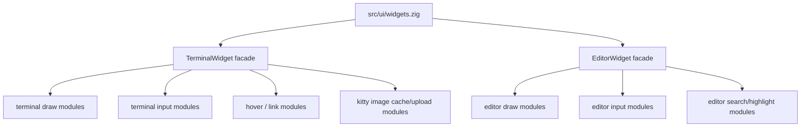
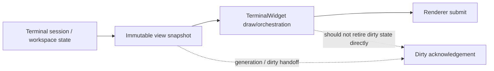

# UI Widget Modularization TODO

## Scope

Modularize UI widgets into smaller, testable units while preserving behavior and keeping the SDL3 renderer path stable.

## Constraints

- Extraction-only by default.
- Keep hot paths allocation-light.
- Preserve existing interaction and appearance.
- Enforce existing import and layering checks.

## Context

- Renderer work is tracked in `docs/todo/ui/renderer.md`.
- SDL3 migration is tracked in `docs/todo/ui/sdl3_migration.md`.

## TODO

### Phase 0 Baseline and Contracts

- [x] `UI-0-01` Document widget API shape
- [x] `UI-0-02` Add UI layering notes to import rules documentation

### Phase 1 Terminal Widget Split

- [x] `UI-TW-01` Extract ctrl-click open logic
- [x] `UI-TW-02` Extract kitty image upload and texture cache
- [x] `UI-TW-03` Extract hover and link underline overlay path
- [x] `UI-TW-04` Split terminal widget into draw and input modules
- [x] `UI-TW-05` Add micro-bench hooks for draw time and uploads

### Phase 2 Editor Widget Followups

- [x] `UI-EW-01` Keep the editor widget split pattern stable

### Phase 3 Registry and Shared Helpers

- [x] `UI-W-01` Keep `src/ui/widgets.zig` as a thin registry
- [x] `UI-W-02` Consolidate small shared UI helpers

### Phase 4 Verification

- [x] `UI-V-01` Smoke terminal mode and default run after extraction
- [x] `UI-V-02` Run import checks after each phase

### Phase 5 UI Thread and Backend Decoupling

- [x] `UI-PERF-01` Reduce terminal widget draw lock scope to snapshot-only
- [x] `UI-PERF-02` Avoid blocking lock waits in terminal widget input
- [x] `UI-PERF-03` Bound terminal workspace polling cost per frame
- [x] `UI-PERF-04` Remove synchronous grammar bootstrap from frame paths

### Phase 6 Terminal UI Boundary Cleanup

- [x] `UI-TB-01` Shrink `TerminalWidget` to presentation and orchestration
- [x] `UI-TB-02` Remove duplicate snapshot-vs-visible hover and open paths
- [ ] `UI-TB-03` Move terminal dirty acknowledgement out of widget draw
- [x] `UI-PERF-05` Move search recompute off the UI thread with generation cancellation
- [x] `UI-PERF-06` Remove synchronous file-detect I/O from terminal ctrl-click
- [x] `UI-PERF-07` Add frame-phase metrics for lock wait and poll budgets
- [ ] `UI-PERF-08` Verification pass for latency under heavy terminal output and large editor files

